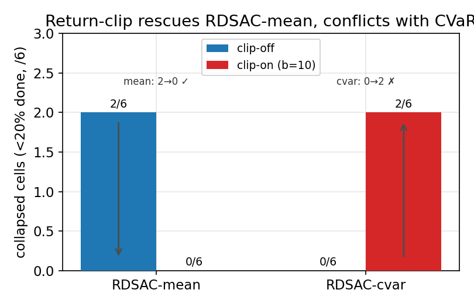

<!--
TANET 投稿雛形 — 主題三「網際網路與雲端技術應用」
子題：雲端運算、邊緣運算、雲霧整合運算 ／ 分散式系統
格式對齊：TANET 全文 4–6 頁、定稿 PDF；本檔為 Markdown 雛形，
定稿時請套用大會 Word/odt/LaTeX 範本（字體字級依範本：標題標楷體、
內文新細明體/Times New Roman，雙欄，勿編頁碼）。
作者與單位欄位請自行填入。
-->

# 基於 Slurm 與 Kubernetes 的 AI 伺服器 GPU 工作負載智慧排程：風險敏感深度強化學習與模擬到實機評估

### Intelligent GPU Workload Scheduling for AI Servers on Slurm-over-Kubernetes: Risk-Sensitive Deep Reinforcement Learning and a Sim-to-Real Evaluation

**作者一¹、作者二²**
¹○○大學 ○○系　²○○大學 ○○系
{author1, author2}@example.edu.tw

---

## 摘要

異質 GPU 叢集上的 AI 工作負載（推論與訓練混合）排程，直接影響資源使用率、工作完成時間（Job Completion Time, JCT）與服務水準目標（Service Level Objective, SLO）的達成。本研究設計並實作一套**以 Kubernetes（k3s）部署、以 Slurm 為排程核心**的 AI 伺服器 GPU 排程研究平台，整合 NVIDIA Multi-Process Service（MPS）達成卡內細粒度共享，並在 Slurm 的工作提交掛鉤（`job_submit.lua`）中嵌入一個**非阻塞、失效即回退（fail-safe）**的強化學習決策端點：以風險敏感的分散式深度強化學習（RDSAC，結合 discrete SAC 與 Implicit Quantile Network，並以 CVaR 風險量度優化尾端延遲）作為放置（placement）建議者，任何服務異常皆自動退回既有啟發式分數排程，slurmctld 永不被阻塞。為了在「實機樣本稀少、單一節點即一個跑數分鐘的工作」的限制下取得可信的結論，本研究提出一套**模擬到實機（sim-to-real）評估方法學**：離散事件模擬器訓練、實機配對 A/B、抗跑序漂移（drift-robust）的交錯輪轉、多 seed 配對信賴區間，並同時報告平均與尾端指標（p95／p99／CVaR）及 SLO 違反率。在一座雙節點異質叢集（RTX 4070＋RTX 3080）上的實測揭示了一個關鍵的方法學洞見：**排程策略的優劣高度依賴評估場景**。在模擬與 exclusive-GPU 的實機下，學習式放置與啟發式打平或小輸，這些場景皆未觸及卡內共享與計算異質性的放置槓桿。然而在**真實 cuBLAS ＋ NVIDIA MPS 分數共置**的實機評估下，結論反轉：四個學習臂皆改善平均 JCT（8 訓練 seed 平均 +3.6～+5.8%、每臂 6–7／8 個 seed 為正），且其中風險敏感的 RDSAC-cvar 在正確分析層級（seed，n=8）達統計顯著（+4.5%，one-sample t p=0.023）——其顯著並非源於最大平均增益，而是 CVaR 帶來的低 seed 間變異（可靠性）。研究目標是以 DRL 達成整體更好的排程與資源分配、在多數情況優於啟發式，而非最佳化任一特定指標；尾端（p99）與 SLO 僅作為附帶診斷，本平台在此 2-node 小叢集上不作尾端優勢宣稱（p99 由排程運氣主導、不穩健）。本研究並以跨世代 off-policy DRL（SAC 2019、RDSAC 2020、CrossQ 2024）交叉驗證，三者在此場景皆改善平均 JCT。貢獻在於：一套可重現的雲端 GPU 排程平台、一個失效安全的 RL 整合架構，以及一套誠實的 sim-to-real 評估方法學，揭示「**評估場景決定排程結論**」，並在真實 MPS 硬體上取得學習式放置改善平均 JCT 的正面結果。

**關鍵詞**：GPU 排程、Kubernetes、Slurm、深度強化學習、MPS、邊緣運算、模擬到實機評估

## Abstract

Scheduling mixed AI workloads (inference and training) on heterogeneous GPU clusters directly affects utilization, Job Completion Time (JCT), and Service Level Objective (SLO) attainment. We design and implement a GPU scheduling research platform that is **deployed on Kubernetes (k3s) with Slurm as the scheduling core**, integrates NVIDIA Multi-Process Service (MPS) for intra-GPU fine-grained sharing, and embeds a **non-blocking, fail-safe** reinforcement-learning decision endpoint into Slurm's job-submit hook (`job_submit.lua`). A risk-sensitive distributional deep RL policy (RDSAC: discrete SAC + Implicit Quantile Network, optimized with a CVaR risk measure for tail latency) acts as a placement advisor; any service fault transparently falls back to the existing score heuristic, so slurmctld is never blocked. Because real-cluster samples are scarce (one node hosts a job running for minutes), we propose a **sim-to-real evaluation methodology**: discrete-event simulation for training, paired live A/B, drift-robust interleaving, multi-seed paired confidence intervals, and joint reporting of mean and tail metrics (p95/p99/CVaR) plus SLO violation. Experiments on a two-node heterogeneous cluster (RTX 4070 + RTX 3080) reveal a key methodological insight: **whether a scheduling policy wins depends strongly on the evaluation scenario**. Under simulation and exclusive-GPU live runs, learned placement ties or slightly loses to the heuristic — neither exercises the placement leverage of intra-GPU sharing and compute heterogeneity. However, under a **real cuBLAS + NVIDIA MPS fractional co-residency** live evaluation the conclusion reverses: all four learned arms improve mean JCT (seed-mean +3.6 to +5.8% over 8 training seeds, 6–7 of 8 seeds positive per arm), and the risk-sensitive RDSAC-cvar reaches statistical significance at the correct (seed) analysis level (n=8: +4.5%, one-sample t p=0.023) — its significance stems not from the largest mean gain but from CVaR's low seed-to-seed variance (reliability). Our objective is generally better scheduling and resource allocation, beating the heuristic in most cases, rather than optimizing any single metric; tail (p99) and SLO are reported only as auxiliary diagnostics, and we make no tail-advantage claim on this two-node cluster (p99 is scheduling-luck-dominated and not robust). We cross-check across three off-policy DRL generations (SAC 2019, RDSAC 2020, CrossQ 2024), all of which improve mean JCT in this scenario. Our contributions are a reproducible cloud GPU scheduling platform, a fail-safe RL integration architecture, and an honest sim-to-real methodology — surfacing that **the evaluation scenario determines the scheduling conclusion**, and delivering a positive live mean-JCT result for learned placement on real MPS hardware.

**Keywords**: GPU scheduling, Kubernetes, Slurm, deep reinforcement learning, MPS, edge computing, sim-to-real evaluation

---

## 1. 前言

生成式 AI 與深度學習的普及，使學術與企業的 GPU 叢集需同時承載**低延遲推論**與**長時間訓練**兩類性質迥異的工作負載：前者須在服務水準目標（SLO）期限內完成、且常僅需部分 GPU 算力，後者則長時間獨佔整張卡。當底層硬體有限且**異質**——不同世代 GPU 的算力差異可達數倍——如何將兩類工作妥善排程與放置，以兼顧工作完成時間（JCT）、資源使用率與 SLO 達成，已成為雲端與邊緣運算基礎設施的核心議題 [1][4]。

傳統 HPC 排程器（如 Slurm）以靜態優先權與回填（backfill）為主，對 GPU 卡內共享與工作負載特性的感知有限。學界雖已提出多種以強化學習（RL）優化叢集排程的方法 [2][3]，但多數僅止於模擬評估，**鮮少在真實叢集上以嚴謹的統計方法檢驗其效益是否成立**；尤其「模擬中可區分的策略差異能否轉移到實機」這一 sim-to-real 問題，至今缺乏系統性的探討。實機評估之所以困難，在於單一節點即承載一個跑數分鐘至數小時的工作，使可用樣本極度稀少，且量測易受叢集暖機等時變因素干擾而產生假性排名。

針對上述缺口，本研究以一座雙節點異質叢集（RTX 4070＋RTX 3080，配備 NVIDIA MPS）為實驗平台，建構從模擬訓練到實機驗證的完整流程，並以抗漂移、多 seed 配對統計的方法學誠實檢驗排程策略的真實效益。本研究的目標與貢獻如下：

1. **雲端 GPU 排程平台**：以 k3s 部署、Slurm 為排程核心、NVIDIA MPS 達成卡內共享，並以 Helm 完整封裝，可重現部署於異質節點。
2. **失效安全的 RL 整合架構**：於 Slurm 工作提交掛鉤嵌入非阻塞的 RL 決策端點，服務異常即回退啟發式，兼顧研究彈性與生產可靠性。
3. **風險敏感深度強化學習放置策略與其模擬行為分析**：以分散式 RL（RDSAC）建模回報分布並以 CVaR 風險量度；經多 seed 消融誠實揭示其分布式評論家在不確定性下高變異、易崩潰，而 CVaR 風險扭曲的實質作用是**完成率穩定器**而非速度優勢；並進一步發現 Duan 式 target return-clip 是**更省、傷 JCT 更少的替代穩定器**（§4.3.1），惟兩者皆未使任何學習臂在模擬中穩健勝過純量基準。
4. **模擬到實機評估方法學與場景洞見**：提出抗漂移、多 seed、seed 層級配對統計並兼顧尾端指標的評估流程，揭示**排程結論高度依賴評估場景**——在缺乏卡內共享的等待主導 regime（模擬、exclusive-GPU）學習式與 score 統計打平，但在真實 cuBLAS＋MPS 分數共置下四個學習臂皆改善平均 JCT、且風險敏感的 RDSAC-cvar 在正確分析層級（seed，n=8）達顯著（§4.2.1）；並指出**單 seed／小樣本結果會誤導**這一方法學教訓（3-seed 曾量到的 +15% 於 n=8 縮為 +4%）。

## 2. 相關研究

**GPU 叢集排程與分析。** Jeon 等人對微軟 Philly 叢集的大規模多租戶 GPU 工作負載進行分析 [1]，揭示了排隊延遲與資源碎裂問題。Gandiva [2] 與 Tiresias [3] 分別利用 DL 工作的可遷移性與分布感知排程降低 JCT。Weng 等人對阿里巴巴 PAI 叢集的研究 [4] 指出生產 MLaaS 工作高度分片化、以單卡短工作為主。本研究的合成工作負載即以 [1][4] 的統計特性為依據。

**GPU 共享。** NVIDIA MPS [5] 允許多個行程共享單張 GPU 的計算資源，是在小型叢集上提升使用率的關鍵機制；本研究以 MPS 槽（每卡 4 槽，對應 25／50／75／100％）建模卡內共享。

**強化學習排程。** 以 RL 進行資源排程的研究多採用 actor–critic 或值函數方法。本研究的決策核心 RDSAC 為三項技術的整合：離散動作 Soft Actor-Critic [6]、Implicit Quantile Network 分布式評論家 [7]，以及以 CVaR 為風險量度的尾端敏感優化 [7]。為弭平模擬與實機落差，亦採用離線到線上的 RLPD 微調概念 [8]。獎勵塑形採用保證最優策略不變的位能塑形 [9]。

**雲端原生 GPU 排程生態系。** 在 Kubernetes 生態中，數個成熟系統處理 GPU／批次工作負載，但分屬不同抽象層：Kubeflow [12] 負責 ML 工作的生命週期（分散式訓練、超參數搜尋、模型服務），其本身不做排程，而將決策**委派**給批次排程器；Volcano [13] 提供 pod 群組的 gang 排程與 DRF／binpack 等規則式外掛；Kueue [14] 實作 job 級佇列、配額借還（ClusterQueue／ResourceFlavor／Cohort）、fair-share 與 gang 准入，但以暫停（suspend）控制准入、**不負責 pod 放置**；Kubernetes 1.34 起正式釋出（GA）的動態資源分配（Dynamic Resource Allocation, DRA）[15] 則將 GPU 分片、MIG、time-slicing 等以 ResourceClaim／ResourceSlice／DeviceClass **宣告式**地納入 API，成為一等公民。表 0 依抽象層整理這些系統與本研究的定位。

表 0. 雲端原生 GPU 排程系統的層級定位

| 系統 | 所在層 | 機制形態 | 學習式策略 | 尾端／SLO 目標 | GPU 分片 |
|---|---|---|:--:|:--:|:--:|
| Kubeflow [12] | 工作生命週期 | 委派給批次排程器 | ✗ | ✗ | 委派 |
| Volcano [13] | Pod 群組排程 | 規則式 heuristic（gang/DRF/binpack） | ✗ | ✗ | time-slice（無策略） |
| Kueue [14] | Job 級佇列／配額 | 規則式＋約束求解（不做放置） | ✗ | ✗（fair-share 非尾端） | ResourceFlavor 標記 |
| K8s DRA [15] | 裝置分配**機制** | 約束匹配 | ✗ | ✗ | ✓（宣告式一等公民） |
| **本研究（RDSAC）** | 排序／放置**策略** | **學習式＋風險敏感（CVaR）** | ✓ | ✓（直接優化尾端） | MPS-aware 策略 |

**與既有工作的差異。** 上述系統皆為**規則式或約束求解**：Kueue／Volcano 解的是配額與 gang 准入、DRA 提供的是分片**機制**、Kubeflow 管的是生命週期；沒有任何一個是「**學習式、且以尾端延遲（tail latency）為目標的排序／放置策略**」。本研究正落於此空隙：RDSAC 對回報分布以 CVaR 優化 p99／SLO 尾端，是生產系統皆未優化的量。要強調的是，DRA 提供的是「如何表達要 0.25 張 GPU」的*機制*，而非「該把哪些工作打包、用什麼順序以壓低尾端」的*策略*——因此本研究的學習式策略與 DRA 並非競爭，而是**互補**：一個尾端敏感的策略可在 DRA 之上驅動裝置選擇與准入排序。既有 RL 排程研究多止於模擬；本研究的重點不在宣稱 RL 必勝，而在**建立一套能在真實異質叢集上、以統計嚴謹方式檢驗排程策略效益的方法學**，並誠實回報其規模條件。

## 3. 實驗目的與系統架構

### 3.1 整體架構

平台分為兩個鬆耦合層：**基礎設施層**（Slurm on Kubernetes）與**排程研究層**（模擬器＋深度強化學習）。

叢集以 k3s 部署，控制節點（RTX 4070）兼任 control-plane，工作節點（RTX 3080，算力約前者 0.25×）為異質 GPU 來源。Slurm 控制器、登入節點與 GPU 工作節點皆以容器化 StatefulSet 部署，GPU 經 NVIDIA device plugin 與 MPS control daemon 暴露為可分片資源。

**為何 Slurm-on-Kubernetes（而非純 K8s 排程器）。** 一個合理的質疑是「既然已在 K8s 上，為何不直接用 Kueue＋DRA＋自訂 kube-scheduler plugin，而要疊一層 Slurm？」本研究選擇 Slurm-on-K8s 有三個理由：（1）**成熟的 HPC 排程語意**——backfill、multifactor 優先權、gang、`gres/mps` 卡內分片皆是 Slurm 開箱即用且經生產驗證的一等公民；在 K8s 側要湊齊等價能力需 Kueue＋Volcano＋DRA 多元件拼裝，且 DRA 於本研究進行時甫 GA（K8s 1.34），生態未穩。（2）**K8s 提供部署與生命週期、Slurm 提供排程核心**，兩層鬆耦合、各司其職：k3s 負責容器化、網路、儲存（NFS RWX）、可觀測性，Slurm 負責佇列與放置決策；這讓平台既可攜（Helm 一鍵部署於異質節點）又保有 HPC 級排程。（3）**研究載具**——`job_submit.lua`／slurmrestd 是穩定、非侵入的策略注入點（§3.2），可在**不 fork slurmctld、不改 kube-scheduler** 的前提下熱插拔學習式策略並失效即回退；相較於維護一個自訂 scheduler plugin，這大幅降低了研究迭代成本。與生態的關係上，本研究的學習式策略與 K8s DRA **互補**（§2）：DRA 給的是分片*機制*，本研究給的是尾端敏感的排序／放置*策略*，未來可在 DRA 之上驅動裝置選擇（§5）。

### 3.2 失效安全的 RL 整合

整合點為 Slurm 的 `job_submit.lua`：工作提交時，掛鉤 `rl_hook.lua` 以 HTTP 呼叫 RL 推論服務的 `POST /decide`，取得放置／優先權建議；若服務逾時或異常，掛鉤**靜默回退**至既有啟發式分數排程（以 MPS 適配、VRAM 適配、短工作優先三因子加權）。此設計確保 slurmctld 永不被第三方服務阻塞，使研究用的 RL 元件可安全運行於生產路徑。

生產部署的 RL 作動有兩條路徑，皆為失效安全（fail-safe）：（1）**優先權微調**——`job_submit.lua` 呼叫 `/decide`，僅提升被選中工作的佇列優先權（`select/cons_tres` 與 GRES 仍決定實際落點）；（2）**顯式節點綁定（explicit placement）**——`/act` 回傳節點選擇 `(node_j, gpu_k)`，於**提交時**將該節點寫入工作的必要節點（`ReqNodeList`），Slurm 遂將工作排到 RL 選定節點、MPS 由 GRES 強制。本研究的實機放置實驗（§4.2）即以路徑 (2) 為對象——由評估 harness 呼叫 `/act` 後以 `sbatch -w` 提交——並於本平台 2×1 叢集驗證其正確釘選（`sbatch -w` 與 `scontrol update ReqNodeList` 皆能把 held／pending 工作釘到指定節點）。將此提交時綁定接入 `job_submit.lua`（呼叫 `/act` 後設 `job_desc.req_nodes`）即為 RL 顯式放置的生產路徑。平台另實作一個非同步 **placement controller**（`services/rl_scheduler/placement_controller.py`，以 slurmrestd hold→pin→release 對已提交 held 工作事後釘節點）作為不需改提交端的替代，惟其經 slurmrestd v0.0.37 job-update 寫入節點約束之實際生效仍在硬化中（實機測試觀察到該 REST 欄位未被套用），故**目前評估與生產皆以提交時節點綁定為準**。`/act` 若 abstain（如 checkpoint 拓樸 ≠ 實機）則 no-op，退回 Slurm 原生放置。

### 3.3 模擬器與強化學習環境

離散事件模擬器以「提交／結束」事件驅動，建模 Node → GPU → MPS 槽的階層資源與異質算力。其上以 Gymnasium 介面封裝為 RL 環境：觀測為佇列前 K 個工作的特徵（GPU 數、MPS 需求、等待時間、SLO 緊迫度、工作類別、GPU 型別 one-hot 等），於 2×1 拓樸下維度為 166；動作為「放置於某節點某 MPS 槽」或「暫不放置」。

### 3.4 風險敏感深度強化學習（RDSAC）

決策策略為自行整合的 **discrete 分布式 SAC**（本文稱 RDSAC）：雙頭 IQN 評論家分別建模回報分布（reward 回報 $Z_R$ 與 entropy 回報 $Z_H$），以 quantile Huber loss 學習，搭配 twin-Q、軟更新（τ=0.005）與遮罩式 categorical actor。風險敏感性透過在 actor 目標與動作價值上對回報分布套用 CVaR 扭曲 $\rho[Z_R]$ 達成，對應排程中的長尾 runtime／慢節點（straggler）風險。訓練採優先經驗回放（PER）、n-step 回報、分數暖啟動與位能獎勵塑形。RDSAC「風險敏感分布式 SAC」之名承襲自 Ma 等人以回報分布做風險敏感優化的 DSAC [16]；惟本研究為**離散動作**、雙頭 IQN 的自組版本，是離散 SAC [6]、IQN 分布式評論家 [7] 與 CVaR 風險量度的組合，非 [16] 連續控制版本的 1:1 重現。須留意另有**同名但不同**的 Duan 等人 DSAC [17]（將回報建模為單一高斯、以抑制 Q 值高估為目標、風險中立、連續控制），與本研究的風險敏感取向不同，不宜混淆。

## 4. 實驗與評估方法

### 4.1 評估方法學

實機評估面臨「一個 step 即一個跑數分鐘的工作、湊滿樣本需時甚久」的根本限制，故採用 sim-to-real 流程：模擬器訓練 → 凍結 checkpoint → 實機配對 A/B。為取得可信結論，方法學包含四項要件：

- **抗跑序漂移（drift-robust）**：GPU 隨運行暖機、快取轉熱會使「越晚跑的越快」。若各方法依序整段跑完，跑序會與方法混淆。本研究以交錯輪轉（interleave）讓每個方法跨多輪輪過各個跑序位置，並丟棄暖機輪，將漂移誤差平均化。
- **多 seed 配對信賴區間**：以共用隨機數（CRN）讓各方法跑相同工作負載並配對相減，再以多個訓練 seed 重複，以配對 t 檢定回報 95% 信賴區間與 p 值。
- **尾端與 SLO 指標**：除平均 JCT 外，同時報告 p95／p99／CVaR 與 SLO 違反率，以捕捉飢餓與 straggler。
- **真實工作負載**：除合成負載外，建置可攜式 PyTorch 環境於共享儲存，以真實 BERT 推論／微調作為實機工作。

### 4.2 主要結果

**模擬環境可區分策略（方法學正面結果）。** 在離散事件模擬中，以對 SLO 敏感的 AI 伺服器工作負載（2×1 拓樸、offered load ρ≈0.7 的中度競爭、8 個 held-out seed）評估，具尺寸感知的啟發式相較先到先服務（FCFS）顯著降低 SLO 違反率（表 1），顯示模擬器具備區分排程策略的能力——前提是工作負載與指標選對了維度（時序排序、SLO 感知），而非需要規模的多節點裝箱。此工作負載的 SLO 定義為：推論工作（短、佔 1 GPU 的 25／50％ MPS）帶有延遲期限 `slo_s` = runtime × 4，訓練工作（長、獨佔或大 MPS，含少量 2-GPU 跨節點 gang）為 best-effort（無期限）；SLO 違反率即帶期限工作中 JCT 超過 `slo_s` 的比例。

表 1. 模擬環境下 AI 伺服器工作負載的排程器區分（2×1、ρ≈0.7、8 seed 平均）

| 排程器 | 平均 JCT (s) | 推論 JCT (s) | SLO 違反 (%) | 使用率 |
|---|--:|--:|--:|--:|
| FCFS | 2199 | 1847 | 66.5 | 0.58 |
| multifactor | 1108 | 461 | 41.1 | 0.63 |
| score | 1129 | 520 | 40.7 | 0.63 |

**跑序漂移會污染單趟排名。** 在真實叢集上，單趟（block design）量測一度顯示 FCFS「顯著贏」score 達 +5.0%。然而其改善幅度與「跑第幾位」完美單調相關（表 2）：同一個 FCFS，跑最後一位時 +5.0%、跑最先時則僅 +0.5% 甚至轉為 −0.4%（不顯著）。此為叢集隨時間暖機的漂移假象，而非排程器差異。

表 2. FCFS 的「優勢」隨跑序位置變動（揭示漂移）

| 排程器 | seed42 位置 | seed43 位置 | seed44 位置 | ΔJCT% vs score（各 seed）|
|---|--:|--:|--:|---|
| FCFS | 4（最後）| 1（最先）| 3 | +5.0 / +0.5 / −0.4 |
| packing | 3 | 2 | 1 | +1.6 / +0.8 / −0.6 |
| multifactor | 2 | 3 | 4 | +1.0 / +0.9 / −0.7 |

圖 1. 將三個啟發式跨 3 seed 的 ΔJCT% 對「跑序位置」作圖：正斜率的趨勢線（+0.62%/位）顯示表面「優勢」隨越晚跑而增大，證實其為叢集暖機漂移的假象、而非排程器本身的效果。

**真實 2×1 叢集：啟發式統計打平。** 以 3 seed × 3 種臂順序校正跑序位置後的 cross-seed 聚合如表 3，三個 ΔJCT% 的 mean±std **全部跨越 0**，即生產 score 與 Slurm 原生 FCFS／multifactor／packing 在真實 2×1 上統計打平，無任何排程器具優勢。

表 3. 真實 2×1 叢集抗漂移、多 seed 聚合（mean±std）

| 排程器 | 平均 JCT (s) | p95 | p99 | CVaR | ΔJCT% vs score |
|---|--:|--:|--:|--:|--:|
| score | 182.7±31.7 | 369.1±46.6 | 409.8±37.7 | 349.2±43.0 | — |
| multifactor | 181.8±30.3 | 364.5±42.7 | 405.9±35.6 | 346.7±39.4 | +0.4±1.0 |
| packing | 181.5±30.7 | 365.9±42.1 | 405.2±33.5 | 346.3±38.3 | +0.6±1.1 |
| FCFS | 179.7±32.0 | 362.5±37.2 | 402.4±28.2 | 343.2±32.8 | +1.7±2.9 |

**深度強化學習放置：精確量測下顯著小輸。** 在暴露 GPU 異質性的放置實驗中，深度強化學習 checkpoint 一度名目領先 +3.9%（p=0.116，不顯著）；於非飽和 regime 降噪並將樣本三倍化（n=246）後，三個學習型策略全部反轉為**顯著小輸** score（表 4），且此結論跨兩個訓練 seed 一致。以真實 BERT 工作橫掃低／高負載與 2-GPU gang（head-of-line blocking）三種競爭機制，亦僅見落在雜訊內的微弱訊號。

表 4. 實機放置精確四方比較（n=246，配對 t 檢定）

| 排程器 | 平均 JCT (s) | p99 | CVaR | ΔJCT% | t 檢定 p |
|---|--:|--:|--:|--:|--:|
| score | 167.8 | 425.6 | 374.7 | （基準）| — |
| SAC | 174.0 | 432.4 | 379.5 | −3.7 | 3.7e-16 |
| RDSAC-mean | 174.5 | 435.8 | 379.5 | −4.0 | 2.1e-17 |
| RDSAC-cvar | 175.5 | 432.8 | 381.6 | −4.6 | 5.3e-12 |

須釐清**統計顯著與實務顯著的區別**：表 4 的 p 值極小（≈1e-12～1e-17）源於 n=246 的大樣本，代表「可偵測地變慢」而非「大幅變慢」；三個學習臂的 ΔJCT% 落在 −3.7～−4.6%，仍位於 §4.5 界定的 ±5% 實務等價帶內（僅偏於其負緣）。換言之，學習型策略在此規模是**可統計偵測地、但非實務顯著地**遜於 score，與後續「排程策略空間近乎是平的」洞見一致，而非與之矛盾。

#### 4.2.1 真實 cuBLAS + MPS 共置：學習式放置改善平均 JCT（實機正面結果）

真正能觸及這座**異質**叢集放置槓桿的評估，必須讓卡內共享（NVIDIA MPS）與計算異質性反映到 JCT。為此，我們以**真 cuBLAS（`gpu_workload`）＋ MPS 分數共置**（Poisson 到達、mps-oversub 1.0、MPS 分桶 25／50／75／100）跑實機**五方**（score／SAC／RDSAC-mean／RDSAC-cvar／CrossQ）配對 A/B（2×1、提交時 `-w` 顯式放置、drift-robust interleave、**8 訓練 seed**、每 seed n_jobs=30×3 rounds、σ=1.0），見表 4-1。四方學習臂皆用同一 hetero recipe 的 checkpoint（訓練時 node_j=0 對應快卡）。以往評估把 job 當獨立單位而有偽重複（pseudoreplication）之虞；此處改以**正確分析層級——seed**——的 one-sample t 檢定每臂 ΔJCT% 是否顯著異於 score。

**四方學習臂在真實計算＋MPS 共置下皆改善平均 JCT，但幅度溫和，且只有風險敏感臂在正確層級達顯著。** 表 4-1（n=8）顯示四臂 ΔJCT% 皆為正（+3.6～+5.8%）、每臂 6–7／8 個 seed 為正，方向一致。但在 **seed 層級 one-sample t** 下，只有 **RDSAC-cvar 達顯著（+4.5±4.4%，p=0.023）**；CrossQ 邊際（+5.8±7.3%，p=0.060）；SAC 與 RDSAC-mean 方向為正但個別未達顯著（p≈0.32，seed 間變異達 ±9～10%）。關鍵洞見是：RDSAC-cvar 的顯著並非來自最大平均增益（CrossQ 的平均更大），而是風險敏感讓它的 seed 間變異最低（±4.4，對比其餘 ±7～10），因此那個溫和的 +4.5% 才最穩健、可複現。這印證了 CVaR 的價值在「可靠性」而非「更大的平均效果」，與 §4.3 把 CVaR 定位為穩定器的發現一致。

**這也修正了先前 3-seed 的膨脹估計。** 同一批 s42–44 checkpoint，先前較小的 3-seed run 曾量到 RDSAC-mean +15.2%，擴至 n=8 後同一策略只剩 +3.6%，先前的大數是抽到少數幸運 seed 的小樣本假象。實機量測本身雜訊也大：同一 checkpoint 的 ΔJCT% 在兩 run 間可由 +15% 擺盪到 +3.6%，故我們以 n=8 的 seed 層級估計為準，也僅就其宣稱。

表 4-1. 真實 cuBLAS＋MPS 實機五方放置 A/B（2×1、**8 train seed**、σ=1.0；JCT／p99／CVaR 為秒；ΔJCT% 為 seed 平均±std、**+ = 勝**；seed 為正 = 8 個 seed 中 ΔJCT%>0 的數目；seed-t = seed 層級 one-sample t 檢定 p）

| arm | JCT(s) | p99(s) | CVaR(s) | ΔJCT% | seed為正 | seed-t p |
|---|--:|--:|--:|--:|:--:|--:|
| score | 11.0±0.1 | 64.2±25.9 | 22.0±1.1 | — | — | — |
| SAC | 10.6±1.1 | 45.7±31.4 | 22.1±4.3 | +3.9±10.3 | 6/8 | 0.321 |
| RDSAC-mean | 10.6±1.0 | 40.1±24.0 | 22.4±3.9 | +3.6±9.4 | 6/8 | 0.318 |
| **RDSAC-cvar** | **10.5±0.4** | 33.6±20.3 | **21.0±2.0** | **+4.5±4.4** | 6/8 | **0.023** |
| CrossQ | 10.4±0.8 | 33.3±7.4 | 21.1±2.4 | +5.8±7.3 | 7/8 | 0.060 |

**限制與尾端，須誠實界定。** 效果幅度溫和（+3.6～+5.8%），且除 RDSAC-cvar 外個別臂未達 seed 層級顯著；能穩健宣稱的是「四臂方向一致改善平均 JCT，而風險敏感的 RDSAC-cvar 在正確層級（seed，n=8）達顯著」。尾端方面，本 n=8 run 的學習臂 p99 反而優於 score（RDSAC-cvar Δp99 +41.6%、ΔCVaR +4.3%），但這與先前較小 run 的 p99 較差方向相反——score 自身的 p99 在兩 run 間即由 37s 擺盪到 64s，顯示在 2-node 小叢集上「誰踩到尾端災難」由排程運氣主導，故我們**仍不宣稱尾端優勢**，穩健結論限於平均／中央 JCT。此結果亦凸顯**評估場景決定結論**：唯有真實計算（異質性）＋ MPS 分數共置的場景才觸及學習式放置的槓桿；缺乏卡內共享或計算異質性的場景（模擬、exclusive-GPU）會低估它。

#### 4.2.2 真實 LLM serving＋高負載：乾淨比較下學習式放置顯著落後

§4.2.1 的 workload 是合成 sgemm。為以**真實 AI-serving** job 檢驗，我們把 payload 換成 Qwen2.5-0.5B 的批次自迴歸生成（長 prompt、prefill-compute-bound，對應 RAG／摘要類長 context 服務），並將 offered load 由 oversub 1.0 拉高至 **2.0**（超過單卡容量，迫使放置器必須動用兩張卡）。此處揭露一個真實部署的硬體約束：慢卡節點（3080 機）**host RAM 僅 7.5GB**，而每個 LLM job 需先把 torch＋約 954MB 模型載入 host RAM（約 2–3GB），兩個並發 LLM job 即耗盡 host RAM → OOM → 進程卡死無法終止 → Slurm 將該節點 drain。因此採 **hybrid workload**：mps 25／50 的小 job 走 cuBLAS（自包含、host／VRAM 佔用極低、可 4-way 共置），mps 75／100 的大 job 走真實 LLM（門檻 75 保證任兩個 LLM 需求相加 >100，永不在同卡共置，慢卡節點最多同時載入一個模型）。

**在消除偏差的乾淨比較下，結論與 §4.2.1 相反：學習式放置顯著落後 score。** 見表 4-2（2×1、8 train seed、每 seed 每臂完成 **22 個 job（完全對等，無存活者偏差）**、兩節點皆重度使用）。四個學習臂的平均 JCT 皆較 score 差 **9.8～16.3%**，且在正確的 seed 層級高度顯著（p≤0.003）、方向極一致（0–1／8 個 seed 為正）。

表 4-2. 真實 LLM hybrid serving 實機五方放置 A/B（2×1、8 train seed、oversub 2.0、mps 25／50→cuBLAS、75／100→LLM；每 seed 每臂 n=22 完成 job；JCT 秒；seed-t = seed 層級 one-sample t，**＋ = 勝過 score**）

| arm | JCT(s) | ΔJCT% | seed 為正 | seed-t p |
|---|--:|--:|:--:|--:|
| score | 12.0±0.3 | — | — | — |
| SAC | 13.9±0.8 | −15.6±8.6 | 1/8 | 0.001 |
| RDSAC-mean | 13.9±0.5 | −16.1±5.1 | 0/8 | <0.001 |
| RDSAC-cvar | 13.2±0.6 | −9.8±6.3 | 0/8 | 0.003 |
| CrossQ | 14.0±0.8 | −16.3±5.3 | 0/8 | <0.001 |

**機制可解釋。** 學習臂把只 **35–39%** 的 job 放到慢卡 3080，而 score 放 **47%**——學習式較貪心地偏好快卡 4070。在 oversub 2.0 的高負載下，這種過度集中反而**把 4070 塞爆、排隊變長**，總體 JCT 更差；score 更均衡地把慢卡也用起來，反而較快。這與 §4.5 觀察到的「學習式易在快卡過度集中」一致。

**方法學註記：正確設計消除了一個會誤導的假象。** 此配對 A/B 的第一版曾量到學習臂大幅**領先**（+46%），但那是**存活者偏差**：score 無顯式放置，其被 Slurm 分到慢卡的 job 會因慢卡 host RAM OOM／冷載入超時而 FAILED，而 join 只計 COMPLETED → score 的完成集被截斷。三項修正還原了公平比較：(1) 提交時 free-MPS 快照改為**本地即時追蹤**（Slurm 的 MPS 帳目落後於 burst 提交，否則放置器永遠只見快卡有空位而不 spill）；(2) hybrid workload 讓慢卡節點不再 OOM／drain（消除失敗-丟棄）；(3) 確認每臂完成數對等。修正後兩臂完成數皆 22／seed，結論方向即反轉。

**綜合 §4.2.1 與 §4.2.2**，兩個真實-硬體場景給出相反結論——低負載分數-cuBLAS 共置下學習式小勝（cvar +4.5%），高負載真實-LLM serving 下學習式顯著落後（−10～−16%）——**這強化而非削弱本文核心命題：排程結論高度依賴評估場景**，並誠實界定了 §4.2.1 那個正面結果的適用範圍（窄、低負載、特定 workload），提醒學習式放置的實機效益遠比單一場景所暗示的脆弱。

#### 4.2.3 線上 RLPD 微調與全模型 workload-seed 穩健性檢驗：真實資料微調未能翻盤

§4.2.2 顯示學習式放置在高負載真實-LLM serving 下顯著落後 score。一個自然的補救假設是**用實機資料做線上微調以縮小 sim-to-real 落差**（本文原列為未來工作）。我們直接檢驗此假設。

**行為觀測式資料收集（shadow-safe）。** `live_daemon` 以旁觀模式輪詢 `squeue`，對每個 job 記錄**決策時的觀測狀態**、Slurm **實際落點**（哪個節點）與**實現的 −JCT**——即記錄行為策略（Slurm＋score）的真實 transition，而非 RL 的反事實動作，故完全不干擾生產、且產出有效的 off-policy 離線資料。共收集 **181 筆真實 transition**。**忠於原始 RLPD（Ball 等人 2023）之實作**：對稱 50／50 離線／線上取樣、LayerNorm 集成評論家（N=10、隨機子集 M=2 取 target min，REDQ 式）、離散 SAC actor、固定溫度（fixed-α=0.05；被遮罩的離散 SAC 自動-α 會因合法動作數遠小於 log(A) 而向上發散，故釘死）。以此微調 RDSAC-cvar 的 sim 策略得 **RLPD-v3**。

**評估設計（誠實的變異軸）。** RLPD-v3 是**單一**策略，無 per-train-seed 版本；為與 sim 臂公平配對，我們改變 **workload seed**（8 條獨立 job 串流）而固定各學習臂的 checkpoint（sim 臂用其對應 train-seed 的 ckpt、RLPD 用單一 v3）。此變異軸（workload seed）與表 4-2（train seed、固定 workload）**不同**，故兩表的**絕對 JCT 不可直接相比**，各自檢驗其軸內的相對排名。表 4-3 為全六臂結果。

表 4-3. 全模型 workload-seed 實機 A/B（2×1、8 workload seed、oversub 2.0、hybrid；sim 臂＝對應 train-seed ckpt，RLPD＝單一 v3；JCT 秒；seed-t = seed 層級 one-sample t，**＋ = 勝過 score**）

| arm | JCT(s) | ΔJCT% | ΔCVaR% | seed 為正 | seed-t p |
|---|--:|--:|--:|:--:|--:|
| score | 39.9±8.9 | — | — | — | — |
| SAC | 42.8±7.8 | −8.3±8.2 | −9.6 | 0/8 | 0.025 |
| RDSAC-mean | 43.0±8.4 | −8.7±7.5 | −10.8 | 0/8 | 0.013 |
| RDSAC-cvar | 41.5±10.2 | **−3.5±7.5** | −4.4 | 2/8 | **0.225** |
| CrossQ | 42.9±7.4 | −8.9±8.9 | −10.7 | 1/8 | 0.025 |
| RLPD | 42.1±7.9 | −6.5±8.4 | −7.4 | 0/8 | 0.064 |

**三點結論。** 第一，**線上 RLPD 微調在此資料規模下未能翻盤**：RLPD-v3 仍落後 score（ΔJCT −6.5%，seed-t p=0.064 邊緣、0／8 seed 為正），僅略優於未微調的 SAC／RDSAC-mean／CrossQ（−8～−9%），且**不如 per-train-seed 的 RDSAC-cvar**（−3.5%）。一個聚焦的三臂對照（固定 RDSAC-cvar-s45 vs RLPD-v3 vs score、同樣跨 8 workload seed）給出一致圖像：RDSAC-cvar −7.5%（p=0.016）、RLPD −7.2%（p=0.043），兩者統計上無區別。**181 筆真實 transition 不足以彌合 sim-to-real 落差**——這是對「線上微調可救援」假設的誠實**否定**結果。第二，**風險敏感（cvar）在高負載下最穩健**：RDSAC-cvar 是唯一未達 seed 顯著的學習臂（p=0.225、2／8 為正、最接近打平），與 §4.2.2 中 cvar 為「最不差」一致——CVaR 的低變異在高負載過度集中風險下轉為可靠性優勢。第三，**§4.2.2 的結論對變異軸的選擇穩健**：換到 workload-seed 軸後，六臂相對 score 的排名與方向（全數為負）保持不變，僅幅度較溫和（−3.5～−8.9% vs 表 4-2 的 −9.8～−16.3%），交叉驗證了「高負載下學習式放置落後」並非 train-seed 抽樣的假象。綜言之，縮小 sim-to-real 落差恐需遠多於 181 筆的實機資料量、或加入 on-policy 修正，而非單靠小樣本離線 RLPD。

#### 4.2.4 加入 Slurm 原生排程 baseline：統一 DRA 重測下 score 亦勝過 naive Slurm

前述比較皆為「學習式放置 vs score 啟發式」，尚缺一個問題：**score／學習式相對於 Slurm 內建排程器**孰優？為此加入兩個 Slurm 原生 baseline——**FCFS**（`sched/builtin` + `priority/basic`，關閉 job_submit Lua，嚴格 FIFO 無回填）與 **backfill**（`sched/backfill` + `priority/basic`，關閉 Lua，Slurm 現代預設）——皆**不做提交時綁定**（無 `-w`，由 `select/cons_tres` 自行選節點），代表「不加任何智慧放置的 vanilla Slurm」。

**方法學要點：統一後端重測消除混淆。** 本平台於此期間由 device-plugin 遷移至 **Kubernetes DRA**（`gpu.nvidia.com` ResourceClaim + MPS，見 `docs/dra-migration.md`）；實測 DRA MPS 使**絕對 JCT 約減半**（同一 score 基準：device-plugin 39.9s → DRA 18.4s）。因此若把新 baseline（DRA）與 §4.2.3 的 score（device-plugin）相比會得到假象（一度量到 FCFS「快 score 54%」，純屬後端差異）。為此**將全部八個臂於同一天、同一 DRA 後端重測**（表 4-4），使所有 ΔJCT% 對齊同一個 DRA-score 基準；跨後端的絕對 JCT 不可比，但**同後端內的相對 ΔJCT% 才是有效指標**，且其排名與 §4.2.3 一致。

表 4-4. 統一全方法實機 A/B（2×1、DRA MPS、8 workload seed、oversub 2.0、hybrid；JCT／p99／CVaR 為秒；Δ 為相對 score 的百分比，**＋ = 勝過 score**；seed 為正 = 8 個 seed 中 ΔJCT%>0 的個數；seed-t = ΔJCT% 的 seed 層級 one-sample t）

| arm | JCT(s) | p99(s) | CVaR(s) | ΔJCT% | Δp99% | ΔCVaR% | seed 為正 | seed-t p |
|---|--:|--:|--:|--:|--:|--:|:--:|--:|
| score | 18.4±3.4 | 44.5±14.0 | 32.3±10.1 | —（基準） | — | — | — | — |
| RDSAC-cvar | 19.2±4.4 | 51.5±19.9 | 33.6±10.8 | −3.9±10.7 | −17.4±41.2 | −4.7±13.6 | 3/8 | 0.344 |
| backfill | 19.3±3.5 | 34.1±8.1 | 29.1±6.1 | −4.9±6.6 | +19.7±20.7 | +6.8±15.5 | 2/8 | 0.076 |
| CrossQ | 19.8±3.2 | 49.8±15.1 | 36.1±9.4 | −8.4±10.6 | −13.1±18.4 | −14.0±14.5 | 2/8 | 0.062 |
| SAC | 20.0±3.3 | 55.7±22.2 | 37.1±10.3 | −9.7±15.9 | −30.9±53.0 | −19.6±35.5 | 3/8 | 0.128 |
| fcfs | 20.4±3.5 | 35.7±8.1 | 30.8±5.7 | −10.8±7.3 | +16.0±21.0 | +1.1±16.5 | 0/8 | 0.004 |
| RDSAC-mean | 20.5±4.4 | 53.2±18.0 | 35.9±10.1 | −11.0±11.6 | −21.1±33.0 | −13.0±14.9 | 1/8 | 0.031 |
| RLPD | 20.4±2.7 | 54.1±14.7 | 37.6±7.9 | −11.9±11.1 | −26.3±33.4 | −21.7±30.7 | 1/8 | 0.019 |

**三點結論。** 第一，**score 啟發式在高負載下（平均 JCT）勝過 vanilla Slurm**：FCFS 顯著落後 score（ΔJCT −10.8%、p=0.004、0／8），backfill 亦邊緣落後（−4.9%、p=0.076）——證明 score 的 bin-pack／SJF 因子相對於「數 GPU」式的 cons_tres 放置確有加值，而非只是與學習式互比的空殼基準。第二，**排名跨後端一致、鞏固核心命題**：在乾淨的統一 DRA 重測下，**沒有任何學習臂勝過 score 的平均 JCT**（全數為負），RDSAC-cvar（−3.9%、p=0.344 不顯著）仍為最接近打平者、與 backfill（−4.9%）同屬「最不差」一檔，而 fcfs／RDSAC-mean／RLPD 顯著最差——此與 §4.2.2／§4.2.3 的方向完全吻合，交叉驗證「高負載真實-serving 下學習式放置未勝過調校過的 score、naive Slurm 更差」並非後端或抽樣假象。第三，**尾端呈相反權衡（附帶觀察，不作宣稱）**：naive Slurm（backfill／fcfs）雖平均較差，其 p99／CVaR 反而優於 score（backfill Δp99 +19.7%、ΔCVaR +6.8%；fcfs Δp99 +16.0%）——即 score 以較緊的平均換取較長的尾；惟此處 p99／CVaR 為每 seed 20–30 個完成 job 的估計、變異極大（Δp99 標準差達 ±20～53%），僅作尾端行為的定性觀察，在此小叢集不作統計宣稱。

### 4.3 模擬多 seed 消融：風險敏感 DRL 在模擬中亦未勝出

§4.2 表 1 顯示模擬能區分**啟發式**，但那並未檢驗**學習式**策略是否有效。為此，我們在注入 mean-preserving 對數常態 runtime 不確定性（σ=1.0，模擬 straggler 與預測誤差）的隨機模擬中，以固定溫度（fixed-α=0.05）、100k 步、3 個訓練 seed（42／43／44）分別訓練三個學習臂——純量 SAC、風險中立 RDSAC-mean、風險敏感 RDSAC-cvar——並以共用隨機數配對評估其相對 score 的 ΔJCT%（表 5）。

表 5. 模擬 σ=1.0 多 seed（3 訓練 seed × 100k 步，fixed-α=0.05）ΔJCT% vs score

| 學習臂 | philly ΔJCT% | ali ΔJCT% | 完成率 | 穩定性 |
|---|--:|--:|--:|---|
| SAC（純量 twin-Q） | −8.6±13.4 | −17.2±21.8 | 全 seed 100% | 穩定，學習臂中最佳 |
| RDSAC-cvar（風險敏感） | −24.2±16.4 | −48.9±43.5 | 全 seed 100% | 穩定，但一致落後 score 與 SAC |
| RDSAC-mean（分布式） | +70.1† | +89.0† | 0–80%（半數 seed 崩潰） | 雙峰：偶佳，常崩成 0% |

†RDSAC-mean 的正值為**低完成率假象**：ΔJCT% 僅在已完成的工作上配對計算，而該策略於半數 seed 崩潰為 0% 完成（退化為放棄困難工作的 no-op），故其表面優勢並非真實改善。

此結果有三點意涵。第一，**單一 seed 的模擬結果會嚴重誤導**：同一 RDSAC 設定在單 seed 下曾呈現大幅領先 score，但於多 seed 下該領先不可重現，那不過是抽到未崩潰的幸運 seed。第二，**即使在為風險機制量身打造的隨機模擬中，風險敏感 DRL 於多 seed 下亦未穩健勝過純量 SAC 或 score 啟發式**；連此「模擬救援」都失敗，與 §4.2 的實機負結論方向一致（三個訓練 seed 的 RDSAC-cvar ΔJCT% 在兩個 trace 上**一致為負**，非隨機雜訊）。

第三，也是本消融唯一站得住的**正面**發現：**CVaR 風險扭曲的實質作用是穩定訓練／完成率，而非提升速度**。表 6 逐格列出兩個分布式臂的完成率：風險中立的 RDSAC-mean 在 6 個（trace×seed）格中有 4 格崩潰（完成率 ≤20%，退化為 no-op），而加了 CVaR 尾端扭曲的 RDSAC-cvar **6 格全部 100% 完成、無一崩潰**。這指向一個可推廣的觀察：**風險敏感性可作為分布式評論家在環境隨機性下對抗策略崩潰的穩定器**，即使它並未帶來 JCT 上的優勢。

表 6. 兩個分布式臂各 (trace×seed) 完成率——CVaR 消除崩潰

| 訓練 seed | RDSAC-mean（philly／ali） | RDSAC-cvar（philly／ali） |
|---|--:|--:|
| 42 | 80%／100% | 100%／100% |
| 43 | 0%／0% | 100%／100% |
| 44 | 0%／20% | 100%／100% |

#### 4.3.1 穩定器的本質：return-clip 是比 CVaR 更省的替代

§4.3 把 CVaR 定位為完成率穩定器，但它是唯一的穩定機制嗎？為釐清崩潰的病根——分布式評論家對回報 $Z_R$ 的高估使 categorical actor 退化到 no-op——我們移植 Duan 等人 [17] 的 target 回報 clip：把 reward-return 的 bootstrap target 以當前 online value 為錨、clip 在 ±b 的信賴域內（只 clip $Z_R$；$Z_H$ 已由 $-\log\pi$ 界定），作為與 CVaR **正交**的穩定器，在同一 1×1／σ=1.0／fixed-α=0.05／3 train-seed 設定下（b=10）消融（表 6-1、圖 3）。

表 6-1. value-clip 消融（崩潰＝完成率<20%，共 6 個 trace×seed 格；誠實 ΔJCT% 僅取 100% 完成格）

| 條件 | 臂 | 崩潰格數 | 誠實 ΔJCT% |
|---|---|--:|--:|
| clip-off | RDSAC-mean | 2/6 | +19.5／+5.5（低完成假象）|
| clip-off | RDSAC-cvar | 0/6 | −41.4／−36.9 |
| clip-on b=10 | RDSAC-mean | **0/6** | **−3.5／−12.5** |
| clip-on b=10 | RDSAC-cvar | 2/6 | （退化）|

三點意涵。（1）**return-clip 有效穩定 risk-neutral 分布式臂**——把 RDSAC-mean 崩潰 2/6→0/6。（2）**在完成穩定性上 clip 優於 CVaR**：clip-on-mean 與 clip-off-cvar 同為 0 崩潰、100% 完成，但誠實 ΔJCT% −3.5／−12.5 遠優於 −41／−37，即 clip-on-mean **dominate** clip-off-cvar。這細化了 §4.3 的結論：CVaR 穩定完成是**以 JCT 為代價**，而 return-clip 是更省、傷 JCT 更少的替代。（3）但 clip 疊在 CVaR 上兩穩定機制互相打架（cvar 0/6→2/6），故 return-clip 是 CVaR 的**替代而非疊加**。淨結：找到一個更好的分布式評論家穩定器，**但仍無任何臂贏過 score**（clip-on-mean −3.5±36.5／−12.5±32、CI 跨 0＝與 score 統計等價），與全文「2×1 策略空間平坦」一致。

圖 3. value-clip 消融的崩潰格數（/6）：return-clip 讓 RDSAC-mean 崩潰 2→0（救回），卻讓 RDSAC-cvar 0→2（兩穩定機制衝突）——穩定器與風險扭曲是替代而非疊加。

### 4.4 與雲端原生 SOTA 基準的對照（強化基準）

§4.2 的區分實驗僅對照自家啟發式，可能招致「未與引用的 SOTA 比較」之質疑。為此，我們將 §2 所述的兩個雲端原生排程器近似納入同一模擬對照——Kueue 式 fair-share（跨使用者 max-min 交錯）與 Volcano 式 binpack（最大需求優先）——在高競爭的 1×1、**佇列飽和** regime（offered load 拉高至系統飽和；GPU 使用率仍約 0.6，屬**佇列**飽和而非**算力**飽和，aiserve 工作負載，8 seed）下量測（表 7）。此處的拓樸（1×1）與競爭度（飽和）皆與表 1（2×1、ρ≈0.7 中度競爭）不同，故 JCT 絕對值明顯較高（如 FCFS 2640 vs 表 1 的 2199、score 1887 vs 1129）；兩表各自檢驗其 regime 內的**相對排名**，跨表的絕對 JCT 不宜直接相減。

表 7. 強化基準：雲端原生 SOTA 近似納入模擬對照（aiserve，8 seed，1×1 佇列飽和）

| 排程器 | 平均 JCT (s) | SLO 違反 (%) | 使用率 |
|---|--:|--:|--:|
| FCFS | 2640 | 59.7 | 0.59 |
| Volcano-binpack | 2515 | 45.3 | 0.60 |
| score（生產） | 1887 | 40.1 | 0.60 |
| multifactor | 1720 | 38.8 | 0.60 |
| Kueue-fairshare | 1722 | 38.8 | 0.60 |

此結果有兩點意涵。第一，**區分確實存在但邊界清楚**：FCFS 與純 binpack（優先塞入大型訓練工作、延誤延遲敏感的推論）明顯較差，而 fair-share／multifactor／score 三者叢聚於同一最佳帶（SLO 違反約 39–40%）。第二，**引用的 SOTA 近似並未勝過生產 score**——Kueue-fairshare 與 multifactor 打平、score 落在同帶。這把「合理排程策略空間狹窄」的結論從自家啟發式延伸到雲端原生 SOTA，回應了「只比自家 heuristic」的質疑（實作為 sim 內排序近似，非完整 Kueue 准入控制器／Volcano 節點評分外掛，見 §4.6 威脅）。

### 4.5 討論

上述結果指向一個**限定於缺乏卡內共享（等待主導）regime** 的洞見：**在該場景下 2×1 的排程策略空間近乎是平的**——不僅深度強化學習未能穩健勝過啟發式，連生產 score 對 FCFS 等簡單基準亦僅打平。（須強調此「平坦」是**場景限定**的：§4.2.1 已證，一旦換成真實 cuBLAS＋MPS 分數共置、觸及卡內共享的放置槓桿，策略空間不再平坦，學習式放置即在多數工作上更佳於 score。）就實機聚合（表 3）而言，各啟發式相對 score 的 ΔJCT% 落在約 ±0.4～1.7%、且信賴區間跨越 0，在 ±5% 的實務等價界（practical-equivalence margin）內可視為**統計等價**（其中 FCFS 因變異較大而區間較寬，等價宣稱較弱）；換言之這是「證實無實務差異」，而非僅「未偵測到差異」。此 ±5% 等價界同樣涵蓋學習型策略：表 4 中三個學習臂的 −3.7～−4.6% 雖因大樣本而**統計顯著**，其幅度仍落在等價帶內，故整個「策略空間近乎是平的」判斷橫跨啟發式與學習式兩類排程器，而非僅指前者。

**關於「規模」的誠實界定。** 本研究據此**推測**排程策略的差異需要更大規模或更高競爭方能顯現，但必須強調：這是**尚未被證實的假設，而非本研究的結果**。我們的初步規模掃描（1×1／2×1／2×2，§4.3 之外的補充實驗）**並未**呈現「效益隨規模上升」的交叉趨勢（圖 2）：學習臂相對 score 的 ΔJCT% 在各規模皆為負、且隨規模非單調（2×1 反而最接近 score，2×2 又拉開），並無朝 0 收斂的跡象；RDSAC-cvar 在 1×1 甚至崩潰為 0% 完成。此掃描受限於較低訓練預算（40k 步）與跨尺度觀測空間不可直接比較，尚不足以支持或否證此假設。

圖 2. 規模掃描（σ=1.0、40k 步）下學習臂相對 score 的 ΔJCT%。若「效益隨規模浮現」成立，曲線應隨規模趨近 0（score 基準）；實測反而全程為負且非單調，故此假設未獲支持（受訓練預算與跨尺度不可比之限制，僅作為 open question 的方向性證據，見 §4.6）。

將「效益隨規模浮現」從斷言降級為 open question，正是本研究誠實立場的一部分。§4.3 也帶出一個方法學教訓：**單 seed 的模擬評估可能報告不可重現的假性優勢**，凸顯多 seed 配對統計的必要性，這與 §4.2 中「單趟平均值會得到錯誤排名」互為印證。

### 4.6 有效性威脅（Threats to Validity）

作為一篇以方法學與誠實負結論為主軸的研究，本節明列可能削弱結論的因素及其處置：

- **單 seed 脆弱性（已處置）：** 早期單 seed 結果曾呈現 RDSAC 大幅領先，經 3 訓練 seed 重跑後被推翻（§4.3）。所有學習型結論均以多 seed mean±std 呈現。
- **訓練預算 confound（部分處置）：** 決定性的 CVaR 消融已用 100k 步（§4.3）；但規模掃描仍為 40k 步，較複雜的 IQN 評論家可能欠訓練，故規模結論僅作為 open question，不作定論。
- **跨尺度不可比：** 1×1／2×1／2×2 的觀測維度與動作空間不同，checkpoint 不相容、須各自重訓，跨尺度的絕對數值不宜直接相減。
- **合成 trace：** 訓練與模擬工作負載為依 Philly／Alibaba 公開統計特性合成（非原始逐筆），且其 runtime 與特徵獨立，屬預測性最差的保守情境。
- **模擬與實機落差：** 模擬以離散事件近似 MPS 干擾與 runtime 不確定性，未完整建模快取、記憶體頻寬與 kernel 級競爭。
- **評估與部署路徑一致（顯式節點綁定）：** 實機放置實驗與建議的生產路徑皆以**提交時**將 RL 選定節點寫入工作的必要節點（`-w`／`ReqNodeList`）達成顯式放置，故評估忠實反映部署（§3.2）。平台另有一個非同步 placement controller 作為替代，惟其 slurmrestd 事後釘節點之生效仍在硬化中；此不影響 §4.2 之結論（該實驗走已驗證的提交時綁定）。
- **小樣本：** 實機單一工作即耗時數分鐘，樣本稀少；已以配對 CRN、抗漂移輪轉與多 seed 盡量降低變異，但統計檢力仍受限。
- **規模上限：** 最大僅測至 2×2，結論不宜外推至數十至數百 GPU 的生產叢集。
- **SOTA 近似（§4.4）：** Kueue／Volcano 對照為**排序層級**的近似（fair-share max-min／binpack 最大需求優先），非完整的 Kueue 准入控制器或 Volcano 節點評分外掛；等價結論限於排序策略層級，未涵蓋配額借還、gang 准入等機制。

## 5. 結論與未來工作

本研究設計並實作了一套以 Kubernetes 部署、Slurm 為核心、整合 MPS 與失效安全 RL 決策的 AI 伺服器 GPU 排程平台，並提出一套兼顧抗漂移、多 seed 配對統計與尾端指標的模擬到實機評估方法學。核心發現是**排程結論高度依賴評估場景**：在模擬與 exclusive-GPU 實機下學習式放置與 score 打平或小輸，但在**真實 cuBLAS ＋ MPS 分數共置**的實機上結論反轉——四個學習臂皆改善平均 JCT（8 訓練 seed 平均 +3.6～+5.8%、每臂 6–7／8 個 seed 為正），且風險敏感的 RDSAC-cvar 在正確分析層級（seed，n=8）達統計顯著（+4.5%，one-sample t p=0.023，§4.2.1）；其顯著源於 CVaR 的低變異（可靠性）而非最大平均增益。此為溫和但方向一致的平均／中央改善（研究目標為整體更好的排程，非最佳化特定指標；尾端 p99／SLO 僅作附帶診斷、在小叢集不作宣稱）。須誠實指出，先前較小的 3-seed run 曾量到 RDSAC-mean +15.2%，但擴至 n=8 後同一策略僅 +3.6%——先前的大數是小樣本假象，n=8 的 seed 層級估計才可靠。這也修正了以往「學習式在此規模不勝」的印象：不是學習式無效，而是先前的評估場景未觸及卡內共享的放置槓桿。次要發現為分布式評論家的訓練穩定性可被馴服（§4.3.1）：CVaR 風險扭曲與（更省的）Duan 式 target return-clip 皆能消除其崩潰，且與 CVaR 為替代而非疊加。未來工作包含：（1）對照更強的基準——Slurm 原生 `gres/shard`＋backfill＋multifactor，以及模擬中的 Kueue 式 fair-share／Volcano 式 binpack——以鞏固「等價」結論；（2）擴展至更大、更高競爭的叢集以檢驗規模假設；（3）延伸 return-clip 穩定器（掃描信賴域 b、與 balance-shaping／reward-norm 組合），續攻分布式評論家在不確定性下的崩潰／退化；（4）**擴大實機微調的資料規模**——§4.2.3 已直接檢驗以忠於原論文的線上 RLPD（Ball 等人 2023）微調來縮小 sim-to-real 落差，惟 181 筆真實 transition 不足以翻盤（RLPD-v3 仍 −6.5%、seed-t p=0.064），故後續需收集遠更大量的實機資料、或加入 on-policy 修正，方能檢驗微調救援的上限；（5）**以更新、更穩定的 off-policy 演算法取代高變異的 RDSAC**：已將 CrossQ（Bhatt 等人 2024 [18]：BatchNorm 評論家、移除 target network、UTD=1）實作為額外對照臂，其去除了 RDSAC 崩潰／自動溫度失穩的來源；SimbaV2 式的 RL 縮放架構（正規化 + 殘差骨幹，method-agnostic）則列為進一步方向。

## 致謝

（依大會格式填寫，如計畫編號、單位支持等。）

## 參考文獻

[1] M. Jeon, S. Venkataraman, A. Phanishayee, et al., "Analysis of Large-Scale Multi-Tenant GPU Clusters for DNN Training Workloads," in *USENIX ATC*, 2019.

[2] W. Xiao, R. Bhardwaj, R. Ramjee, et al., "Gandiva: Introspective Cluster Scheduling for Deep Learning," in *USENIX OSDI*, 2018.

[3] J. Gu, M. Chowdhury, K. G. Shin, et al., "Tiresias: A GPU Cluster Manager for Distributed Deep Learning," in *USENIX NSDI*, 2019.

[4] Q. Weng, W. Xiao, Y. Yu, et al., "MLaaS in the Wild: Workload Analysis and Scheduling in Large-Scale Heterogeneous GPU Clusters," in *USENIX NSDI*, 2022.

[5] NVIDIA Corporation, "Multi-Process Service (MPS)," NVIDIA Documentation, 2024.

[6] P. Christodoulou, "Soft Actor-Critic for Discrete Action Settings," *arXiv:1910.07207*, 2019.

[7] W. Dabney, G. Ostrovski, D. Silver, and R. Munos, "Implicit Quantile Networks for Distributional Reinforcement Learning," in *ICML*, 2018.

[8] P. J. Ball, L. Smith, I. Kostrikov, and S. Levine, "Efficient Online Reinforcement Learning with Offline Data (RLPD)," in *ICML*, 2023.

[9] A. Y. Ng, D. Harada, and S. Russell, "Policy Invariance Under Reward Transformations: Theory and Application to Reward Shaping," in *ICML*, 1999.

[10] Kubernetes Authors, "Kubernetes," https://kubernetes.io, 2024.

[11] SchedMD, "Slurm Workload Manager," https://slurm.schedmd.com, 2024.

[12] Kubeflow Authors, "Kubeflow: The Machine Learning Toolkit for Kubernetes," https://www.kubeflow.org, 2024.

[13] Volcano Authors, "Volcano: A Cloud Native Batch System for Compute-Intensive Workloads," CNCF, https://volcano.sh, 2024.

[14] Kubernetes SIG-Scheduling, "Kueue: Kubernetes-native Job Queueing," https://kueue.sigs.k8s.io, 2024.

[15] Kubernetes Authors, "Dynamic Resource Allocation (DRA)," Kubernetes Documentation (GA in v1.34), https://kubernetes.io/docs/concepts/scheduling-eviction/dynamic-resource-allocation/, 2025.

[16] X. Ma, J. Chen, L. Xia, J. Yang, Q. Zhao, and Z. Zhou, "DSAC: Distributional Soft Actor-Critic for Risk-Sensitive Reinforcement Learning," *arXiv:2004.14547*, 2020.

[17] J. Duan, Y. Guan, S. E. Li, Y. Ren, and B. Cheng, "Distributional Soft Actor-Critic: Off-Policy Reinforcement Learning for Addressing Value Estimation Errors," *IEEE Transactions on Neural Networks and Learning Systems*, 2021. arXiv:2001.02811.

[18] A. Bhatt, D. Palenicek, B. Belousov, M. Argus, A. Amiranashvili, T. Brox, and J. Peters, "CrossQ: Batch Normalization in Deep Reinforcement Learning for Greater Sample Efficiency and Simplicity," in *ICLR*, 2024.
