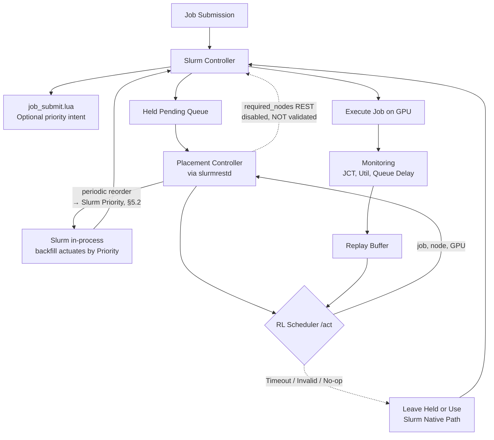

# 基於 Slurm 與 Kubernetes 架構下 AI 伺服器 GPU 工作負載智慧排程技術之研究

### Intelligent GPU Workload Scheduling Techniques for AI Servers under a Slurm-on-Kubernetes Architecture

**作者一¹、作者二²**
¹○○大學 ○○系　²○○大學 ○○系
{author1, author2}@stumail.nutn.edu.tw

---

## 摘要

異質 GPU 與 NVIDIA MPS 共享使排程器必須同時考量硬體差異、工作配額與佇列狀態；傳統 Slurm 靜態優先序難以動態兼顧工作完成時間（JCT）與尾端延遲 [1][2][3][4]。現有深度強化學習（DRL）排程研究多停留於模擬，較少在真實 Slurm 流程中處理 MPS-aware 工作派遣與 GPU placement。

本研究提出以 Slurm-on-Kubernetes 為排程核心的異質 GPU 智慧排程框架；Kubernetes 僅負責部署 [5]。框架以聯合動作介面建模 MPS-aware 工作派遣與 placement。本研究於 RTX 4070 與 RTX 3080 環境，以 trace-derived 混合 AI 工作負載比較 FCFS、Backfill、SAC、RDSAC 與 RLPD [6][7][8][9]。在由 DRL 控制順序、並以可落地的 **動態優先權重排（非阻塞週期性重排、失效安全）**下，使用真實 CUDA、poisson 到達、10 個 seed 與每次 150 個工作進行三點負載掃描。相較 Backfill，學習式策略的平均 JCT 改善幅度為 oversub=2 的 −2.7% 至 −4.9%、oversub=4 的 −8.1% 至 −10.0%、以及 oversub=6 的 −10.8% 至 −12.0%；其中 oversub=4、6 的所有學習臂達顯著差異，oversub=2 僅 RDSAC-cvar 顯著。P99 並未普遍改善，學習臂在各負載點勝過 Backfill 的 seed 數為 0–5/10；同時 GPU 利用率僅小幅增加，平均 slowdown 下降但 Jain slowdown fairness 約由 0.8 降至 0.7。結果顯示效益主要來自平均完成時間改善，並伴隨尾端與公平性的取捨。

**關鍵詞**：GPU 資源排程、異質 GPU、NVIDIA MPS、Slurm、Kubernetes、深度強化學習

## Abstract

The rapid growth of large language models and generative AI has made GPUs the primary compute resource for AI workloads [1][2]. However, many laboratory and small-scale clusters consist of heterogeneous GPU generations, and NVIDIA Multi-Process Service (MPS) allows multiple jobs to share a single GPU [3], making it difficult for traditional Slurm scheduling [4] to jointly optimize GPU utilization, job completion time (JCT), and tail latency. Existing Slurm policies rely on static priorities and cannot adapt to workload characteristics, while existing DRL schedulers rarely perform job selection and heterogeneous GPU placement under explicit MPS-quota constraints inside a real Slurm environment.

This paper proposes an intelligent scheduling framework for heterogeneous GPUs with NVIDIA MPS, using **Slurm as the scheduling core**. Kubernetes (k3s) only provides deployment and lifecycle management [5]. The policy interface models joint queue selection and placement. A placement-only real-machine path calls `/act` before submission and binds the selected node through `sbatch -w`, leaving job *ordering* to Slurm; the final evaluation instead uses a **non-blocking periodic re-prioritization daemon** (fail-safe): every few seconds it re-ranks the live pending queue by the served policy and writes administrator `Priority` on unheld jobs (`scontrol update`), letting Slurm's in-process backfill dispatch and place jobs natively. Under **real-CUDA aimix workloads and poisson arrival** (10 seeds, 150 jobs per run), learned policies reduce mean JCT versus Backfill by 2.7–4.9% at oversub=2, 8.1–10.0% at oversub=4, and 10.8–12.0% at oversub=6. All learned arms are significant at oversub=4 and 6; only RDSAC-cvar is significant at oversub=2. P99 is not consistently improved: learned policies beat Backfill in only 0–4 of 10 seeds across the load points. GPU utilization rises by at most about one percentage point, while mean slowdown decreases and Jain slowdown fairness declines from about 0.8 to 0.7. These results establish a mean-JCT benefit with explicit tail and fairness trade-offs rather than a universal improvement on every metric. Multiple-comparison-aware paired statistics and a placement-path discussion characterize the remaining efficacy boundary [6][7][8][9].

**Keywords**: GPU Resource Scheduling, Heterogeneous GPU, NVIDIA MPS, Slurm, Kubernetes, Deep Reinforcement Learning

---

## 1. 緒論

Slurm Workload Manager 是高效能運算叢集最廣泛使用的工作排程系統之一，提供完整的工作提交、佇列管理、資源限額與 GPU 資源配置功能 [4]，其以「節點」為基礎的資源模型非常適合研究工作環境。然而 Slurm 原生設計以固定實體節點為主，對彈性擴縮與容器化整合的支援相對有限。Kubernetes 則是目前最主流的容器編排平台，能自動管理容器的部署、擴縮與健康監控 [5]，但其原生排程器 (kube-scheduler) 以服務導向設計為主，對批次工作、GPU 共享與研究工作特有的排程需求支援不足。因此有多項研究嘗試將 Slurm 與 Kubernetes 整合，以同時取得批次排程語意與雲端彈性管理能力；實作層面也有 Slinky [10] 等 Slurm-on-Kubernetes 方向的工具，顯示此類架構已具有實務需求與發展基礎。

### 1.1 AI 工作負載快速增加

近年大型語言模型、生成式 AI 與深度學習服務快速發展，使 GPU 成為 AI 訓練與推論最重要的運算資源 [1][2]。相較於傳統批次運算，AI 叢集經常同時承載短時間推論、模型微調、長時間訓練與矩陣運算等不同工作，這些工作在執行時間、記憶體需求、延遲敏感度與 GPU 使用型態上皆有明顯差異 [1][2]。

在大學實驗室與中小型研究叢集中，GPU 資源通常有限，且硬體常由不同世代 GPU 漸進式擴充而成。例如 RTX 4070 與 RTX 3080 在算力、記憶體容量與功耗上皆不同。若排程器只把 GPU 視為同質資源，便可能讓小型推論工作佔用高效能 GPU，或讓長時間訓練阻塞後續短工作，造成 GPU utilization、JCT 與 queue delay 之間的取捨更加困難。

NVIDIA MPS 提供另一個重要槓桿：多個 CUDA 工作可共享同一張 GPU，使 GPU 不再只能以整張卡為單位分配 [3]。然而 MPS 也讓排程問題從「選哪張 GPU」變成「選哪張 GPU 與該工作需要多少 **MPS fraction**」。因此，在異質 GPU 與 MPS 共存的環境中，GPU scheduling 已成為影響叢集效能的核心問題。

### 1.2 現有方法限制

Slurm 提供 FCFS、Backfill、multifactor priority 與 GRES/TRES GPU 資源管理 [4]，但其傳統策略主要依賴靜態優先序，難以感知異質 GPU、MPS 分片、工作類型與長期回報之間的相互影響。現有方法主要存在四項限制：

1. **不充分考慮 GPU 差異**：許多排程方法把 GPU 視為同質資源，較少將不同世代 GPU 的算力、記憶體與執行時間差異納入 placement 決策。
2. **不充分考慮 MPS fraction**：部分研究討論 GPU sharing 或 GPU partition，但未將 **MPS fraction** 需求作為排程器的顯式感知變數。
3. **依賴靜態優先序**：FCFS 與 Backfill 能提供穩定基準，但難以隨工作負載動態調整策略。
4. **缺乏真實 Slurm 流程驗證**：不少學習式排程研究停留在模擬環境，未整合到真實 Slurm job submission path，也未處理服務失效與實機部署。

### 1.3 為什麼使用 DRL

GPU scheduling 不是單次分類問題，而是序列決策問題。一次 placement 會改變 GPU 剩餘 MPS、後續佇列等待時間、工作共置干擾與未來可用資源，因此當下看似最佳的放置，未必能帶來長期最佳的 JCT 或利用率。此問題具有三個適合使用 DRL 的特徵：

1. **Sequential decision**：每次工作放置會影響後續所有排程決策。
2. **Long-term optimization**：排程目標不只包含當下工作的執行時間，也包含 queue delay、makespan、tail latency 與整體 GPU utilization。
3. **Dynamic environment**：工作到達率、工作類型、GPU 使用率與 MPS 剩餘容量會隨時間改變，固定策略難以完整涵蓋所有情境。

因此，本研究採用 DRL 作為排程策略學習方法，讓代理人從模擬與實機回饋中學習 GPU placement 與 MPS-aware 排程的長期效果。

### 1.4 研究貢獻

本研究的核心貢獻在於將「異質 GPU + MPS + 真實 Slurm 流程」三者結合，具體如下：

1. **MPS 配額約束下的工作派遣與異質 GPU placement**：不同於 UXP-RL [11] 主要決定 CPU-vs-GPU 資源類型、KIS-S [12] 調整 Kubernetes 推論副本數、DRR [13] 處理 GPU 碎片化，本研究的策略介面與模擬環境將「派哪個工作」與「放到哪張異質 GPU」建模為聯合離散動作。每個工作攜帶既定的 MPS fraction 需求（25%/50%/75%/100%）作為 state 特徵與 action mask 的可行性約束，使決策在尊重 MPS 配額的前提下進行。此設計首次在真實 Slurm 佇列上刻畫「job 選擇與異質 GPU placement 聯合決策」相對於僅決定資源類型 [11] 或僅調整副本數 [12] 的可行性與行為差異。

2. **失效安全的 Slurm 策略層整合**：不同於 UXP-RL、KIS-S 等純模擬研究，本研究把學習式決策服務嵌入真實 Slurm job submission path，並提供 fail-safe 回退機制，當 RL 服務逾時、回傳無效 action 或健康檢查失敗時自動回退至 Slurm 原生策略，使排程核心 (slurmctld) 永不被阻塞。此設計讓 DRL scheduler 得以在真實排程路徑中部署，而不需修改 Slurm 核心。本研究因此證明學習式排程可在不更動 slurmctld 的前提下安全嵌入生產排程路徑，這是先前純模擬研究 [11][12] 未曾示範的部署可行性。

3. **實機比較與效益邊界分析**：本研究於 RTX 4070/3080 異質環境，以 trace-derived 混合 AI 工作負載比較 FCFS、Backfill、SAC、RDSAC 與 RLPD，並採 10 個 seed 的配對 Wilcoxon 檢定、95% CI、P99 勝負計數與 GPU telemetry。結果分析不同佇列深度下的平均 JCT、尾端 P99、slowdown、公平性與資源壓力；由於實驗環境限於小叢集，跨較大規模的效益仍待驗證。

## 2. 相關研究

### 2.1 GPU 叢集排程、分析與資源共享

近期研究聚焦於單節點內或單一叢集模型上的動態資源調度本身。Wang 等人的 DCUDA [14] 針對單節點多 GPU 情境，設計了一套輕量級核心／記憶體使用率監控機制，搭配近乎零開銷的「執行中」CUDA 應用即時遷移，將 GPU 過載時間平均降低 78.3%、一般工作執行時間降低 42.1%（記憶體密集型工作最高 67%）。Sedighi 等人 [15] 則在 Alibaba 的 cluster-trace-gpu 生產工作負載軌跡之上，提出結合硬體與軟體分割的公平且需求感知動態資源配置演算法，於模擬環境中將 GPU 資源使用量降低達 88%。這兩項工作皆聚焦「資源配置本身如何隨工作負載動態調整」（即時遷移／再分割），評估分別侷限於單一多 GPU 節點與純模擬 trace 重放，並未涉及與批次排程器（如 Slurm）的整合。

在 GPU 共享機制方面，NVIDIA MPS 允許多個 CUDA process 同時共享同一張 GPU 的運算資源 [3]，NVIDIA MIG 則在硬體層面將 GPU 切分成隔離的 instance [16]。學術上亦有更細緻的 partition 與時空共享研究，如多 GPU 伺服器上的時空共享服務 [17] 與現代 GPU 的階層式資源分割 [18]。針對深度學習工作負載，也有專門的叢集排程系統：Gandiva [19] 以 introspective 排程與工作遷移提升利用率，Tiresias [20] 以近似 age-based 的優先序縮短 JCT，MLaaS 生產叢集分析 [2] 則刻畫了大規模異質 GPU 叢集的工作特性。這些方法多假設整卡分配或同質 GPU，較少把 MPS fraction 作為排程流程的顯式決策脈絡。

### 2.2 強化學習排程

Lin 等人 [11] 提出 UXP-RL：一個以 DQN 為核心、涵蓋前處理／訓練／推論三類任務、可部署為集中式或分散式排程器、並跨雲／邊／霧三層架構運作的 CPU-GPU 任務排程演算法。其於**模擬環境**中，集中式排程器將平均週轉時間相較 SJF／FCFS 與 TYPE 基準分別降低 57.81%、57.28% 與 27.66%；分散式排程器則因能將長訓練工作卸載至雲端而把推論任務週轉時間再降低 89.07%。同年 Zhang 等人的 KIS-S [12] 以 PPO 訓練一個 GPU-aware 的 Kubernetes 推論自動擴縮策略，完全於自建模擬器 (KISim) 中訓練後零樣本部署，於多種流量情境下平均獎勵提升 75.2%；其問題設定是調整副本數的自動擴縮，而非本研究的工作放置排程。Wu 等人的 DRR [13] 則針對 GPU 共享叢集的碎片化問題，以模仿學習暖啟動一個深度強化學習去碎片化排程器，並同時於實體 Kubernetes 測試床與大規模模擬叢集上驗證，平均碎片率降低 50%，是少數同時涉及真實 Kubernetes 部署的學習式排程器。

在演算法基礎方面，Discrete SAC 將最大熵框架延伸到離散動作空間，以 categorical 策略取代高斯策略、以期望估計熵項 [6]；分布式評論家（如 IQN [7]、DSAC [8]）以回報分布與風險敏感目標處理尾端延遲；以 BatchNorm 移除 target network 以提升樣本效率的 CrossQ [21] 則代表近期簡化訓練流程的方向；RLPD [9] 進一步以對稱取樣真實資料的方式進行 offline-to-online 微調，降低從零探索的成本。然而，現有 RL scheduler 多假設單一 GPU、同質 GPU 或大型模擬叢集，或將 Kubernetes 當作排程主體（如 Kubeflow [22]、Volcano [23]、Kueue [24]、NVIDIA KAI [25]）；較少探討在真實 Slurm 流程中，如何讓 RL 同時決定異質 GPU placement 與 MPS-aware 排程，並在服務失效時維持排程安全。

### 2.3 異質與邊緣 GPU 排程

Tsenos 與 Kalogeraki [26] 針對缺乏原生虛擬化支援的邊緣 GPU（如消費級卡）提出一套硬體無關的時空共享機制：為每個行程建立 cgroup、動態調整其 duty cycle 來實現優先權式與截止期限式排程，且無需修改工作負載原始碼即可整合進 TensorFlow、PyTorch、FFmpeg 等既有框架。Majeed 等人 [27] 則以系統性文獻回顧整理 NVIDIA Jetson 系列邊緣 SoC 上的 DNN 排程器，區分規則式與最佳化式兩大類，並整理其記憶體競爭、跨加速器轉移成本與靜態／動態排程的權衡；其排程粒度是單一 DNN 模型內的層級（將個別網路層指派給不同硬體加速器）。這些邊緣場景的資源與延遲約束與資料中心叢集不同，惟顯示異質硬體上的細粒度排程是一個活躍的研究方向。此外，異質 Kubernetes 叢集上的 RL 排程 [28]、混合學習與最佳化排程 [29] 與語意感知的 LLM 叢集排程 [30] 亦顯示學習式方法在異質資源分配上的潛力。

### 2.4 定位比較

表 1 彙整本研究與主要研究類型的定位差異。本研究的核心位置在於將「異質 GPU + MPS + 真實 Slurm 流程」三者結合；Kubernetes 僅是部署平台 [5]，不是本文的主要排程貢獻。

表 1. 相關研究定位比較

| 類型 | 是否考慮異質 GPU | 是否考慮 MPS fraction | 是否整合真實 Slurm | 主要限制 |
|---|:--:|:--:|:--:|---|
| FCFS / Backfill [4] | 部分 | 部分 | 是 | Slurm 原生策略，難以學習長期效果 |
| GPU sharing / partition [3][16][17][18] | 部分 | 部分 | 否 | 多聚焦 partition 機制，較少處理排程流程 |
| RL scheduler（模擬）[11][12] | 部分 | 少 | 否 | sim-to-real 效益不明 |
| RL scheduler（真實 K8s）[13] | 部分 | 少 | 否 | 針對碎片化，非 Slurm 工作流 |
| Kubernetes GPU scheduler [22][23][24][25] | 部分 | 部分 | 否 | Kubernetes 是排程主體，不處理 Slurm 工作流 |
| 本研究 | 是 | 是 | 是 | 目前實機規模仍小，需擴大驗證 |

## 3. 研究目的與系統架構

### 3.1 研究目的

基於上述背景，本研究聚焦於以下三項問題：

1. 在每個工作的 MPS 配額與 GPU 型號差異（異質 GPU）同時存在時，聯合考慮工作選擇與 GPU 放置能否改善工作完成時間？
2. 學習式策略接入真實 Slurm 排程機制後，能否在保有失效回退機制的條件下，與 FCFS 及 Backfill 進行公平比較？
3. 在不同 job queue 深度下，學習式策略能否改善平均 JCT，且改善是否會延伸到尾端延遲、GPU 利用率與工作公平性？

本研究的核心貢獻在於將「異質 GPU + MPS + 真實 Slurm 流程」三者結合，主要貢獻有三：

- **MPS 配額約束下的工作派遣與異質 GPU placement**。不同於 UXP-RL [4] 主要決定 CPU-vs-GPU 資源類型、KIS-S [5] 調整 Kubernetes 推論副本數、DRR [6] 處理 GPU 碎片化，本研究的策略介面與模擬環境將「派哪個工作」與「放到哪張異質 GPU」建模為聯合離散動作。每個工作攜帶既定的 MPS 配額需求作為 state 特徵與 action mask 的可行性約束，使決策在尊重 MPS 配額的前提下進行。此設計在模擬環境刻畫「job 選擇與異質 GPU placement 聯合決策」，實機則聚焦提交時 placement 相對於僅決定資源類型 [4] 或僅調整副本數 [5] 的可行性與行為差異。
- **失效安全的 Slurm 策略層整合**。不同於 UXP-RL、KIS-S 等純模擬研究，本研究把學習式決策服務嵌入 Slurm job submission path，並提供 fail-safe 回退機制，當學習式排程服務逾時就自動回退至 Slurm 原生策略，在評估量測中未觀察到逾時，且策略服務失效時具備回退機制。此設計讓客製化 DRL 排程器得以在真實排程路徑中部署，而不需修改 Slurm 核心，這是先前純模擬研究 [4, 5] 未曾示範的部署可行性。
- **實機比較與效益分析**。本研究於 RTX 4070 與 RTX 3080 異質環境，以 trace-derived 混合 AI 工作負載比較 FCFS、Backfill、SAC、RDSAC 與 RLPD，並使用 10 個 seed 的配對統計與完整 GPU telemetry。最新實機結果顯示，學習式策略相對 Backfill 的平均 JCT 改善隨負載由 −2.7%～−4.9%（oversub=2）擴大至 −8.1%～−10.0%（oversub=4）與 −10.8%～−12.0%（oversub=6）；但 P99 勝率僅 0–5/10，且公平性指標顯示平均 slowdown 降低伴隨 Jain slowdown 由約 0.8 降至 0.7，故效益不是所有指標都同步改善。

**State.** 狀態包含四類資訊：

1. **Job features**：工作類型、預估 runtime、GPU memory 需求、MPS 需求、SLO 緊迫度與等待時間。
2. **GPU features**：GPU 型號、GPU utilization、SM utilization、memory usage、可用 MPS、目前共置工作數。
3. **Queue features**：佇列長度、前 K 個工作的需求、等待時間分布與到達率。
4. **History features**：近期完成工作 JCT、slowdown、SLO violation 與各 GPU 的負載變化。

**Action.** 動作為「從佇列前 K 個工作中選一個」與「將其放置到哪張 GPU」的聯合離散決策，另含一個 no-op（暫不派遣）：

$$
\text{Action} \;=\; \big(\text{選 job}_i \in \text{top-}K\ \text{佇列}\big) \,\times\, \big(\text{放置至 node}_j / \text{gpu}_k\big) \;\cup\; \{\text{no-op}\}
$$

在本研究的 2×1 實驗平台（K=16、2 個 placement）中，動作空間為 16×2+1 = 33 個離散動作，observation 維度為 168。每個工作攜帶自身的 MPS fraction 需求（25%/50%/75%/100%），排程器透過 state 特徵感知、並由 action mask 遮蔽 MPS 剩餘容量不足的放置，因此策略是在符合工作 MPS 需求的前提下做 job 選擇與 placement

**Reward.** Reward 的設計目標是降低使用者感受到的等待與完成時間、同時抑制尾端延遲並促進異質節點間的負載均衡。本研究之產出模型（§5.8 之 fairness-reward checkpoint）以下列**單一**每步回報訓練（不再區分單／多目標；S 為 `reward_scale`）：

$$
\begin{aligned}
r_t \;=&\; \underbrace{\sum_{j \in \mathcal{C}(t)} \left[ -\frac{\mathrm{JCT}_j}{S} \;-\; \lambda_{\mathrm{fair}}\left(\frac{\mathrm{JCT}_j}{S}\right)^{2} \right]}_{\text{工作完成時計入}} \;+\; \underbrace{\big[\, \gamma\,\phi(s_{t+1}) - \phi(s_t) \,\big]}_{\text{每步 potential shaping}}, \\[4pt]
\phi(s) \;=&\; -\frac{1}{S\,N}\sum_{i \in \mathcal{P}(s)} \mathrm{wait}_i \;-\; \lambda_{\mathrm{bal}}\cdot \mathrm{imbalance}(s), \\[4pt]
\mathrm{imbalance}(s) \;=&\; \frac{\mathrm{std}_n\big(\mathrm{freeMPS}_n\big)}{\mathrm{MPSperGPU}},
\end{aligned}
$$

其中 $\mathcal{C}(t)$ 為在第 $t$ 步完成的工作集合、$\mathcal{P}(s)$ 為狀態 $s$ 下的待排（pending）工作集合。訓練參數：**$\lambda_{\mathrm{fair}}=5.0$、$\lambda_{\mathrm{bal}}=5.0$、$\gamma=0.99$、$S=20000$（reward_scale）、$N=$ 每 episode 工作數**。各項意義如下：

- **完成項**（工作完成時計入）：$-\mathrm{JCT}_j/S$，其中 $\mathrm{JCT}=$ 完成時間 $-$ 提交時間、已含 queue delay，$S$ 使該項落於 $O(0.1)$ 尺度。此為主要吞吐訊號。
- **公平／抗飢餓項**：$-\lambda_{\mathrm{fair}}(\mathrm{JCT}_j/S)^{2}$，對單一工作 JCT 的**凸（平方）懲罰**。其效果為將目標由純平均改寫為

$$
\min \sum_j \Big(\mathrm{JCT}_j + \lambda_{\mathrm{fair}}\,\mathrm{JCT}_j^{2}\Big) \;=\; \underbrace{\textstyle\sum_j \mathrm{JCT}_j}_{\text{平均}} \;+\; \underbrace{\lambda_{\mathrm{fair}}\textstyle\sum_j \mathrm{JCT}_j^{2}}_{\text{尾端／變異項}},
$$

  是一個**改變目標**的項（非 optimum-preserving），刻意以少許平均換取有界的最差情況——這正是純平均-JCT reward 無法表達、而 §5.8 尾端結果所需者。
- **Potential-based shaping** $\gamma\,\phi(s')-\phi(s)$ [31]：提供密集訊號且**不改變最優策略**（Ng et al. 1999）。$\phi$ 含兩部分——(i) 待排工作的累計等待（排入工作即降低總等待 $\to$ 每步正向 bonus）；(ii) **節點負載均衡項** $-\lambda_{\mathrm{bal}}\cdot\mathrm{imbalance}$，懲罰把負載集中於單一節點，於 2×1 異質叢集促進 free-MPS 平衡。

需澄清一點：**interference（干擾）並非 reward 項而是環境動力學**。訓練環境設 `interference=0.3`，即工作的實際執行時間為

$$
\mathrm{runtime}_{\text{real}} \;=\; \mathrm{runtime}_{\text{nominal}} \times \big(1 + 0.3\,k\big), \qquad k = \text{同一 GPU 上的共置工作數},
$$

使 MPS 過度打包付出真實的執行變慢代價；此設定讓上述 fairness／balance 訊號在「打包 vs 干擾」的真實張力下學習，而非 reward 公式的一部分。此 reward 設計讓 DRL 不只最佳化單一工作，而是學習兼顧平均、尾端與節點均衡的長期排程結果。

### 3.2 系統架構

本研究建立一套以 Slurm 為排程核心的異質 GPU + MPS 智慧排程平台（圖 1）。學習式策略以服務形式接入 Slurm 的工作提交流程：策略讀取工作、GPU、MPS 剩餘容量與佇列狀態，輸出建議的工作與 GPU placement，並由系統於提交時據以綁定節點（工作的 MPS fraction 依其請求分配、非策略輸出）。若策略服務逾時或回傳不可行決策，系統自動回退至 Slurm 原生路徑，確保排程核心不被阻塞。工作執行期間，監控服務收集資源使用、queue delay、JCT 與 reward，寫入 replay buffer 供後續訓練或 RLPD (Reinforcement Learning with Prior Data) [9] 微調使用。

需說明的是，本文的最新實機評估聚焦於**原生排序施行路徑**：工作正常以 unheld 方式提交，daemon 週期性讀取 pending queue，依策略更新 Slurm `Priority`，再由 Slurm 自身的 in-process backfill 決定派工時機與 GPU placement。由策略即時從佇列挑選下一個工作並以 held-job 控制器透過 `required_nodes` REST 呼叫派工，在受測 slurmrestd 中未納入本次效能宣稱；因此本文不把最新結果解讀為 RL 已完全控制 GPU placement。Priority daemon 失效時仍回退至 Slurm 原生路徑，確保工作不被阻塞。

**圖 1. 系統架構與排程流程。** 學習式策略接入 Slurm 提交流程，週期性讀取 pending queue 並更新工作 Priority；透過 `required_nodes` REST 的即時派工未納入最新實機效能宣稱（圖中虛線），Slurm 自身 in-process backfill 負責派工與 placement。逾時、不可行決策或 no-op 時回退至 Slurm 原生路徑。監控服務週期蒐集資源使用、queue delay 與 job events，寫入 Replay Buffer。

本平台使用 Kubernetes (k3s) 部署 Slurm controller、worker、RL scheduler、monitoring service 與相關容器 [5]。底層 GPU 基礎建設是透過 Kubernetes Dynamic Resource Allocation (DRA) 宣告與取得裝置 [32]，工作層級的 MPS 配額仍由 Slurm `gres/mps` 與對應的 MPS 執行環境落實。**Kubernetes 在本文中不負責工作排程決策**，只提供容器化部署、服務健康檢查、網路與生命週期管理。此設計保留 Slurm 在 HPC batch scheduling 中成熟的佇列語意 [4]。此方向與將 Slurm 整合進 Kubernetes 的 Slinky [10] 互補：Slinky 提供 Slurm-on-Kubernetes 部署基礎，本研究則在 Slurm 排程路徑上加入具失效回退機制的學習式策略層。

## 4. 排程技術

本章介紹本研究的 scheduler：以 Slurm 原生能力 Backfill 作為穩定 baseline，再以 DRL agent 學習序列排程策略。

### 4.1 Slurm 內建排程演算法

本研究以 Slurm 原生排程能力作為穩定基線，而非重寫排程核心。例如 Backfill 允許在不延後高優先權工作的前提下，讓資源需求較小、執行時間較短的工作提前插隊執行，緩解大工作長期佔用資源造成的閒置；此外也納入更保守的 FCFS 作為基準對照（為現成排程器基準，非理論下界），用以檢驗學習式策略相對 Slurm 開箱即用能力是否確有改善。

### 4.2 深度強化學習策略

本研究比較以下 DRL 方法：

1. **Discrete SAC**：將 Soft Actor-Critic 延伸到離散 action space，以 categorical 策略取代高斯策略、以期望估計熵項，適合 job 選擇與 GPU placement 這類有限離散動作 [6]。
2. **RDSAC-mean**：以分布式 critic 建模回報分布，但 actor 主要依平均回報決策 [7][8]。
3. **RDSAC-cvar**：在 RDSAC 上加入 CVaR 風險敏感目標，使策略更重視尾端 JCT 與 SLO violation [8]。
4. **RLPD**：以真實資料對模擬訓練出的模型進行微調，縮小 sim-to-real gap [9]。本研究忠實採用原論文核心配方——每個 batch 對稱取樣 50% sim 先驗 + 50% 真實資料、critic 加 LayerNorm 的 critic ensemble、高 UTD——但訓練機制為離線（更新迴圈只做梯度更新、不在真環境即時互動），故為「sim + 真實混合 buffer 的離線微調」，非原論文的真線上更新。具體作法為：**暖啟動自對應 campaign 的 RDSAC-cvar base**（§5.2 重載複核用早期 RDSAC-cvar base、§5.8 用該節之 fairness-reward RDSAC-cvar base），offline 先驗為同一異質 regime 的 sim rollouts、online 半批為 §5.1 所述之真實 Slurm 線上日誌（168 維、2 786 筆 transition、以 sacct 真實 JCT 計 reward）。關鍵在於 **RLPD 微調階段的 reward 刻意採 `jct_aligned`（$-\mathrm{JCT}/1000$）而非 base 的 mo＋公平 reward**：RLPD 的 critic 從頭學起，需要 offline↔online 兩半批的 reward *定義一致*，而線上日誌記錄的即是 $-\mathrm{JCT}/1000$，故 offline 半批亦以同尺度的 `jct_aligned` 計，而非與 base 的訓練目標一致（此為與其他三臂在 reward 上的**刻意差異**）。微調配置：offline-steps=50 000、gradient updates=200、UTD=20、固定 $\alpha=0.05$。

RDSAC 採用雙頭 IQN critic 建模 reward return 與 entropy return [7]，並使用 masked categorical actor 避免選到不可執行 action（即所選放置的 GPU 剩餘 MPS 不足以容納該工作請求的動作）。訓練流程包含 prioritized replay、n-step return 與 potential-based reward shaping [31]。需澄清命名：本研究的 RDSAC 為自組的「distributional + discrete SAC」，以離散動作空間搭配 IQN 分位數 critic 建構 [7][8]，與 Duan 等人 [33] 針對連續控制、將回報建模為單一高斯分布的 Distributional Soft Actor-Critic 不同，兩者不應混淆。

## 5. 實驗與評估

### 5.1 實驗環境與訓練

本研究使用一個小規模異質 GPU 實機叢集進行部署與評估，相關環境如表 2 所示。此環境刻意保留 GPU 世代差異，讓排程器必須面對異質 GPU placement 的問題；由於硬體規模只有兩張 GPU，本研究將結果定位為實機 proof-of-concept 與方法學驗證，不直接外推至大型生產叢集。

表 2. 實驗環境列表

| 項目 | 設定 |
|---|---|
| 節點 1（控制平面） | Intel Core i7-10700（16 執行緒）、64 GB RAM、NVIDIA RTX 4070 |
| 節點 2（工作節點） | Intel Core i7-9700、8 GB RAM、NVIDIA RTX 3080 |
| 作業系統 | Ubuntu 24.04.4 LTS（kernel 7.0.0 / 6.8.0） |
| NVIDIA driver／CUDA | 580.167.08／CUDA 13.0 |
| 容器平台 | k3s v1.35.8、containerd 2.2.7-k3s1；僅負責容器部署與服務生命週期 [5] |
| GPU 資源宣告 | Kubernetes Dynamic Resource Allocation (DRA) driver v0.4.1 [32] |
| 排程器 | Slurm 23.11.4 with GRES/TRES and MPS（slurmrestd REST API v0.0.39）[4] |
| GPU sharing | NVIDIA MPS，MPS fraction 為 25%、50%、75%、100% [3] |
| 深度學習框架 | PyTorch |
| 網路 | 同一區域網路，節點間 RTT ≈ 0.16 ms（ping 量測，可忽略） |
| 監控 | SM 利用率、memory usage、job event、queue delay |

訓練資料集使用 Alibaba GPU Trace 與 Microsoft Philly Trace：前者用於參考生產 MLaaS 工作的到達率、工作長度與資源需求分布 [2]，後者用於參考多租戶 GPU training workload 的佇列與 JCT 特性 [1]。同時在本研究叢集上執行 cuBLAS、BERT inference、ResNet training、Qwen fine-tuning 與矩陣運算等真實 AI 工作。

為確保比較公平，各方法在同一評估中取得一致的工作資訊：FCFS／Backfill 使用提交時的 Slurm time-limit，學習式策略使用相同的工作特徵與 MPS 請求；模擬與實機均不讓單一方法取得其他方法沒有的未來資訊。

直接在實際環境從頭訓練需要數十萬到數百萬個 transition，而真實叢集中一個決策對應一個跑數分鐘至數小時的任務，收集足夠樣本需時數月。因此本研究採 sim-to-real 兩段式：(1) 在模擬環境大量訓練，產出基本模型；(2) 上線部署，記錄真實叢集 (observation, action, reward) 資料；(3) 以 RLPD 用真實資料把基本模型微調成真實環境策略。DRL 訓練參數如表 3 所示；所有學習臂共用網路與最佳化設定，僅 critic 家族與風險目標不同。

表 3. DRL 訓練超參數

| 項目 | 數值 |
|---|---|
| 優化器／學習率（actor, critic, α） | Adam／3×10⁻⁴ |
| 折扣 γ／目標軟更新 τ | 0.99／0.005 |
| 隱藏層（MLP trunk） | (256, 256) + LayerNorm |
| batch size／UTD ratio | 256／4 |
| n-step return | 10 |
| replay | Prioritized (SumTree) |
| IQN 分位數 N_QUANT／cosine 維度 | 32／64（RDSAC 臂） |
| 風險目標／tail mass β | CVaR／0.25（RDSAC-cvar 臂） |
| 溫度 α | 固定 0.05 |
| reward（§3.1） | mo：−JCT/S 完成項＋凸公平項 λ_fair=5.0＋potential shaping（等待＋節點均衡 λ_bal=5.0）；S=reward_scale=20000；環境 interference=0.3 |
| 訓練長度 | 每臂約 1×10⁵ curriculum env-steps |

圖 2 為三個學習臂在 aimix-family 課程訓練下的 episode reward 與 critic loss（跨 seed、rolling window w=80 平滑）。三臂皆使用固定溫度 α=0.05；曲線在課程切換後維持有限值，未出現數值發散。由於不同 critic 的 loss 尺度不可直接比較，圖 2 僅用於檢查訓練穩定性，不據此判定策略優劣。

**圖 2. 學習臂訓練收斂**（SAC / RDSAC-mean / RDSAC-cvar，aimix-family 課程，跨 seed 平均、rolling window w=80）。

### 5.2 實機評估結果

在 BERT 推論、ResNet 訓練、Qwen 微調與 cuBLAS 矩陣運算四路混合工作負載（數量占比分別為 30%、30%、30%、10%）下，每個 seed 提交 150 個工作，使用 seed 42–51 進行評估。工作以 poisson 到達，平均 inter-arrival 為 mean(runtime)/oversub，故 oversub=2、4、6 分別形成淺、中、深三種 job queue 深度。所有方法使用同一 seed 的到達時刻與工作序列；實機路徑為非阻塞的動態 Slurm Priority 重排，工作由 Slurm 原生 backfill 派工與放置。

JCT、P50、P95 與 P99 為各 seed 內 150 個工作的統計量，再以 10 個 seed 做未加權平均 ± 標準差；ΔmeanJCT% 為同 seed 相對 Backfill 的配對差，並附 95% CI、Wilcoxon *p* 與 P99 勝負計數。GPU telemetry 以兩個 worker pod 內的 `nvidia-smi` 每秒取樣；完成率與 telemetry 完整性均列入檢查。表 4–6 保留延遲指標，表 8 另列資源、slowdown、公平性、等待時間與完整性指標。

表 4. 重載混合工作負載評估結果（oversub=6，動態優先權重排，10 seeds × 150 工作）

| 排程策略 | 平均 JCT (s) | P50 (s) | P95 (s) | P99 (s) | ΔmeanJCT% [95% CI] | Wilcoxon *p* | P99<bf |
|---|--:|--:|--:|--:|--:|--:|--:|
| FCFS | 335.7 ± 18.8 | 339.1 ± 26.4 | 614.2 ± 24.0 | 637.4 ± 25.5 | +5.3 [+2.6, +8.0] | 0.002 | 5/10 |
| Backfill | 319.0 ± 17.9 | 311.9 ± 23.0 | 609.1 ± 32.6 | 633.1 ± 32.9 | — | — | — |
| SAC | 280.6 ± 18.0 | 243.0 ± 27.7 | 603.9 ± 52.7 | 679.1 ± 70.7 | −12.0 [−14.2, −9.8] | 0.002 | 3/10 |
| RDSAC-mean | 283.8 ± 15.6 | 262.4 ± 31.9 | 584.3 ± 26.9 | 698.8 ± 52.9 | −11.0 [−12.3, −9.8] | 0.002 | 1/10 |
| RDSAC-cvar | 280.4 ± 16.8 | 236.3 ± 31.8 | 611.1 ± 27.8 | 690.6 ± 55.9 | −12.0 [−14.8, −9.3] | 0.002 | 3/10 |
| RLPD | 284.4 ± 18.1 | 237.0 ± 27.1 | 680.6 ± 61.2 | 704.4 ± 68.4 | −10.8 [−13.1, −8.6] | 0.002 | 3/10 |

表 5. 中載混合工作負載評估結果（oversub=4，動態優先權重排，10 seeds × 150 工作）

| 排程策略 | 平均 JCT (s) | P50 (s) | P95 (s) | P99 (s) | ΔmeanJCT% [95% CI] | Wilcoxon *p* | P99<bf |
|---|--:|--:|--:|--:|--:|--:|--:|
| FCFS | 318.6 ± 23.6 | 325.4 ± 32.8 | 577.3 ± 32.4 | 599.2 ± 33.4 | +14.0 [+9.0, +19.1] | 0.002 | 0/10 |
| Backfill | 280.2 ± 21.6 | 278.3 ± 26.9 | 531.3 ± 31.0 | 550.4 ± 33.2 | — | — | — |
| SAC | 253.1 ± 16.6 | 228.6 ± 28.2 | 540.1 ± 77.0 | 639.4 ± 99.2 | −9.5 [−12.3, −6.7] | 0.002 | 4/10 |
| RDSAC-mean | 252.9 ± 20.4 | 229.1 ± 34.3 | 511.7 ± 29.9 | 652.9 ± 71.2 | −9.7 [−12.3, −7.0] | 0.002 | 1/10 |
| RDSAC-cvar | 257.8 ± 23.8 | 237.8 ± 32.6 | 555.9 ± 56.4 | 648.2 ± 85.9 | −8.1 [−9.8, −6.3] | 0.002 | 0/10 |
| RLPD | 251.7 ± 16.2 | 214.2 ± 26.8 | 641.7 ± 75.1 | 666.5 ± 83.2 | −10.0 [−12.1, −8.0] | 0.002 | 1/10 |

表 6. 淺載混合工作負載評估結果（oversub=2，動態優先權重排，10 seeds × 150 工作）

| 排程策略 | 平均 JCT (s) | P50 (s) | P95 (s) | P99 (s) | ΔmeanJCT% [95% CI] | Wilcoxon *p* | P99<bf |
|---|--:|--:|--:|--:|--:|--:|--:|
| FCFS | 180.9 ± 33.7 | 187.8 ± 40.6 | 317.8 ± 60.7 | 330.0 ± 63.4 | +1.6 [−1.7, +4.9] | 0.322 | 6/10 |
| Backfill | 177.6 ± 28.9 | 179.7 ± 37.5 | 322.6 ± 50.4 | 335.3 ± 52.0 | — | — | — |
| SAC | 169.3 ± 26.2 | 169.1 ± 23.7 | 329.6 ± 71.9 | 362.4 ± 102.9 | −4.4 [−8.2, −0.5] | 0.064 | 2/10 |
| RDSAC-mean | 170.8 ± 24.2 | 169.6 ± 29.2 | 318.4 ± 43.7 | 359.9 ± 75.3 | −3.4 [−7.0, +0.3] | 0.105 | 3/10 |
| RDSAC-cvar | 168.3 ± 24.1 | 169.4 ± 26.4 | 319.6 ± 51.6 | 366.2 ± 117.9 | −4.9 [−7.4, −2.5] | 0.006 | 3/10 |
| RLPD | 172.1 ± 24.3 | 174.1 ± 23.7 | 319.4 ± 48.6 | 338.4 ± 49.4 | −2.7 [−5.5, +0.1] | 0.084 | 5/10 |

表 7. 三點 poisson 負載掃描：相對 Backfill 的 seed-level 配對 ΔmeanJCT%（負值＝快於 Backfill；平均 ± 標準差；括號為 Backfill 絕對平均 JCT）

| 策略 | oversub=2（177.6 s） | oversub=4（280.2 s） | oversub=6（319.0 s） |
|---|--:|--:|--:|
| FCFS | +1.6 ± 5.3 | +14.0 ± 8.2 | +5.3 ± 4.3 |
| SAC | −4.4 ± 6.2 | −9.5 ± 4.5 | −12.0 ± 3.6 |
| RDSAC-mean | −3.4 ± 5.9 | −9.7 ± 4.3 | −11.0 ± 2.0 |
| RDSAC-cvar | −4.9 ± 3.9 | −8.1 ± 2.9 | −12.0 ± 4.4 |
| RLPD | −2.7 ± 4.5 | −10.0 ± 3.3 | −10.8 ± 3.7 |

表 8. 資源、工作公平性與完整性指標（平均 ± 標準差；10 seeds）

| 負載 | 策略 | GPU 利用率 (%) | VRAM 平均／峰值 (%) | slowdown 平均／P95／最大 | Jain slowdown | 等待 P95 (s) | 完成率 | telemetry |
|---|---|--:|--:|--:|--:|--:|--:|--:|
| ov2 | FCFS | 55.4 ± 1.9 | 28.0 ± 1.2 / 84.2 ± 0.0 | 3.0 / 5.3 / 5.6 | 0.8 ± 0.0 | 304.5 ± 60.6 | 100% | 10/10 |
| ov2 | Backfill | 54.9 ± 1.4 | 27.9 ± 1.3 / 84.2 ± 0.0 | 3.0 / 5.4 / 5.7 | 0.8 ± 0.0 | 308.3 ± 49.8 | 100% | 10/10 |
| ov2 | SAC | 55.2 ± 2.0 | 28.2 ± 1.2 / 84.2 ± 0.0 | 2.8 / 5.5 / 7.3 | 0.7 ± 0.0 | 315.2 ± 71.8 | 100% | 10/10 |
| ov2 | RDSAC-mean | 54.9 ± 2.0 | 28.1 ± 1.1 / 84.2 ± 0.0 | 2.8 / 5.3 / 6.7 | 0.8 ± 0.0 | 304.3 ± 44.6 | 100% | 10/10 |
| ov2 | RDSAC-cvar | 55.1 ± 1.9 | 28.2 ± 1.2 / 84.2 ± 0.0 | 2.8 / 5.3 / 6.8 | 0.7 ± 0.0 | 306.1 ± 51.9 | 100% | 10/10 |
| ov2 | RLPD | 55.2 ± 1.7 | 28.2 ± 1.2 / 84.3 ± 0.1 | 2.9 / 5.3 / 5.8 | 0.8 ± 0.0 | 305.8 ± 49.5 | 100% | 10/10 |
| ov4 | FCFS | 54.6 ± 1.8 | 27.4 ± 0.9 / 84.2 ± 0.0 | 5.3 / 9.6 / 10.1 | 0.8 ± 0.0 | 564.7 ± 33.8 | 100% | 10/10 |
| ov4 | Backfill | 56.9 ± 1.6 | 28.7 ± 1.1 / 84.2 ± 0.0 | 4.7 / 8.9 / 9.4 | 0.8 ± 0.0 | 518.8 ± 32.3 | 100% | 10/10 |
| ov4 | SAC | 57.7 ± 2.5 | 29.5 ± 1.2 / 84.2 ± 0.0 | 4.2 / 9.0 / 11.5 | 0.7 ± 0.0 | 527.2 ± 75.8 | 100% | 10/10 |
| ov4 | RDSAC-mean | 57.8 ± 1.9 | 29.5 ± 1.2 / 84.2 ± 0.0 | 4.2 / 8.5 / 11.8 | 0.7 ± 0.0 | 497.5 ± 30.0 | 100% | 10/10 |
| ov4 | RDSAC-cvar | 57.8 ± 1.4 | 29.4 ± 1.4 / 84.2 ± 0.0 | 4.3 / 9.3 / 11.7 | 0.7 ± 0.0 | 543.7 ± 56.4 | 100% | 10/10 |
| ov4 | RLPD | 57.4 ± 1.9 | 29.4 ± 1.4 / 83.7 ± 1.7 | 4.2 / 10.7 / 11.3 | 0.7 ± 0.0 | 628.9 ± 74.8 | 100% | 10/10 |
| ov6 | FCFS | 57.2 ± 1.6 | 28.6 ± 1.2 / 83.7 ± 1.7 | 5.6 / 10.2 / 10.8 | 0.8 ± 0.0 | 601.9 ± 26.5 | 100% | 10/10 |
| ov6 | Backfill | 57.2 ± 2.1 | 28.8 ± 1.4 / 84.2 ± 0.0 | 5.3 / 10.2 / 10.8 | 0.8 ± 0.0 | 596.5 ± 32.8 | 100% | 10/10 |
| ov6 | SAC | 58.1 ± 2.4 | 29.6 ± 1.3 / 83.7 ± 1.7 | 4.7 / 10.1 / 12.4 | 0.7 ± 0.0 | 589.4 ± 53.8 | 100% | 10/10 |
| ov6 | RDSAC-mean | 58.2 ± 1.9 | 29.5 ± 1.2 / 83.7 ± 1.7 | 4.7 / 9.7 / 12.5 | 0.7 ± 0.0 | 571.4 ± 26.5 | 100% | 10/10 |
| ov6 | RDSAC-cvar | 57.7 ± 1.8 | 29.3 ± 1.3 / 83.7 ± 1.7 | 4.7 / 10.2 / 12.3 | 0.7 ± 0.0 | 597.4 ± 26.8 | 100% | 10/10 |
| ov6 | RLPD | 57.5 ± 2.2 | 29.3 ± 1.4 / 83.7 ± 1.7 | 4.7 / 11.3 / 11.9 | 0.7 ± 0.0 | 669.2 ± 60.2 | 100% | 10/10 |

**結果分析。** 平均 JCT 的改善在 oversub=2 僅 −2.7% 至 −4.9%，其中 RDSAC-cvar 的 *p*=0.006，其餘學習臂未達顯著；oversub=4 所有學習臂為 −8.1% 至 −10.0%，oversub=6 為 −10.8% 至 −12.0%，均為 *p*=0.002。FCFS 在三個負載點均慢於或接近 Backfill，尤其 oversub=4 的差異為 +14.0%。

P99 沒有跟隨平均 JCT 一起改善：oversub=2 的學習臂僅有 2–5/10 個 seed 勝過 Backfill，oversub=4 為 0–4/10，oversub=6 為 1–3/10；FCFS 在 oversub=4 更沒有任何 seed 勝過 Backfill。換言之，最新實機證據支持「學習式排序改善平均 JCT」，但不支持「學習式策略普遍降低 P99」的結論。

資源與公平性結果顯示，學習臂的 GPU 利用率相較 Backfill 約增加 0–1.0 個百分點，VRAM 平均壓力增加約 0.2–0.8 個百分點，峰值大致維持 84%。平均 slowdown 在中、重載由 Backfill 的 4.7／5.3 降至約 4.2／4.7，等待時間 P95 也以 RDSAC-mean 在 oversub=4（497.5 s）與 oversub=6（571.4 s）最低；但 RLPD 的等待 P95 在兩個負載點分別為 628.9 s 與 669.2 s，顯示平均改善並不保證尾端等待改善。Jain slowdown fairness 多數學習臂約 0.7，而 FCFS／Backfill 約 0.8，表示本 campaign 存在吞吐與公平性的取捨。所有 180 個結果均完成，六種策略在三個負載點的完成率皆為 100%，兩張 GPU 的 telemetry 完整性皆為 10/10。

### 5.3 系統行為量測

除排程品質外，本研究亦量測學習式決策路徑的系統行為，以檢驗其失效安全整合是否非侵入。在 2×1 平台上以 8 個工作負載 seed（每 seed 125 個工作）重放排程序列，於控制平面（CPU）逐次計時策略決策，並依線上服務的判定門檻（低信心 value／entropy）將每次決策分類為 RL 主導、低信心回退，或暫不派遣（no-op），結果如表 9。

決策延遲為次毫秒級（p99 0.27 ms、最大 7.3 ms），較 Lua hook 的 fail-safe 逾時門檻（150 ms）低約三個數量級；在 76,099 次決策中無任一次逾時，顯示 RL 路徑對 slurmctld 幾乎零額外負擔，逾時型回退不會因決策過慢而觸發。在實際放置決策中約 12% 因低信心回退至 Slurm 原生基準、其餘由 RL 主導；其中大量的 no-op 反映離散事件下多數時間步並無可派工作，屬正常等待行為。

表 9. 系統行為量測（RDSAC-cvar 策略，2×1，8 seeds × 125 工作，控制平面 CPU）

| 指標 | 數值 |
|---|--:|
| 決策延遲 mean／p50／p95／p99／max (ms) | 0.19／0.18／0.26／0.27／7.27 |
| 逾時（> 150 ms fail-safe 門檻）比例 | 0.00%（0 / 76,099） |
| 放置決策中低信心回退比例 | 12.0%（115 / 959） |
| RL 主導放置比例 | 88.0%（844 / 959） |

### 5.4 統計方法

§5.2 之實機負載掃描（表 4–7）採用三項方法降低誤判：

- Common random numbers：同一 seed 下的所有排程器共用相同工作序列（相同到達時刻與 runtime），使 seed 間變異在配對比較中相互抵消。
- Drift-robust interleaving：同一 campaign 內各臂交錯執行，降低 GPU 暖機或系統漂移與特定方法混淆。
- Seed-level paired statistics：以 seed 為分析單位（每個負載點 n=10 seeds，seed 42–51），避免偽重複；每個非基準臂（FCFS、SAC、RDSAC-mean、RDSAC-cvar、RLPD）皆與 **Slurm 內建 Backfill** 於**同一 seed** 上配對比較。配對顯著性以 seed-level **Wilcoxon 符號秩檢定**（雙尾、n=10）計算——此檢定不假設常態、對尾端敏感，適合本節之偏態 JCT 分佈。

**ΔmeanJCT% 與分析單位**：ΔmeanJCT% 由表 4–7 之 seed-mean JCT 計

$$
\Delta\mathrm{meanJCT}\% \;=\; \frac{\mathrm{JCT}_{\text{arm}} - \mathrm{JCT}_{\text{Backfill}}}{\mathrm{JCT}_{\text{Backfill}}} \times 100 \qquad (\text{負值} = \text{快於 Backfill}),
$$

故可由表 4–7 **逐格還原**；各表的「平均 JCT」為各 seed 內平均 JCT 之未加權平均 ± 標準差（n=10），非 pooled jobs。95% CI 由 seed-level 配對差得出（$\bar{d}\pm1.96\,\mathrm{SE}$）；「P99<bf」為該臂 P99 勝過 Backfill 之 seed 計數（10 中之幾）。RLPD 與其餘學習臂同屬本 campaign、同 10 seed 配對，故其對 Backfill 之比較為配對推論。

**多重比較**：每個負載點對 Backfill 有 5 項比較（FCFS 與四個學習臂）。本節所報之學習臂 *p*=0.002 為 Wilcoxon 於 n=10 的最小可達 *p* 值，遠低於 Holm-Bonferroni 於 5 項 family 校正後之門檻，故顯著性於多重比較下仍穩健。

因單一顯著性檢定於 n=10 之檢定力有限，本研究不僅依賴 *p* 值，而是以點估計、95% CI、逐 seed P99 勝負計數（P99<bf）、slowdown、公平性與 GPU telemetry 交叉呈現效益邊界。

> 上述配對與 interleaving 保證僅適用於各自 campaign 內；跨 campaign（如 §4.2 之 RLPD live 量測與本節之動態優先權重排部署掃描）不作配對推論。百分比若由彙總平均值計算僅描述點估計，推論性結論一律以同一 seed 內的配對差為準。

### 5.6 天花板分析

此節用於量測 RL 方法的提升效益天花板，因此在模擬器中進行了獨立於任何學習式方法的天花板分析：固定 GPU/MPS placement，讓排程器唯一能控制的槓桿只有**分派順序**，並以 random-restart + swap local search 搜尋每個 instance 在所有 ordering 中可達的最佳平均 JCT，定義

$$
\text{headroom}\% \;=\; \frac{\mathrm{JCT}_{\text{Backfill}} - \mathrm{JCT}_{\text{best-ordering}}}{\mathrm{JCT}_{\text{best-ordering}}},
$$

結果如表 10 所示，代表 headroom 會隨著工作負載的數目有單調遞增的趨勢，即工作越多、學習式的效益越明顯。

表 10. Headroom vs. 負載（2-GPU 叢集，3 families × 10 seeds/row，n=30）

| 負載 (n_jobs) | Headroom（mean ± 95% CI） |
|---|--:|
| 40 | +0.1% ± 0.1% |
| 60 | +0.7% ± 0.5% |
| 80 | +2.0% ± 1.1% |
| 100 | +4.1% ± 2.3% |
| 125 | 10.3% ± 5.3% |
| 150 | 14.0% ± 4.6 |

### 5.8 排序施行的實機驗證：ordering headroom 於重載下可被學習式策略捕捉

§5.2 的最新 campaign 採用已驗證的原生排序施行路徑：工作以 unheld 方式提交，常駐 daemon 每數秒讀取當前 pending queue，依服務中的 DRL policy 更新 Slurm `Priority`，再由 Slurm 原生 backfill 決定派工時機與 GPU placement。此路徑不阻塞 job submission；daemon 失效時工作仍可由 Slurm 原生優先序排程。受測的 `required_nodes` REST placement 並未納入本次效能宣稱，因此本節不把結果解讀為 RL 已完全控制 GPU placement。

最新三點負載掃描的結論如表 4–8：學習式策略在 oversub=4、6 的平均 JCT 均顯著低於 Backfill，在 oversub=2 僅 RDSAC-cvar 達顯著；P99 勝率為 0–5/10，沒有普遍的 tail improvement。資源 telemetry 顯示 GPU 利用率與 VRAM 壓力只有小幅增加，完成率與資料完整性則全數通過。這表示目前最穩健的研究結論是「DRL 優先權重排改善平均完成時間」，而不是「同時改善所有延遲與公平性指標」。

效益亦具有負載與策略依賴性：oversub=2 的 queue backlog 較短，平均改善有限且統計不確定性較高；oversub=4、6 形成較深 backlog，學習臂的平均 slowdown 降低約 0.5–0.6，但 Jain slowdown fairness 多數由 0.8 降至 0.7。RDSAC-mean 在中、重載的等待 P95 最低，RLPD 則出現較高的等待尾端，說明平均 JCT 與等待公平性之間仍有取捨。這些結果來自同一 2×1 異質叢集、單一 aimix 工作負載家族與 10 個 seed，不應外推為大型叢集或其他工作負載的普遍保證。

### 5.9 效益邊界小結

綜合 §5.2–5.8，最新實機證據支持以下效益邊界：在非阻塞的動態 Priority 重排路徑下，學習式策略能穩定改善中、重載的平均 JCT（相對 Backfill 約 8.1%–12.0%），但淺載改善較小（2.7%–4.9%，僅 RDSAC-cvar 顯著）。P99 勝率只有 0–5/10，故不能宣稱學習式策略普遍改善尾端；平均 slowdown 的下降也伴隨 Jain slowdown fairness 降低，表示仍存在吞吐與公平性取捨。

系統層面，180 個實機結果均完成，兩張 GPU 的 telemetry 完整，且所有策略完成率均為 100%。GPU 利用率與 VRAM 壓力只小幅增加，因此平均 JCT 的改善不能簡化為單純「多使用 GPU」；較合理的解釋是 DRL 優先權重排改變了 Slurm pending queue 的派遣順序。另一方面，本次實驗未以 `required_nodes` REST 對 Slurm 實施硬式 placement，故結果證明的是**排序整合與其效益**，不等同於已證明 RL 可在生產路徑完全控制 GPU placement。

最後，結果只涵蓋 RTX 4070/3080 的 2×1 叢集、單一 aimix 工作負載家族、三個 poisson 負載點與 10 個 seed；對更多節點、GPU 型號、MIG 或 LLM serving 的外推仍需另外評估。

> 相關材料見 `runs/headroom_*/` 與 `runs/ablation_std_*/`

## 6. 結論與未來展望

### 6.1 結論

本研究實作了可在異質 GPU 與 NVIDIA MPS 配額約束下輸出工作選擇與 GPU placement 的 DRL 策略，並透過 Slurm job submission path 整合到真實排程流程。相較傳統只選 GPU 或只依賴靜態優先序的方法，本研究在排程框架中整合了 GPU 型號差異、MPS 配額、工作特徵、佇列狀態與回饋訊號，並以失效安全設計確保排程核心穩定。

最新實機評估顯示，在動態 Priority 重排路徑下，學習式策略相對 Backfill 的平均 JCT 改善為 oversub=2 的 −2.7% 至 −4.9%、oversub=4 的 −8.1% 至 −10.0%、oversub=6 的 −10.8% 至 −12.0%。oversub=4 與 6 的所有學習臂均達配對 Wilcoxon 顯著，oversub=2 僅 RDSAC-cvar 顯著；因此本文的主要實證結論是 DRL 能在真實 Slurm 佇列中改善平均完成時間，且效益在 backlog 較深時較明顯。

這項改善不代表所有指標同步提升。學習式策略的 P99 勝過 Backfill 僅 0–5/10 seeds；GPU 利用率最多增加約 1.0 個百分點，VRAM 壓力增加幅度有限；中、重載的平均 slowdown 下降，但 Jain slowdown fairness 多數由約 0.8 降至 0.7，RLPD 的等待 P95 亦高於其他學習臂。所有策略完成率均為 100%，兩張 GPU 的 telemetry 均為 10/10 完整。這些結果支持「平均效能改善伴隨 tail/fairness trade-off」的結論，而非普遍的 P99 或公平性改善。

本研究亦完成失效安全的 Slurm 策略層整合：daemon 失效或決策不可行時仍回退至 Slurm 原生排程，且本次評估沒有遺失工作。實驗限制為兩張 RTX 4070/3080、單一 aimix 混合工作負載家族與 10 個 seed；多節點、更多 GPU 型號、MIG 與 LLM serving 的可延展性仍待驗證。

### 6.2 未來展望

未來工作可沿以下方向展開：

1. **更大、更高競爭的叢集**：擴展至更多節點與 GPU，檢驗學習式策略的效益是否隨叢集規模與競爭程度進一步增強。
2. **MIG + MPS fraction 混合 partition**：同時納入硬體級隔離與軟體級共享，建立更完整的 GPU sharing action space [3][16]。
3. **Offline RL / 真線上 RLPD**：收集更大量真實 Slurm transition，以 offline RL 或真線上 RLPD 改善 sim-to-real 轉移 [9]。
4. **Energy-aware scheduling**：將功耗、能效與碳排納入 reward，使排程器兼顧效能與能源效率的最佳化。
5. **LLM serving workload**：加入更真實的 LLM serving trace，評估 token latency、throughput、SLO violation 與 batch scheduling 的交互影響 [30]。

## 附錄 A：優先權更新方式的比較（動態重排 vs 一次性靜態）

主評估採用**動態優先權重排**：背景 daemon 每數秒依當前 pending queue 由 DRL policy 重新計算順序，透過 `scontrol update` 更新 unheld 工作的 Slurm `Priority`，再由 Slurm 原生 backfill 派工與放置。這個路徑是非阻塞且失效安全；daemon 停止時，工作仍可由 Slurm 原生優先序處理。

本版定稿不再列出舊版一次性靜態優先權 campaign 的數值，避免與最新的 10-seed 動態重排結果混用。可重現的最新結果、原始 JSON 與彙整腳本位於 `runs/step3prio_real10s-metrics-20260917-033806/`、`eval/scripts/run_step3_prio.sh` 與 `eval/scripts/aggregate_optB_deploy.py`；主結論以 §5.2 表 4–8 為準。

## 參考文獻

[1] M. Jeon, S. Venkataraman, A. Phanishayee, et al., "Analysis of large-scale multi-tenant GPU clusters for DNN training workloads," in *USENIX ATC*, 2019.

[2] Q. Weng, W. Xiao, Y. Yu, et al., "MLaaS in the wild: workload analysis and scheduling in large-scale heterogeneous GPU clusters," in *USENIX NSDI*, 2022.

[3] NVIDIA Corporation, "Multi-Process service (MPS)," NVIDIA Documentation, 2024.

[4] SchedMD, "Slurm workload manager," https://slurm.schedmd.com, 2024.

[5] Kubernetes Authors, "Kubernetes," https://kubernetes.io, 2024.

[6] P. Christodoulou, "Soft actor-critic for discrete action settings," *arXiv:1910.07207*, 2019 (unpublished).

[7] W. Dabney, G. Ostrovski, D. Silver, and R. Munos, "Implicit quantile networks for distributional reinforcement learning," in *ICML*, 2018.

[8] X. Ma, J. Chen, L. Xia, J. Yang, Q. Zhao, and Z. Zhou, "DSAC: distributional soft actor-critic for risk-sensitive reinforcement learning," *Journal of Artificial Intelligence Research*, vol. 83, 2025.

[9] P. J. Ball, L. Smith, I. Kostrikov, and S. Levine, "Efficient online reinforcement learning with offline data (RLPD)," in *ICML*, 2023.

[10] SchedMD, "Slinky: Slurm in Kubernetes," https://github.com/SlinkyProject, 2024.

[11] Y.-D. Lin, Y.-T. Ling, Y.-C. Lai, and D. Sudyana, "Reinforcement learning for AI as a service: CPU-GPU task scheduling for preprocessing, training, and inference tasks," *IEEE Transactions on Network and Service Management*, vol. 22, no. 4, 2025.

[12] G. Zhang, W. Guo, Z. Tan, Q. Guan, and H. Jiang, "KIS-S: a GPU-aware Kubernetes inference simulator with RL-based auto-scaling," *arXiv:2507.07932*, 2025 (unpublished).

[13] Q. Wu, P. Chen, and Y. Wang, "Defragmentation scheduling with deep reinforcement learning in shared GPU clusters," in *ACM SoCC*, 2025.

[14] X. Wang, Y. Li, F. Guo, Y. Xu, and J. C. S. Lui, "Dynamic GPU scheduling with multi-resource awareness and live migration support," *IEEE Transactions on Cloud Computing*, vol. 11, no. 3, 2023.

[15] H. Sedighi, F. Wuhib, and R. H. Glitho, "Dynamic task scheduling and adaptive GPU resource allocation in the cloud," *IEEE Transactions on Network and Service Management*, vol. 23, 2026.

[16] E. Lipe, N. Karia, C. Espenshade, C. Stein, A. Tantawi, and O. Tardieu, "Energy efficient scheduling of AI/ML workloads on Multi-Instance GPUs with dynamic repartitioning," in *IEEE CCGrid*, 2025.

[17] S. Choi, S. Lee, Y. Kim, J. Park, Y. Kwon, and J. Huh, "Serving heterogeneous machine learning models on multi-GPU servers with spatio-temporal sharing," in *USENIX ATC*, 2022.

[18] U. Saroliya, E. Arima, D. Liu, and M. Schulz, "Hierarchical resource partitioning on modern GPUs: a reinforcement learning approach," in *IEEE CLUSTER*, 2023.

[19] W. Xiao, R. Bhardwaj, R. Ramjee, et al., "Gandiva: introspective cluster scheduling for deep learning," in *USENIX OSDI*, 2018.

[20] J. Gu, M. Chowdhury, K. G. Shin, et al., "Tiresias: a GPU cluster manager for distributed deep learning," in *USENIX NSDI*, 2019.

[21] A. Bhatt, D. Palenicek, B. Belousov, M. Argus, A. Amiranashvili, T. Brox, and J. Peters, "CrossQ: batch normalization in deep reinforcement learning for greater sample efficiency and simplicity," in *ICLR*, 2024.

[22] Kubeflow Authors, "Kubeflow: the machine learning toolkit for Kubernetes," https://www.kubeflow.org, 2024.

[23] Volcano Authors, "Volcano: a cloud native batch system for compute-intensive workloads," CNCF, https://volcano.sh, 2024.

[24] Kubernetes SIG-Scheduling, "Kueue: Kubernetes-native job queueing," https://kueue.sigs.k8s.io, 2024.

[25] NVIDIA, "KAI scheduler: a Kubernetes-native GPU scheduler for AI workloads," https://github.com/NVIDIA/KAI-Scheduler, 2025.

[26] M. Tsenos and V. Kalogeraki, "Exploring GPU-based workload scheduling techniques for edge computing," in *IEEE IC2E*, 2025.

[27] A. A. Majeed, M. Meribout, and S. M. Sali, "Scheduling techniques of AI models on modern heterogeneous edge GPU: a critical review," *IEEE Transactions on Industrial Informatics*, vol. 22, no. 4, 2026.

[28] S. Dong, B. Zheng, L. Pan, and S. Liu, "A reinforcement learning-based approach for scheduling machine learning training tasks in heterogeneous Kubernetes clusters," *Future Generation Computer Systems*, vol. 182, art. 108459, 2026.

[29] S. Dongare, R. I. S. Khan, H. Albahar, N. Zhao, D. Melendez Maita, and A. R. Butt, "Hybrid learning and optimization-based dynamic scheduling for DL workloads on heterogeneous GPU clusters," in *ACM SoCC*, 2025.

[30] Y. Wang, Y. Hu, A. Klimovic, X. Zhang, Y. Wen, G. Sun, and J. Lin, "Semantic-aware scheduling for GPU clusters with large language models," *arXiv:2510.03334*, 2025 (unpublished).

[31] A. Y. Ng, D. Harada, and S. Russell, "Policy invariance under reward transformations: theory and application to reward shaping," in *ICML*, 1999.

[32] Kubernetes Authors, "Dynamic resource allocation (DRA)," Kubernetes Documentation, 2025.

[33] J. Duan, Y. Guan, S. E. Li, Y. Ren, and B. Cheng, "Distributional soft actor-critic: off-policy reinforcement learning for addressing value estimation errors," *IEEE Transactions on Neural Networks and Learning Systems*, 2021.
