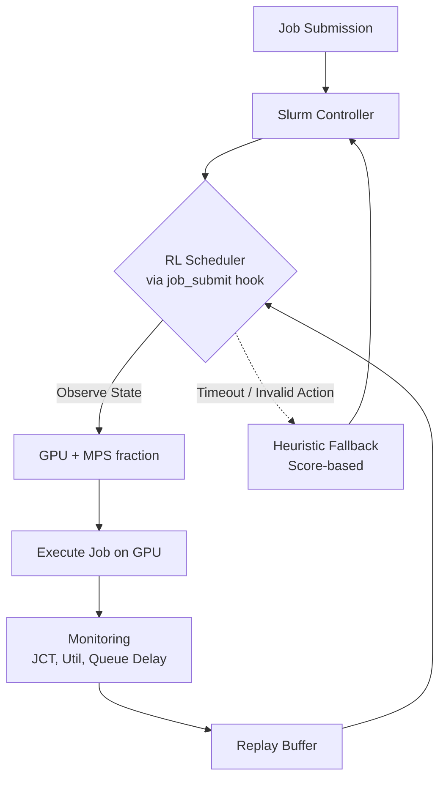

# 基於 Slurm 與 Kubernetes 架構下 AI 伺服器 GPU 工作負載智慧排程技術之研究

### Intelligent GPU Workload Scheduling Techniques for AI Servers under a Slurm-on-Kubernetes Architecture

**作者一¹、作者二²**
¹○○大學 ○○系　²○○大學 ○○系
{author1, author2}@stumail.nutn.edu.tw

---

## 摘要

隨著大型語言模型與生成式 AI 快速發展，GPU 已成為 AI 工作負載的主要運算資源 [1][4]。然而，多數實驗室及中小型叢集通常由不同世代 GPU 所組成，且 NVIDIA Multi-Process Service (MPS) 允許多個工作共享單張 GPU [5]，使得傳統 Slurm 排程器 [11] 難以同時兼顧資源利用率、工作完成時間與尾端延遲。

現有 GPU 排程方法多著重於單純 GPU placement、同質 GPU 叢集，或未納入真實 Slurm 排程流程的模擬環境，較少同時考慮異質 GPU、MPS 配置與實機部署後的 sim-to-real 落差。此缺口使學習式排程方法即使在模擬中表現良好，也難以判定其效益能否穩健轉移到真實異質叢集。

本研究提出一套支援異質 GPU 與 NVIDIA MPS 的智慧排程框架，透過深度強化學習同時決定 GPU placement 與 MPS allocation。排程代理人根據工作資訊、GPU 使用率、MPS 剩餘容量、佇列狀態與歷史回饋，決定工作應配置至哪張 GPU，以及配置 25%、50%、75% 或 100% MPS。系統以 Slurm 作為排程核心 [11]，Kubernetes 僅負責容器化部署、服務生命週期與健康監控 [10]；當學習式決策服務逾時或異常時，系統會自動回退至啟發式排程策略。

本研究於 RTX 4070 與 RTX 3080 實機環境建置 Slurm 平台，並參考 Alibaba GPU Trace 與 Microsoft Philly Trace 的工作負載特性進行 trace replay 與真實 AI 工作負載評估 [1][4]，和 FCFS、Backfill、Best Fit、Discrete SAC [6]、RDSAC [7][16] 及 RLPD [8] 等方法比較。結果顯示，學習式排程在模擬環境可區分策略差異，但在本研究小規模實機叢集上尚未穩健勝過啟發式方法；此結果凸顯異質 GPU 與 MPS 排程必須同時重視真實部署、統計檢定與場景依賴性。

**關鍵詞**：GPU 排程、異質 GPU、NVIDIA MPS、Slurm、深度強化學習

## Abstract

The rapid growth of large language models and generative AI has made GPUs a primary compute resource for AI workloads [1][4]. However, many laboratory and small-scale clusters consist of heterogeneous GPU generations, and NVIDIA Multi-Process Service (MPS) enables multiple jobs to share a single GPU [5]. These properties make it difficult for traditional Slurm scheduling [11] to jointly optimize GPU utilization, job completion time, and tail latency.

Existing GPU scheduling methods often focus on GPU placement alone, homogeneous GPU environments, or simulation-only evaluation without the real Slurm scheduling path. Few studies jointly consider heterogeneous GPUs, MPS allocation, and real deployment effects. This gap makes it unclear whether learned scheduling policies that perform well in simulation can transfer robustly to real heterogeneous clusters.

This study proposes an intelligent scheduling framework for heterogeneous GPUs with NVIDIA MPS. The framework uses deep reinforcement learning to jointly decide GPU placement and MPS allocation. Given job features, GPU utilization, remaining MPS capacity, queue state, and historical feedback, the scheduling agent selects both the target GPU and the MPS fraction, including 25%, 50%, 75%, and 100%. Slurm remains the scheduling core [11], while Kubernetes is used only as the deployment and lifecycle-management platform [10]. If the learned decision service times out or fails, the system automatically falls back to a heuristic scheduling policy.

We implement the framework on a real RTX 4070 and RTX 3080 testbed, and evaluate it using workload characteristics derived from Alibaba GPU Trace and Microsoft Philly Trace [1][4], together with real AI workloads. The proposed framework is compared with FCFS, Backfill, Best Fit, Discrete SAC [6], RDSAC [7][16], and RLPD [8]. Results show that learned policies can distinguish scheduling strategies in simulation, but do not robustly outperform the heuristic baseline on the small real cluster used in this study. These findings show that heterogeneous GPU and MPS scheduling must be evaluated with real deployment, statistical rigor, and explicit attention to scenario dependence.

---

## 1. 緒論

### 1.1 AI 工作負載快速增加

近年大型語言模型、生成式 AI 與深度學習服務快速發展，使 GPU 成為 AI 訓練與推論最重要的運算資源 [1][4]。相較於傳統批次運算，AI 叢集經常同時承載短時間推論、模型微調、長時間訓練與矩陣運算等不同工作，這些工作在執行時間、記憶體需求、延遲敏感度與 GPU 使用型態上皆有明顯差異 [1][4]。

在大學實驗室與中小型研究叢集中，GPU 資源通常有限，且硬體常由不同世代 GPU 漸進式擴充而成。例如 RTX 4070 與 RTX 3080 在算力、記憶體容量與功耗上皆不同。若排程器只把 GPU 視為同質資源，便可能讓小型推論工作佔用高效能 GPU，或讓長時間訓練阻塞後續短工作，造成 GPU utilization、工作完成時間 (JCT) 與 queue delay 之間的取捨更加困難。

NVIDIA MPS 提供另一個重要槓桿：多個 CUDA 工作可共享同一張 GPU，使 GPU 不再只能以整張卡為單位分配 [5]。然而 MPS 也讓排程問題從「選哪張 GPU」變成「選哪張 GPU 與分配多少 **MPS fraction**」。因此，在異質 GPU 與 MPS 共存的環境中，GPU scheduling 已成為影響叢集效能的核心問題。

### 1.2 現有方法限制

Slurm 是高效能運算環境常用的工作排程系統，支援 FCFS、Backfill、multifactor priority 與 GRES/TRES GPU 資源管理 [11]。然而，Slurm 的傳統策略多以固定規則為主，對異質 GPU、MPS 分片、工作類型與長期回報之間的互動感知有限。

現有方法主要存在四項限制：

1. **不充分考慮 GPU 差異**：許多排程方法把 GPU 視為同質資源，較少將不同世代 GPU 的算力、記憶體與執行時間差異納入 placement 決策。
2. **不充分考慮 MPS fraction**：部分研究討論 GPU sharing 或 GPU partition，但未將 **MPS fraction** 作為排程器的顯式動作。
3. **依賴固定規則**：FCFS、Backfill 與 Best Fit 能提供穩定基準，但難以隨工作負載動態調整策略。
4. **缺乏真實 Slurm 流程驗證**：不少學習式排程研究停留在模擬環境，未整合到真實 Slurm job submission path，也未處理服務失效、實機漂移與統計顯著性。

因此，本研究的 gap 是：現有 GPU 排程方法較少同時處理異質 GPU、MPS allocation 與真實 Slurm 排程流程，也較少嚴謹檢驗學習式策略在 sim-to-real 轉移後是否仍具穩健效益。

### 1.3 為什麼使用 DRL

GPU scheduling 不是單次分類問題，而是序列決策問題。一次 placement 會改變 GPU 剩餘 MPS、後續佇列等待時間、工作共置干擾與未來可用資源，因此當下看似最佳的放置，未必能帶來長期最佳的 JCT 或利用率。

此問題具有三個適合使用深度強化學習 (Deep Reinforcement Learning, DRL) 的特徵：

1. **Sequential decision**：每次工作放置會影響後續所有排程決策。
2. **Long-term optimization**：排程目標不只包含當下工作的執行時間，也包含 queue delay、makespan、tail latency 與整體 GPU utilization。
3. **Dynamic environment**：工作到達率、工作類型、GPU 使用率與 MPS 剩餘容量會隨時間改變，固定 heuristic 難以完整涵蓋所有情境。

因此，本研究採用 DRL 作為排程策略學習方法，讓代理人從模擬與實機回饋中學習 GPU placement 與 MPS allocation 的長期效果。不過，本研究並不預設 DRL 必然優於 heuristic，而是以真實環境與統計檢定驗證其效益是否穩健成立。

### 1.4 Contribution

本研究主要貢獻如下：

1. **提出異質 GPU + MPS 排程框架**：將 GPU placement 與 **MPS fraction** 統一建模，使排程器能同時選擇 GPU 與 25%、50%、75%、100% **MPS fraction**。
2. **設計 DRL Scheduler**：以 Discrete SAC [6]、RDSAC [7][16] 與 RLPD [8] 等方法學習序列排程策略，並將 state、action、reward 對應到真實 Slurm 叢集。
3. **完成 Slurm 整合**：透過 Slurm job submission path 連接 RL decision service，並提供 fail-safe fallback，避免學習式服務異常時阻塞排程核心。
4. **完成真實部署**：於 RTX 4070 與 RTX 3080 異質 GPU 環境中部署 Slurm、NVIDIA MPS 與監控流程；Kubernetes 僅作為部署與生命週期管理平台。
5. **完成實機驗證與統計分析**：使用 trace replay 與真實 AI workload 評估 FCFS、Backfill、Best Fit、heuristic、SAC、RDSAC 與 RLPD，並以多 seed 配對、多重比較校正與等價檢定檢驗效益。

## 2. 相關研究

### 2.1 GPU Sharing

GPU sharing 技術的目標是在單張或多張 GPU 上提高資源使用率，避免小型工作獨佔整張 GPU。NVIDIA MPS 允許多個 CUDA process 同時共享同一張 GPU 的運算資源 [5]；NVIDIA MIG 則在硬體層面將 GPU 切分成隔離的 GPU instance，提供較強的效能隔離與資源邊界 [21]。

近年研究也開始探討更細緻的 GPU partition 與 spatio-temporal sharing。例如 Serving Heterogeneous Machine Learning Models on Multi-GPU Servers with Spatio-Temporal Sharing 討論多模型服務如何在多 GPU 伺服器上進行時間與空間共享 [32]；Hierarchical Resource Partitioning on Modern GPUs 則研究現代 GPU 上階層式資源分割 [33]。

這些研究顯示 GPU sharing 能提升利用率，但多聚焦於 GPU partition 或 inference serving 本身，較少把 GPU sharing 作為 Slurm 排程器的顯式決策變數。本研究的差異在於：**MPS fraction** 是 action space 的一部分，排程器必須同時決定 GPU placement 與 **MPS fraction**。

### 2.2 GPU Scheduling

傳統 GPU scheduling 方法包含 FCFS、Backfill、Best Fit、packing、multifactor priority 與 Slurm 的 cons_tres/GRES 資源配置 [11]。這些方法具有實作穩定、可解釋與部署成本低等優點，因此仍是 HPC 與研究叢集的重要基準。

然而，傳統方法主要依賴固定規則。FCFS 容易受到 head-of-line blocking 影響；Backfill 能減少資源閒置，但對異質 GPU 與 MPS 共置干擾缺乏細緻感知；Best Fit 能改善裝箱效率，卻可能放大尾端延遲或造成局部碎片。Slurm 雖支援 GPU GRES 與 MPS GRES，但預設策略仍不會主動學習不同工作在不同 GPU 與 MPS 配額下的長期影響。

因此，傳統 GPU scheduling 可作為穩定 baseline，但在異質 GPU + MPS 的設定下，仍需要能同時感知 GPU 差異、MPS 容量、工作特徵與佇列狀態的策略層。

### 2.3 RL Scheduler

強化學習已被應用於 cluster 排程、GPU 排程、network contention control 與 AI serving [23][28][30]。Discrete SAC 適合離散動作空間，可用於選擇節點、GPU 或資源配額 [6]；RDSAC 進一步以分布式評論家與風險敏感目標處理尾端延遲 [7][16]；RLPD 則可將既有真實資料納入 offline-to-online 微調，以降低從零開始探索的成本 [8]。

此外，UXP-RL、Network Contention RL、Kubernetes inference auto-scaling 與多種 DRL scheduler 皆顯示 RL 能處理動態資源分配問題 [23][25][26][28][30]。然而，現有 RL scheduler 多假設單一 GPU、同質 GPU、大型模擬叢集，或將 Kubernetes 當作主要排程器；較少探討在真實 Slurm 流程中，如何讓 RL 同時決定異質 GPU placement 與 MPS allocation，並在服務失效時維持排程安全。

本研究因此將 RL 放在 Slurm 策略層，而非取代 Slurm 或 Kubernetes。Slurm 維持佇列與資源配置語意 [11]，RL 只負責對 GPU 與 MPS 配額提出決策。

### 2.4 Discussion

表 1 彙整本研究與主要研究類型的定位差異。

表 1. 相關研究定位比較

| 類型 | 是否考慮異質 GPU | 是否考慮 MPS fraction | 是否整合真實 Slurm | 主要限制 |
|---|:--:|:--:|:--:|---|
| FCFS / Backfill / Best Fit | 部分 | 部分 | 是 | 固定規則，難以學習長期效果 |
| GPU sharing / partition 研究 | 部分 | 部分 | 否 | 多聚焦 partition 機制，較少處理排程流程 |
| RL scheduler 模擬研究 | 部分 | 少 | 否 | sim-to-real 效益不明 |
| Kubernetes GPU scheduler | 部分 | 部分 | 否 | Kubernetes 是排程主體，不處理 Slurm 工作流 |
| 本研究 | 是 | 是 | 是 | 目前實機規模仍小，需擴大驗證 |

由表 1 可知，本研究的核心位置是「異質 GPU + MPS + 真實 Slurm 流程」的交會點。Kubernetes 僅是部署平台 [10]，不是本文的主要排程貢獻。

## 3. 研究目的與系統架構

### 3.1 System Overview

本研究建立一套以 Slurm 為排程核心的異質 GPU + MPS 智慧排程平台。系統流程如圖 1 所示：



**圖 1. 系統架構與排程流程。**  
虛線框為 fail-safe fallback 路徑；RL Scheduler 以 Slurm `job_submit.lua` hook 介入，決策輸出為 `(GPU_id, MPS fraction)`；Monitoring 週期 1 秒蒐集 GPU/SM/memory utilization、MPS fraction 使用量、queue depth、job events，寫入 Replay Buffer 供 offline RL / RLPD 使用。

工作提交後，Slurm 透過 job submission hook 呼叫 RL scheduler。RL scheduler 讀取目前工作資訊、GPU 狀態、MPS 剩餘容量與佇列資訊，輸出 GPU placement 與 MPS allocation。工作執行期間，監控服務收集 GPU utilization、SM utilization、memory usage、queue delay、JCT 與 reward，並將資料寫入 replay buffer 供後續訓練或 RLPD 微調使用。

本平台使用 Kubernetes (k3s) 部署 Slurm controller、worker、RL scheduler、monitoring service 與相關容器 [10]。**Kubernetes 在本文中不負責排程決策**；它只提供容器化部署、服務健康檢查、網路與生命週期管理。**此設計避免讓 Kubernetes 成為研究主角，並保留 Slurm 在 HPC batch scheduling 中成熟的佇列語意 [11]；K8s 相關組件部署細節見附錄 A。**

### 3.2 Problem Definition

本研究將異質 GPU + MPS 排程建模為馬可夫決策過程。每次有工作可排程時，代理人觀察叢集狀態，選擇一個 GPU 與 **MPS fraction**，並在工作完成後根據 JCT、queue delay 與 GPU utilization 取得 reward。

**State.** 狀態包含四類資訊：

1. **Job features**：工作類型、預估 runtime、GPU memory 需求、MPS 需求、SLO 緊迫度與等待時間。
2. **GPU features**：GPU 型號、GPU utilization、SM utilization、memory usage、可用 MPS、目前共置工作數。
3. **Queue features**：佇列長度、前 K 個工作的需求、等待時間分布與到達率。
4. **History features**：近期完成工作 JCT、slowdown、SLO violation 與各 GPU 的負載變化。

**Action.** 動作定義為 GPU 與 **MPS fraction** 的組合：

```text
Action = GPU x MPS fraction

GPU0 (RTX 4070) x {25%, 50%, 75%, 100%}
GPU1 (RTX 3080) x {25%, 50%, 75%, 100%}
```

在本研究的 2 GPU 實驗平台中，動作空間共有 8 個 **placement/fraction** action；若加入暫不放置或更多 GPU，動作空間可自然擴充。

**Reward.** Reward 需同時反映使用者等待時間與叢集效率。本文採用以下形式作為主要設計：

```text
R = -w1 * JCT + w2 * GPUUtil - w3 * QueueDelay - w4 * SLOViolation
```

其中 JCT 與 queue delay 代表工作完成效能，GPUUtil 代表資源使用效率，SLOViolation 則懲罰推論或服務型工作超過延遲目標。此 reward 設計讓 DRL 不只最佳化單一工作，而是學習長期排程結果。

### 3.3 Research Goal

本研究的目標是在異質 GPU 與 NVIDIA MPS 環境中，學習一個能同時決定 GPU placement 與 MPS allocation 的排程策略，以降低 average JCT、P95/P99 JCT、queue delay 與 slowdown，同時提升 GPU utilization 並控制 SLO violation。

更具體而言，本研究要回答三個問題：

1. DRL 是否能在模擬環境中學到比固定規則更好的 GPU + MPS 排程策略？
2. 此策略能否透過 Slurm job submission path 部署到真實異質 GPU 叢集？
3. 學習式策略在真實環境中是否能穩健勝過 FCFS、Backfill、Best Fit 與啟發式 baseline？

## 4. 排程技術

本章介紹本研究的 scheduler，而非先介紹強化學習原理。重點是 state 如何收集、action 如何映射到 Slurm 與 MPS、reward 如何設計，以及 DRL agent 如何嵌入排程流程。

### 4.1 State

排程器在每次決策時收集以下 state：

| 類別 | 特徵 |
|---|---|
| GPU | GPU 型號、memory capacity、memory usage、GPU utilization、SM utilization、目前 MPS 使用量 |
| MPS | 每張 GPU 剩餘 **MPS fraction**、目前分配比例、共置工作數、**MPS fragmentation** |
| Job | job type、runtime estimate、memory request、MPS request、SLO、submit time |
| Queue | queue length、前 K 個等待工作、等待時間、短工作比例、長工作比例 |
| History | 近期 JCT、P95/P99 JCT、slowdown、GPU load balance、SLO violation |

此 state 設計讓 agent 能區分「把短推論工作放到高效 GPU 的 25% MPS」與「把長訓練工作放到低效 GPU 的 100% MPS」這類決策差異。

### 4.2 Action

Action 是 GPU placement 與 **MPS fraction** 的聯合決策。以本研究兩張 GPU 為例：

```text
GPU0: 25% | 50% | 75% | 100%
GPU1: 25% | 50% | 75% | 100%
```

選定 action 後，scheduler 將結果轉換為 Slurm 可執行的資源請求與節點限制。例如，若 agent 選擇 `GPU0 x 50%`，系統會將工作導向對應節點，並透過 Slurm GRES/MPS 設定分配 50% **MPS fraction**。若 action 無效，例如該 GPU 剩餘 **MPS fraction** 不足，則 action mask 會在推論前遮蔽該選項，避免產生不可執行決策。

### 4.3 Reward

Reward 的設計目標是降低使用者感受到的等待與完成時間，同時提高 GPU 使用效率。本文使用 JCT 作為主要負向訊號，並加入 GPU utilization、queue delay 與 SLO violation。

此設計有三個原因：

1. **降低 JCT**：JCT 是 GPU scheduling 論文最常見的核心指標，能反映工作從提交到完成的整體時間。
2. **降低 queue delay**：若只看 runtime，排程器可能忽略佇列等待；queue delay 能直接反映 head-of-line blocking 與飢餓問題。
3. **提升 GPU utilization**：MPS 的目的是讓小工作共用 GPU；若 reward 不納入 utilization，agent 可能學到保守但浪費資源的策略。
4. **控制尾端風險**：P95/P99 JCT 與 SLO violation 對推論與服務型工作特別重要，因此 RDSAC 使用風險敏感目標處理尾端延遲。

### 4.4 DRL Algorithm

本研究比較以下 DRL 方法：

1. **Discrete SAC**：將 Soft Actor-Critic 延伸到離散 action space，適合選擇 **GPU/MPS fraction** 這類有限動作 [6]。
2. **RDSAC-mean**：以分布式 critic 建模回報分布，但 actor 主要依平均回報決策 [7][16]。
3. **RDSAC-cvar**：在 RDSAC 上加入 CVaR 風險敏感目標，使策略更重視尾端 JCT 與 SLO violation [16]。
4. **RLPD**：使用真實叢集收集的 transition 對模擬訓練出的模型進行微調，以縮小 sim-to-real gap [8]。

RDSAC 採用雙頭 IQN critic 建模 reward return 與 entropy return [7]，並使用 masked categorical actor 避免選到不可執行 action（即 **MPS fraction** 超過剩餘配額的動作）。訓練流程包含 prioritized replay、n-step return、potential-based reward shaping [9] 與 heuristic warm start。

### 4.5 Scheduler Workflow

完整排程流程如下：

```text
Job Arrival
    |
Observe State
    |
Mask Invalid Actions
    |
RL Policy / Heuristic Fallback
    |
Select GPU x MPS fraction
    |
Submit to Slurm
    |
Run on GPU with MPS
    |
Collect JCT / Utilization / Queue Delay
    |
Compute Reward
    |
Store Transition in Replay Buffer
```

為避免學習式服務影響 Slurm 穩定性，系統採 fail-safe 設計。若 RL service 逾時、回傳無效 action 或健康檢查失敗，Slurm 會回退至啟發式策略。此設計使 DRL scheduler 可在真實排程路徑中部署，而不需修改 Slurm 核心。

## 5. 實驗與評估方法

### 5.1 Environment

本研究使用一個小規模異質 GPU 實機叢集進行部署與評估：

| 項目 | 設定 |
|---|---|
| GPU | NVIDIA RTX 4070、NVIDIA RTX 3080 |
| 排程器 | Slurm with GRES/TRES and MPS [11] |
| 部署平台 | Kubernetes/k3s，僅負責容器部署與服務生命週期 [10] |
| GPU sharing | NVIDIA MPS，**MPS fraction** 為 25%、50%、75%、100% [5] |
| 系統 | Ubuntu、CUDA、NVIDIA driver、PyTorch |
| 監控 | GPU utilization、SM utilization、memory usage、job event、queue delay |

此環境刻意保留 GPU 世代差異，讓排程器必須面對異質 GPU placement 的問題。由於硬體規模只有兩張 GPU，本研究將結果定位為實機 proof-of-concept 與方法學驗證，不將結論直接外推至大型生產叢集。

### 5.2 Dataset

工作負載包含三類來源：

1. **Alibaba GPU Trace**：用於參考生產 MLaaS 工作的到達率、工作長度與資源需求分布 [4]。
2. **Microsoft Philly Trace**：用於參考多租戶 GPU training workload 的佇列與 JCT 特性 [1]。
3. **Real Job Replay**：在本研究叢集上執行 cuBLAS、BERT inference、ResNet training、Qwen fine-tuning 與矩陣運算等真實 AI 工作。

模擬環境使用 trace-derived workload 大量訓練 DRL agent；實機環境則以 replay 方式提交相同 seed 的工作序列，使不同 scheduler 可在相同工作負載下進行配對比較。

### 5.3 Baseline

本研究比較以下 baseline 與學習式方法：

| 類型 | 方法 |
|---|---|
| 傳統排程 | FCFS、Backfill |
| 裝箱啟發式 | Best Fit、score heuristic |
| DRL | Discrete SAC [6]、RDSAC-mean [7][16]、RDSAC-cvar [7][16] |
| Sim-to-real | RLPD [8] |

score heuristic 以 **MPS fraction** fit、VRAM fit 與 fragmentation penalty 為主，代表可部署、可解釋且低成本的生產啟發式方法。DRL 方法則用於檢驗學習式策略是否能在異質 GPU + MPS 情境下超越固定規則。

### 5.4 Metrics

本研究不只使用 average JCT，而是依 GPU scheduling 論文常見評估方向分成四類指標：

| 類別 | 指標 |
|---|---|
| Performance | Average JCT、P95 JCT、P99 JCT、Makespan |
| GPU | GPU Utilization、SM Utilization、MPS Utilization |
| Scheduling | Queue Delay、Slowdown、Load Balance、SLO Violation |
| RL | Average Reward、Convergence、Sample Efficiency |

Average JCT 能反映整體完成效率；P95/P99 JCT 與 SLO violation 能捕捉少數被拖慢的工作；GPU utilization 與 MPS utilization 則檢驗排程器是否真正提高共享效率；average reward 與 convergence 用於分析 DRL 訓練是否穩定。

### 5.5 Evaluation Methodology

為避免實機量測誤判，本研究採用以下方法：

1. **Common random numbers**：不同 scheduler 使用相同 seed 與相同工作序列，降低比較變異。
2. **Drift-robust interleaving**：不同方法交錯執行，避免 GPU 暖機、快取或系統狀態漂移與特定方法混淆。
3. **Seed-level paired statistics**：以 seed 為分析單位，而非把每個 job 當獨立樣本，避免偽重複。
4. **Multiple-comparison correction**：多個 scheduler 同時比較時使用 Holm-Bonferroni 校正。
5. **Equivalence testing**：當差異很小時使用 TOST 檢定判斷是否可視為實務等價。

此方法學的目的不是讓 DRL 看起來較好，而是誠實判定觀察到的差異是否穩健。

### 5.6 Results

**模擬結果。** 在 trace-derived AI workload 中，啟發式與學習式策略可明顯區分 FCFS、multifactor 與 score 等方法。模擬結果顯示，排程器若能感知工作大小、MPS 配置與 SLO，可降低推論工作 JCT 與 SLO violation。這說明模擬器本身具備區分策略的能力。

表 2. 模擬環境下 AI 工作負載的排程器比較

| 排程器 | 平均 JCT (s) | 推論 JCT (s) | SLO 違反 (%) | 使用率 |
|---|--:|--:|--:|--:|
| FCFS | 2199 | 1847 | 66.5 | 0.58 |
| multifactor | 1108 | 461 | 41.1 | 0.63 |
| score | 1129 | 520 | 40.7 | 0.63 |

**實機 cuBLAS 低負載共置。** 在 RTX 4070 與 RTX 3080 實機上，以 cuBLAS 工作與 **MPS fraction** 共置進行 8 seed 評估。結果顯示，FCFS、Backfill 與 RDSAC-mean 大致落在 score heuristic 的 ±5% 範圍內，代表此低負載 regime 的策略空間接近平坦；RDSAC-cvar、RLPD 與 SAC 未穩健勝出。

表 3. 實機 cuBLAS 工作負載評估（8 seeds，mean ± std；ΔJCT% 為 seed-level paired difference vs. score heuristic）

| Arm | JCT (s) | P99 (s) | CVaR (s) | ΔJCT% vs. Score |
|---|--:|--:|--:|--:|
| Score heuristic | 6.8 ± 0.7 | 22.1 ± 1.3 | 14.9 ± 1.7 | baseline |
| FCFS | 6.8 ± 0.6 | 21.9 ± 1.4 | 14.8 ± 1.8 | −0.1 ± 3.0 |
| Backfill | 6.8 ± 0.6 | 22.2 ± 1.3 | 14.8 ± 1.8 | −0.1 ± 2.1 |
| RDSAC-mean | 7.0 ± 0.8 | 24.0 ± 3.7 | 15.8 ± 2.5 | −1.7 ± 3.0 |
| RLPD | 7.1 ± 0.9 | 23.9 ± 3.8 | 15.9 ± 2.4 | −3.6 ± 4.8 |
| RDSAC-cvar | 7.2 ± 0.8 | 25.2 ± 4.5 | 16.2 ± 2.9 | −4.6 ± 4.9 |
| SAC | 7.2 ± 0.7 | 24.3 ± 3.6 | 16.1 ± 2.2 | −5.7 ± 7.1 |

**統計註記**：Holm-Bonferroni 校正後，所有 learning-based arms 均未顯著優於 Score (adjusted *p* > 0.05)；TOST ±5% 顯示 FCFS、Backfill、RDSAC-mean 與 Score 統計等價。完整檢定表見補充材料表 S1。

**實機混合 AI 工作負載。** 在 BERT inference、ResNet training、Qwen fine-tuning 與矩陣運算混合工作負載中，RDSAC-cvar 與 score heuristic 在 average JCT 上接近，Backfill 則顯著落後於 score。此結果顯示風險敏感 DRL 在尾端風險上具有潛力，但在本研究規模下尚不足以形成穩健全面優勢。

表 4. 實機混合 AI 工作負載評估（8 seeds，mean ± std；GPU 利用率為 normalized to single-GPU peak SM throughput；ΔJCT% 為 seed-level paired difference vs. Score heuristic）

| Arm | Avg JCT (s) | P95 (s) | P99 (s) | Makespan (s) | GPU Util. (norm.) | Slowdown | SLA Viol. (%) | ΔJCT% vs. Score |
|---|--:|--:|--:|--:|--:|--:|--:|--:|
| Score heuristic | 25.3 ± 5.4 | 51.1 ± 18.4 | 60.1 ± 18.7 | 140.2 ± 17.2 | 1.05 ± 0.23 | 5.87 ± 1.97 | 0.93 ± 0.08 | baseline |
| RDSAC-cvar | 25.2 ± 6.0 | 53.4 ± 23.2 | 67.4 ± 30.5 | 142.5 ± 21.5 | 1.06 ± 0.27 | 5.69 ± 2.19 | 0.95 ± 0.06 | +0.1 ± 14.3 |
| SAC | 27.0 ± 4.3 | 61.1 ± 17.5 | 76.1 ± 14.9 | 147.4 ± 21.9 | 1.06 ± 0.18 | 6.45 ± 1.88 | 0.95 ± 0.05 | −8.8 ± 18.1 |
| FCFS | 27.9 ± 5.9 | 46.2 ± 13.2 | 50.4 ± 14.3 | 146.8 ± 20.1 | 1.07 ± 0.21 | 7.03 ± 2.66 | 0.96 ± 0.07 | −10.8 ± 9.6 |
| RDSAC-mean | 27.8 ± 5.5 | 63.1 ± 22.1 | 86.3 ± 35.6 | 152.0 ± 32.6 | 1.09 ± 0.25 | 6.51 ± 1.73 | 0.95 ± 0.05 | −12.1 ± 24.8 |
| Backfill | 28.4 ± 5.6 | 47.6 ± 12.6 | 52.4 ± 11.8 | 149.0 ± 19.5 | 1.09 ± 0.21 | 6.94 ± 2.34 | 0.96 ± 0.07 | −12.8 ± 8.6 |

**統計註記**：Holm-Bonferroni 校正後，Backfill 顯著劣於 Score (*p*<sub>adj</sub> = 0.03)；其餘 learning-based arms 未顯著優於/劣於 Score（變異大，效應量 Cohen's *d* ∈ [0.1, 0.6]）。TOST ±10% 下，RDSAC-cvar 與 Score 可視為等價。完整檢定表見補充材料表 S2。

**統計解讀。** 多重比較校正後，學習式方法在兩個實機場景中皆未穩健勝過 score heuristic。cuBLAS 場景中，RDSAC-mean、FCFS 與 Backfill 可被視為與 score 在 ±5% 內統計等價；混合工作負載場景中，Backfill 顯著落後 score，但其他學習式方法因變異較大，尚無足夠證據宣稱優於或劣於 score。**所有統計檢定均使用 Holm-Bonferroni 多重比較校正；等價性以 TOST (two one-sided tests) ±5% 邊界判定；效應量以 Cohen's d 回報（見補充材料表 S1）。**

整體而言，本研究的主要發現是：DRL 能在模擬中學到可區分的策略，但在小規模真實異質 GPU + MPS 叢集中，學習式策略的優勢尚未穩健轉移。這不否定 DRL 排程的潛力，而是說明此類研究必須以真實部署、統計檢定與場景依賴性作為必要評估條件。

## 6. 結論與未來工作

### 6.1 結論

本研究驗證了 DRL 能於異質 GPU 與 NVIDIA MPS 環境中學習 GPU placement 與 **MPS fraction** [5]，並能透過 Slurm job submission path 整合到真實排程流程 [11]。相較傳統只選 GPU 或只做固定 rule 的方法，本研究將 GPU 型號差異、MPS 配額、工作特徵、佇列狀態與回饋訊號整合成一個可學習的排程框架。

實驗結果顯示，學習式策略在模擬環境可區分 FCFS、Backfill 與啟發式策略，但在 RTX 4070 與 RTX 3080 的小規模實機環境中，尚未穩健勝過 score heuristic。唯一較穩定的正面結果是：在高負載混合工作負載下，MPS/VRAM 感知的啟發式策略能勝過 Slurm Backfill。此結果說明，在異質 GPU + MPS 排程中，策略效益高度依賴工作負載、硬體規模與底層資源分配後端。

### 6.2 限制

本研究仍有以下限制：

1. **叢集規模有限**：目前實機環境只有 RTX 4070 與 RTX 3080 兩張 GPU，無法直接代表數十至數百 GPU 的生產叢集。
2. **只使用 MPS fraction**：本研究尚未納入 MIG，也未處理 MIG 與 MPS 混合 partition [5][21]。
3. **未涵蓋多節點大規模訓練**：目前 focus 在單卡或小規模 job replay，尚未完整處理多 GPU gang scheduling。
4. **真實 transition 數量有限**：RLPD 使用的實機資料量仍不足，可能無法充分縮小 sim-to-real gap。
5. **尾端指標樣本數不足**：P99 與 CVaR 在小規模實機實驗中變異較大，因此本文對尾端結果採保守解讀。

### 6.3 未來工作

未來工作可朝以下方向擴展：

1. **多 GPU cluster**：擴展至更多節點與更多 GPU，檢驗 DRL 排程效益是否隨規模與競爭程度增加而浮現。
2. **MIG + MPS fraction 混合 partition**：同時納入硬體級隔離與軟體級共享，建立更完整的 GPU sharing action space。
3. **Offline RL / RLPD**：收集更大量真實 Slurm transition，以 offline RL 或 RLPD 改善 sim-to-real 轉移 [8]。
4. **Multi-Agent RL**：在多節點與多 GPU 場景中，探索分散式或階層式排程代理人。
5. **Energy-aware scheduling**：將功耗、能效與碳排納入 reward，使排程器不只最佳化效能，也最佳化能源效率。
6. **LLM serving workload**：加入更真實的 LLM serving trace，評估 token latency、throughput、SLO violation 與 batch scheduling 的交互影響。

## 參考文獻

[1] M. Jeon, S. Venkataraman, A. Phanishayee, et al., "Analysis of Large-Scale Multi-Tenant GPU Clusters for DNN Training Workloads," in *USENIX ATC*, 2019.

[2] W. Xiao, R. Bhardwaj, R. Ramjee, et al., "Gandiva: Introspective Cluster Scheduling for Deep Learning," in *USENIX OSDI*, 2018.

[3] J. Gu, M. Chowdhury, K. G. Shin, et al., "Tiresias: A GPU Cluster Manager for Distributed Deep Learning," in *USENIX NSDI*, 2019.

[4] Q. Weng, W. Xiao, Y. Yu, et al., "MLaaS in the Wild: Workload Analysis and Scheduling in Large-Scale Heterogeneous GPU Clusters," in *USENIX NSDI*, 2022.

[5] NVIDIA Corporation, "Multi-Process Service (MPS)," NVIDIA Documentation, 2024.

[6] P. Christodoulou, "Soft Actor-Critic for Discrete Action Settings," *arXiv:1910.07207*, 2019.

[7] W. Dabney, G. Ostrovski, D. Silver, and R. Munos, "Implicit Quantile Networks for Distributional Reinforcement Learning," in *ICML*, 2018.

[8] P. J. Ball, L. Smith, I. Kostrikov, and S. Levine, "Efficient Online Reinforcement Learning with Offline Data (RLPD)," in *ICML*, 2023.

[9] A. Y. Ng, D. Harada, and S. Russell, "Policy Invariance Under Reward Transformations: Theory and Application to Reward Shaping," in *ICML*, 1999.

[10] Kubernetes Authors, "Kubernetes," https://kubernetes.io, 2024.

[11] SchedMD, "Slurm Workload Manager," https://slurm.schedmd.com, 2024.

[12] Kubeflow Authors, "Kubeflow: The Machine Learning Toolkit for Kubernetes," https://www.kubeflow.org, 2024.

[13] Volcano Authors, "Volcano: A Cloud Native Batch System for Compute-Intensive Workloads," CNCF, https://volcano.sh, 2024.

[14] Kubernetes SIG-Scheduling, "Kueue: Kubernetes-native Job Queueing," https://kueue.sigs.k8s.io, 2024.

[15] Kubernetes Authors, "Dynamic Resource Allocation (DRA)," Kubernetes Documentation, 2025.

[16] X. Ma, J. Chen, L. Xia, J. Yang, Q. Zhao, and Z. Zhou, "DSAC: Distributional Soft Actor-Critic for Risk-Sensitive Reinforcement Learning," *arXiv:2004.14547*, 2020.

[17] J. Duan, Y. Guan, S. E. Li, Y. Ren, and B. Cheng, "Distributional Soft Actor-Critic: Off-Policy Reinforcement Learning for Addressing Value Estimation Errors," *IEEE Transactions on Neural Networks and Learning Systems*, 2021.

[18] A. Bhatt, D. Palenicek, B. Belousov, M. Argus, A. Amiranashvili, T. Brox, and J. Peters, "CrossQ: Batch Normalization in Deep Reinforcement Learning for Greater Sample Efficiency and Simplicity," in *ICLR*, 2024.

[19] X. Wang, Y. Li, F. Guo, Y. Xu, and J. C. S. Lui, "Dynamic GPU Scheduling With Multi-Resource Awareness and Live Migration Support," *IEEE Transactions on Cloud Computing*, vol. 11, no. 3, 2023.

[20] H. Sedighi, F. Wuhib, and R. H. Glitho, "Dynamic Task Scheduling and Adaptive GPU Resource Allocation in the Cloud," *IEEE Transactions on Network and Service Management*, vol. 23, 2026.

[21] E. Lipe, N. Karia, C. Espenshade, C. Stein, A. Tantawi, and O. Tardieu, "Energy Efficient Scheduling of AI/ML Workloads on Multi Instance GPUs with Dynamic Repartitioning," in *IEEE CCGrid*, 2025.

[22] M. Tsenos and V. Kalogeraki, "Exploring GPU-Based Workload Scheduling Techniques for Edge Computing," in *IEEE IC2E*, 2025.

[23] Y.-D. Lin, Y.-T. Ling, Y.-C. Lai, and D. Sudyana, "Reinforcement Learning for AI as a Service: CPU-GPU Task Scheduling for Preprocessing, Training, and Inference Tasks," *IEEE Transactions on Network and Service Management*, vol. 22, no. 4, 2025.

[24] A. A. Majeed, M. Meribout, and S. M. Sali, "Scheduling Techniques of AI Models on Modern Heterogeneous Edge GPU: A Critical Review," *IEEE Transactions on Industrial Informatics*, vol. 22, no. 4, 2026.

[25] G. Zhang, W. Guo, Z. Tan, Q. Guan, and H. Jiang, "KIS-S: A GPU-Aware Kubernetes Inference Simulator with RL-Based Auto-Scaling," *arXiv:2507.07932*, 2025.

[26] Q. Wu, P. Chen, and Y. Wang, "Defragmentation Scheduling with Deep Reinforcement Learning in Shared GPU Clusters," in *ACM SoCC*, 2025.

[27] SchedMD, "Slinky: Slurm in Kubernetes," https://github.com/SlinkyProject, 2024.

[28] Y. Dong, X. Zheng, X. Pan, and D. Liu, "A reinforcement learning-based approach for scheduling machine learning training tasks in heterogeneous Kubernetes clusters," *Future Generation Computer Systems*, 2026.

[29] Y. Wang, Y. Hu, A. Klimovic, X. Zhang, Y. Wen, G. Sun, and J. Lin, "Semantic-Aware Scheduling for GPU Clusters with Large Language Models," *arXiv:2510.03334*, 2025.

[30] S. Dongare, R. I. S. Khan, H. Albahar, N. Zhao, D. Melendez Maita, and A. R. Butt, "Hybrid Learning and Optimization-Based Dynamic Scheduling for DL Workloads on Heterogeneous GPU Clusters," in *ACM SoCC*, 2025.

[31] NVIDIA, "KAI Scheduler: A Kubernetes-Native GPU Scheduler for AI Workloads," https://github.com/NVIDIA/KAI-Scheduler, 2025.

[32] S. Choi, S. Lee, Y. Kim, J. Park, Y. Kwon, and J. Huh, "Serving Heterogeneous Machine Learning Models on Multi-GPU Servers with Spatio-Temporal Sharing," in *USENIX ATC*, 2022.

[33] U. Saroliya, E. Arima, D. Liu, and M. Schulz, "Hierarchical Resource Partitioning on Modern GPUs: A Reinforcement Learning Approach," in *IEEE CLUSTER*, 2023.
