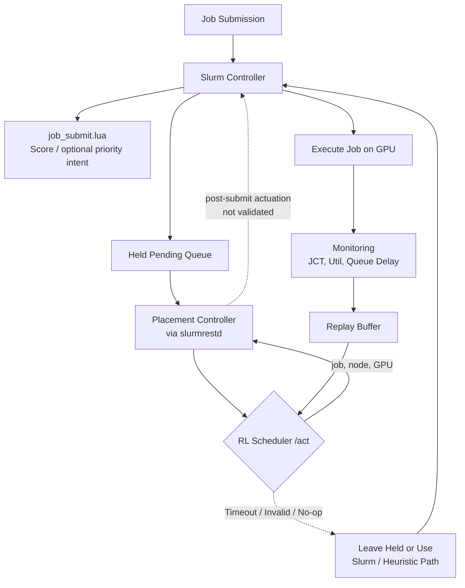

# 基於 Slurm 與 Kubernetes 架構下 AI 伺服器 GPU 工作負載智慧排程技術之研究

### Intelligent GPU Workload Scheduling Techniques for AI Servers under a Slurm-on-Kubernetes Architecture

**作者一¹、作者二²**
¹○○大學 ○○系　²○○大學 ○○系
{author1, author2}@stumail.nutn.edu.tw

---

## 摘要

異質 GPU 與 NVIDIA MPS 共享使排程器必須同時考量硬體差異、工作配額與佇列狀態；傳統 Slurm 固定規則難以動態兼顧工作完成時間（JCT）與尾端延遲 [1][2][3][4]。現有深度強化學習（DRL）排程研究多停留於模擬，較少在真實 Slurm 流程中處理 MPS-aware 工作派遣與 GPU placement。

本研究提出以 Slurm-on-Kubernetes 為排程核心的異質 GPU 智慧排程框架；Kubernetes 僅負責部署 [5]。框架以聯合動作介面建模 MPS-aware 工作派遣與 placement，並以提交時節點綁定完成實機 placement 評估。本研究於 RTX 4070 與 RTX 3080 環境，以 trace-derived 混合 AI 工作負載比較 FCFS、Backfill、啟發式、SAC、RDSAC 與 RLPD [6][7][8][9]。SAC、RDSAC-cvar 的平均 JCT 點估計低於 FCFS／Backfill；真實資料微調的 RLPD 取得最佳平均 JCT，但皆未形成穩健優勢。RDSAC-cvar 僅在學習式策略中呈現較佳尾端平衡，顯示效益取決於負載、規模與基準。

**關鍵詞**：GPU 資源排程、異質 GPU、NVIDIA MPS、Slurm、Kubernetes、深度強化學習

## Abstract

The rapid growth of large language models and generative AI has made GPUs the primary compute resource for AI workloads [1][2]. However, many laboratory and small-scale clusters consist of heterogeneous GPU generations, and NVIDIA Multi-Process Service (MPS) allows multiple jobs to share a single GPU [3], making it difficult for traditional Slurm scheduling [4] to jointly optimize GPU utilization, job completion time (JCT), and tail latency. Existing heuristic policies such as FCFS and Backfill rely on fixed rules and cannot adapt to workload characteristics, while existing DRL schedulers rarely perform job selection and heterogeneous GPU placement under explicit MPS-quota constraints inside a real Slurm environment.

This paper proposes an intelligent scheduling framework for heterogeneous GPUs with NVIDIA MPS, using **Slurm as the scheduling core**. Kubernetes (k3s) only provides deployment and lifecycle management [5]. The policy interface models joint queue selection and placement, while the validated real-machine path evaluates only placement by calling `/act` before submission and binding the selected node through `sbatch -w`. A held-job controller was also implemented as a prototype, but its post-submission `required_nodes` actuation did not take effect with the tested Slurm REST API and is therefore not treated as a validated execution path. On an RTX 4070/3080 testbed with trace-derived mixed AI workloads [1][2], SAC and RDSAC-cvar have lower mean-JCT point estimates than FCFS and Backfill in the main campaign. In a separate paired campaign, RLPD is slightly better than its concurrent size-aware score baseline; neither result establishes a statistically robust advantage. RDSAC-cvar provides better tail latency only among the learned policies. Multiple-comparison correction, TOST, a ceiling analysis, and a placement ablation characterize the efficacy boundary and remaining uncertainty [6][7][8][9].

**Keywords**: GPU Resource Scheduling, Heterogeneous GPU, NVIDIA MPS, Slurm, Kubernetes, Deep Reinforcement Learning

---

## 1. 緒論

Slurm Workload Manager 是高效能運算叢集最廣泛使用的工作排程系統之一，提供完整的工作提交、佇列管理、資源限額與 GPU 資源配置功能 [4]，其以「節點」為基礎的資源模型非常適合研究工作環境。然而 Slurm 原生設計以固定實體節點為主，對彈性擴縮與容器化整合的支援相對有限。Kubernetes 則是目前最主流的容器編排平台，能自動管理容器的部署、擴縮與健康監控 [5]，但其原生排程器 (kube-scheduler) 以服務導向設計為主，對批次工作、GPU 共享與研究工作特有的排程需求支援不足。因此有多項研究嘗試將 Slurm 與 Kubernetes 整合，以同時取得批次排程語意與雲端彈性管理能力；實作層面也有 Slinky [10] 等 Slurm-on-Kubernetes 方向的工具，顯示此類架構已具有實務需求與發展基礎。

### 1.1 AI 工作負載快速增加

近年大型語言模型、生成式 AI 與深度學習服務快速發展，使 GPU 成為 AI 訓練與推論最重要的運算資源 [1][2]。相較於傳統批次運算，AI 叢集經常同時承載短時間推論、模型微調、長時間訓練與矩陣運算等不同工作，這些工作在執行時間、記憶體需求、延遲敏感度與 GPU 使用型態上皆有明顯差異 [1][2]。

在大學實驗室與中小型研究叢集中，GPU 資源通常有限，且硬體常由不同世代 GPU 漸進式擴充而成。例如 RTX 4070 與 RTX 3080 在算力、記憶體容量與功耗上皆不同。若排程器只把 GPU 視為同質資源，便可能讓小型推論工作佔用高效能 GPU，或讓長時間訓練阻塞後續短工作，造成 GPU utilization、JCT 與 queue delay 之間的取捨更加困難。

NVIDIA MPS 提供另一個重要槓桿：多個 CUDA 工作可共享同一張 GPU，使 GPU 不再只能以整張卡為單位分配 [3]。然而 MPS 也讓排程問題從「選哪張 GPU」變成「選哪張 GPU 與該工作需要多少 **MPS fraction**」。因此，在異質 GPU 與 MPS 共存的環境中，GPU scheduling 已成為影響叢集效能的核心問題。

### 1.2 現有方法限制

Slurm 提供 FCFS、Backfill、multifactor priority 與 GRES/TRES GPU 資源管理 [4]，但其傳統策略多以固定規則為主，難以感知異質 GPU、MPS 分片、工作類型與長期回報之間的相互影響。現有方法主要存在四項限制：

1. **不充分考慮 GPU 差異**：許多排程方法把 GPU 視為同質資源，較少將不同世代 GPU 的算力、記憶體與執行時間差異納入 placement 決策。
2. **不充分考慮 MPS fraction**：部分研究討論 GPU sharing 或 GPU partition，但未將 **MPS fraction** 需求作為排程器的顯式感知變數。
3. **依賴固定規則**：FCFS 與 Backfill 能提供穩定基準，但難以隨工作負載動態調整策略。
4. **缺乏真實 Slurm 流程驗證**：不少學習式排程研究停留在模擬環境，未整合到真實 Slurm job submission path，也未處理服務失效與實機部署。

### 1.3 為什麼使用 DRL

GPU scheduling 不是單次分類問題，而是序列決策問題。一次 placement 會改變 GPU 剩餘 MPS、後續佇列等待時間、工作共置干擾與未來可用資源，因此當下看似最佳的放置，未必能帶來長期最佳的 JCT 或利用率。此問題具有三個適合使用 DRL 的特徵：

1. **Sequential decision**：每次工作放置會影響後續所有排程決策。
2. **Long-term optimization**：排程目標不只包含當下工作的執行時間，也包含 queue delay、makespan、tail latency 與整體 GPU utilization。
3. **Dynamic environment**：工作到達率、工作類型、GPU 使用率與 MPS 剩餘容量會隨時間改變，固定 heuristic 難以完整涵蓋所有情境。

因此，本研究採用 DRL 作為排程策略學習方法，讓代理人從模擬與實機回饋中學習 GPU placement 與 MPS-aware 排程的長期效果。

### 1.4 研究貢獻

本研究的核心貢獻在於將「異質 GPU + MPS + 真實 Slurm 流程」三者結合，具體如下：

1. **MPS 配額約束下的工作派遣與異質 GPU placement**：不同於 UXP-RL [11] 主要決定 CPU-vs-GPU 資源類型、KIS-S [12] 調整 Kubernetes 推論副本數、DRR [13] 處理 GPU 碎片化，本研究的策略介面與模擬環境將「派哪個工作」與「放到哪張異質 GPU」建模為聯合離散動作。每個工作攜帶既定的 MPS fraction 需求（25%/50%/75%/100%）作為 state 特徵與 action mask 的可行性約束，使決策在尊重 MPS 配額的前提下進行。此設計首次在真實 Slurm 佇列上刻畫「job 選擇與異質 GPU placement 聯合決策」相對於僅決定資源類型 [11] 或僅調整副本數 [12] 的可行性與行為差異。

2. **失效安全的 Slurm 策略層整合**：不同於 UXP-RL、KIS-S 等純模擬研究，本研究把學習式決策服務嵌入真實 Slurm job submission path，並提供 fail-safe 回退機制，當 RL 服務逾時、回傳無效 action 或健康檢查失敗時自動回退至啟發式策略，使排程核心 (slurmctld) 永不被阻塞。此設計讓 DRL scheduler 得以在真實排程路徑中部署，而不需修改 Slurm 核心。本研究因此證明學習式排程可在不更動 slurmctld 的前提下安全嵌入生產排程路徑，這是先前純模擬研究 [11][12] 未曾示範的部署可行性。

3. **實機比較與效益邊界分析**：本研究於 RTX 4070/3080 異質環境，以 trace-derived 混合 AI 工作負載比較 FCFS、Backfill、啟發式、SAC、RDSAC 與 RLPD，並採多 seed、Holm-Bonferroni 校正與 TOST 等價檢定。學習式策略在平均 JCT 上優於傳統 Slurm 排程，但兩者皆不足以支持穩健超越 size-aware 啟發式。並且由於實驗環境限於小叢集，經消融實驗分析後因變異過大而無法辨識哪個決策具有穩定優勢。

## 2. 相關研究

### 2.1 GPU 叢集排程、分析與資源共享

近期研究聚焦於單節點內或單一叢集模型上的動態資源調度本身。Wang 等人的 DCUDA [14] 針對單節點多 GPU 情境，設計了一套輕量級核心／記憶體使用率監控機制，搭配近乎零開銷的「執行中」CUDA 應用即時遷移，將 GPU 過載時間平均降低 78.3%、一般工作執行時間降低 42.1%（記憶體密集型工作最高 67%）。Sedighi 等人 [15] 則在 Alibaba 的 cluster-trace-gpu 生產工作負載軌跡之上，提出結合硬體與軟體分割的公平且需求感知動態資源配置演算法，於模擬環境中將 GPU 資源使用量降低達 88%。這兩項工作皆聚焦「資源配置本身如何隨工作負載動態調整」（即時遷移／再分割），評估分別侷限於單一多 GPU 節點與純模擬 trace 重放，並未涉及與批次排程器（如 Slurm）的整合。

在 GPU 共享機制方面，NVIDIA MPS 允許多個 CUDA process 同時共享同一張 GPU 的運算資源 [3]，NVIDIA MIG 則在硬體層面將 GPU 切分成隔離的 instance [16]。學術上亦有更細緻的 partition 與時空共享研究，如多 GPU 伺服器上的時空共享服務 [17] 與現代 GPU 的階層式資源分割 [18]。針對深度學習工作負載，也有專門的叢集排程系統：Gandiva [19] 以 introspective 排程與工作遷移提升利用率，Tiresias [20] 以近似 age-based 的優先序縮短 JCT，MLaaS 生產叢集分析 [2] 則刻畫了大規模異質 GPU 叢集的工作特性。這些方法多假設整卡分配或同質 GPU，較少把 MPS fraction 作為排程流程的顯式決策脈絡。

### 2.2 強化學習排程

Lin 等人 [11] 提出 UXP-RL：一個以 DQN 為核心、涵蓋前處理／訓練／推論三類任務、可部署為集中式或分散式排程器、並跨雲／邊／霧三層架構運作的 CPU-GPU 任務排程演算法。其於**模擬環境**中，集中式排程器將平均週轉時間相較 SJF／FCFS 與 TYPE 啟發式分別降低 57.81%、57.28% 與 27.66%；分散式排程器則因能將長訓練工作卸載至雲端而把推論任務週轉時間再降低 89.07%。同年 Zhang 等人的 KIS-S [12] 以 PPO 訓練一個 GPU-aware 的 Kubernetes 推論自動擴縮策略，完全於自建模擬器 (KISim) 中訓練後零樣本部署，於多種流量情境下平均獎勵提升 75.2%；其問題設定是調整副本數的自動擴縮，而非本研究的工作放置排程。Wu 等人的 DRR [13] 則針對 GPU 共享叢集的碎片化問題，以模仿學習從既有啟發式暖啟動一個深度強化學習去碎片化排程器，並同時於實體 Kubernetes 測試床與大規模模擬叢集上驗證，平均碎片率降低 50%，是少數同時涉及真實 Kubernetes 部署的學習式排程器。

在演算法基礎方面，Discrete SAC 將最大熵框架延伸到離散動作空間，以 categorical 策略取代高斯策略、以期望估計熵項 [6]；分布式評論家（如 IQN [7]、DSAC [8]）以回報分布與風險敏感目標處理尾端延遲；以 BatchNorm 移除 target network 以提升樣本效率的 CrossQ [21] 則代表近期簡化訓練流程的方向；RLPD [9] 進一步以對稱取樣真實資料的方式進行 offline-to-online 微調，降低從零探索的成本。然而，現有 RL scheduler 多假設單一 GPU、同質 GPU 或大型模擬叢集，或將 Kubernetes 當作排程主體（如 Kubeflow [22]、Volcano [23]、Kueue [24]、NVIDIA KAI [25]）；較少探討在真實 Slurm 流程中，如何讓 RL 同時決定異質 GPU placement 與 MPS-aware 排程，並在服務失效時維持排程安全。

### 2.3 異質與邊緣 GPU 排程

Tsenos 與 Kalogeraki [26] 針對缺乏原生虛擬化支援的邊緣 GPU（如消費級卡）提出一套硬體無關的時空共享機制：為每個行程建立 cgroup、動態調整其 duty cycle 來實現優先權式與截止期限式排程，且無需修改工作負載原始碼即可整合進 TensorFlow、PyTorch、FFmpeg 等既有框架。Majeed 等人 [27] 則以系統性文獻回顧整理 NVIDIA Jetson 系列邊緣 SoC 上的 DNN 排程器，區分規則式與最佳化式兩大類，並整理其記憶體競爭、跨加速器轉移成本與靜態／動態排程的權衡；其排程粒度是單一 DNN 模型內的層級（將個別網路層指派給不同硬體加速器）。這些邊緣場景的資源與延遲約束與資料中心叢集不同，惟顯示異質硬體上的細粒度排程是一個活躍的研究方向。此外，異質 Kubernetes 叢集上的 RL 排程 [28]、混合學習與最佳化排程 [29] 與語意感知的 LLM 叢集排程 [30] 亦顯示學習式方法在異質資源分配上的潛力。

### 2.4 定位比較

表 1 彙整本研究與主要研究類型的定位差異。本研究的核心位置在於將「異質 GPU + MPS + 真實 Slurm 流程」三者結合；Kubernetes 僅是部署平台 [5]，不是本文的主要排程貢獻。

表 1. 相關研究定位比較

| 類型 | 是否考慮異質 GPU | 是否考慮 MPS fraction | 是否整合真實 Slurm | 主要限制 |
|---|:--:|:--:|:--:|---|
| FCFS / Backfill [4] | 部分 | 部分 | 是 | 固定規則，難以學習長期效果 |
| GPU sharing / partition [3][16][17][18] | 部分 | 部分 | 否 | 多聚焦 partition 機制，較少處理排程流程 |
| RL scheduler（模擬）[11][12] | 部分 | 少 | 否 | sim-to-real 效益不明 |
| RL scheduler（真實 K8s）[13] | 部分 | 少 | 否 | 針對碎片化，非 Slurm 工作流 |
| Kubernetes GPU scheduler [22][23][24][25] | 部分 | 部分 | 否 | Kubernetes 是排程主體，不處理 Slurm 工作流 |
| 本研究 | 是 | 是 | 是 | 目前實機規模仍小，需擴大驗證 |

## 3. 研究目的與系統架構

### 3.1 研究目的

本研究的目標是在異質 GPU 與 NVIDIA MPS 環境中，學習一個能在 MPS 配額約束下決定工作派遣與 GPU placement 的排程策略，以降低 average JCT 與尾端 JCT。更具體而言，本研究要回答兩個問題：第一，DRL 在模擬環境中相對固定規則的表現如何；第二，此學習式策略部署到真實異質 GPU 叢集後，相對 FCFS、Backfill 與 size-aware 啟發式的效益與限制為何。

本研究將異質 GPU + MPS 排程建模為馬可夫決策過程 (MDP)。每次有工作可排程時，代理人觀察叢集狀態，選擇一個工作與其 GPU placement，並在工作完成後根據 JCT 與 GPU utilization 取得 reward。

**State.** 狀態包含四類資訊：

1. **Job features**：工作類型、預估 runtime、GPU memory 需求、MPS 需求、SLO 緊迫度與等待時間。
2. **GPU features**：GPU 型號、GPU utilization、SM utilization、memory usage、可用 MPS、目前共置工作數。
3. **Queue features**：佇列長度、前 K 個工作的需求、等待時間分布與到達率。
4. **History features**：近期完成工作 JCT、slowdown、SLO violation 與各 GPU 的負載變化。

**Action.** 動作為「從佇列前 K 個工作中選一個」與「將其放置到哪張 GPU」的聯合離散決策，另含一個 no-op（暫不派遣）：

```text
Action = (選 job_i ∈ top-K 佇列) × (放置到 node_j / gpu_k)  ∪  {no-op}
```

在本研究的 2×1 實驗平台（K=16、2 個 placement）中，動作空間為 16×2+1 = 33 個離散動作，observation 維度為 168。每個工作攜帶自身的 MPS fraction 需求（25%/50%/75%/100%），排程器透過 state 特徵感知、並由 action mask 遮蔽 MPS 剩餘容量不足的放置，因此策略是在尊重工作 MPS 需求的前提下做 job 選擇與 placement

**Reward.** Reward 的設計目標是降低使用者感受到的等待與完成時間，並以小權重的資源使用項避免 GPU 閒置，故採以 JCT 為核心的多目標形式：

```text
R = w_jct · (−JCT / reward_scale) + w_util · GPUUtil
```

本研究訓練使用 w_jct=1.0、w_util=0.05、reward_scale=20000。JCT = 完成時間 − 提交時間，已包含 queue delay；GPUUtil 是模擬器每一步的叢集資源使用狀態，用於避免策略學到保守閒置；因此 reward 的 util 項於每一步給予、JCT 項則於工作完成時給予。另可選用 potential-based reward shaping [31] 提供密集訊號，並以 opt-in 的 SLO 逾時懲罰處理延遲敏感工作。此 reward 設計讓 DRL 不只最佳化單一工作，而是學習長期排程結果。

### 3.2 系統架構

本研究建立一套以 Slurm 為排程核心的異質 GPU + MPS 智慧排程平台（圖 1）。學習式策略以服務形式接入 Slurm 的工作提交流程：策略讀取工作、GPU、MPS 剩餘容量與佇列狀態，輸出建議的工作與 GPU placement，並由系統於提交時據以綁定節點（工作的 MPS fraction 依其請求分配、非策略輸出）。若策略服務逾時或回傳不可行決策，系統自動回退至啟發式路徑，確保排程核心不被阻塞。工作執行期間，監控服務收集資源使用、queue delay、JCT 與 reward，寫入 replay buffer 供後續訓練或 RLPD (Reinforcement Learning with Prior Data) [9] 微調使用。

需說明的是，本文的實機評估聚焦於 **GPU placement** 的效果：系統於提交時取得策略建議的節點並綁定，藉此在真實叢集上比較不同 placement 決策。至於由策略即時從佇列挑選下一個工作的完整線上派遣，目前仍為原型、尚未於受測環境穩定落實，因此不納入本文的實機效能宣稱。



**圖 1. 系統架構與排程流程。** 學習式策略接入 Slurm 提交流程，於提交時提供節點綁定建議；完整的即時佇列選擇與 placement 仍為原型（圖中虛線）。逾時、不可行決策或 no-op 時回退至 Slurm／啟發式路徑。監控服務週期蒐集資源使用、queue delay 與 job events，寫入 Replay Buffer。

本平台使用 Kubernetes (k3s) 部署 Slurm controller、worker、RL scheduler、monitoring service 與相關容器 [5]。底層 GPU 基礎建設是透過 Kubernetes Dynamic Resource Allocation (DRA) 宣告與取得裝置 [32]，工作層級的 MPS 配額仍由 Slurm `gres/mps` 與對應的 MPS 執行環境落實。**Kubernetes 在本文中不負責工作排程決策**，只提供容器化部署、服務健康檢查、網路與生命週期管理。此設計保留 Slurm 在 HPC batch scheduling 中成熟的佇列語意 [4]。此方向與將 Slurm 整合進 Kubernetes 的 Slinky [10] 互補：Slinky 提供 Slurm-on-Kubernetes 部署基礎，本研究則在 Slurm 排程路徑上加入具失效回退機制的學習式策略層。

## 4. 排程技術

本章介紹本研究的 scheduler：以 Slurm 原生能力作為穩定基線，以啟發式評分函式作為可部署的中階基準，再以 DRL agent 學習序列排程策略。

### 4.1 Slurm 內建排程演算法

本研究以 Slurm 原生排程能力作為穩定基線，而非重寫排程核心。例如 Backfill 允許在不延後高優先權工作的前提下，讓資源需求較小、執行時間較短的工作提前插隊執行，緩解大工作長期佔用資源造成的閒置；此外也納入更保守的 FCFS 作為基準對照（為現成排程器基準，非理論下界），用以檢驗啟發式與學習式策略相對 Slurm 開箱即用能力是否確有改善。

### 4.2 啟發式排程策略

啟發式策略以加權線性組合公式計算工作優先級，分數越高代表該工作越值得優先排程。三個因子及對應權重如表 2 所示。此 score heuristic 代表可部署、可解釋且低成本的生產啟發式方法。

表 2. 啟發式因子與係數定義

| 因子 | 係數 | 定義 |
|---|:--:|---|
| MPS | 0.40 | `mps_req/100 ∈ [0, 1]`。沒給=1.0，超過=0.0。 |
| VRAM | 0.20 | `(1 − (fit_tier − req))/max_tier ∈ [0, 1]`。依 job 需求選最小可用 VRAM tier，沒給=0.5。 |
| Frag | 0.20 | `4x(1 − x), x = mps_req/100`，並以負號納入總分。mps_req=0 或滿載→0.0；mps_req=50%→最高懲罰 1.0。 |

需注意 score 在兩個評估管線的強度不同：模擬使用含 SJF-like runtime kicker 的完整版本（ε=0.30），而實機部署因 runtime predictor 未上線而停用該項（ε=0），僅保留 MPS-fit 與 VRAM-fit。兩者為同一評分函式的兩種設定，故模擬表與實機表的 score 絕對表現不宜直接跨表比較；各表內部的相對比較則不受影響。

### 4.3 深度強化學習策略

本研究比較以下 DRL 方法：

1. **Discrete SAC**：將 Soft Actor-Critic 延伸到離散 action space，以 categorical 策略取代高斯策略、以期望估計熵項，適合 job 選擇與 GPU placement 這類有限離散動作 [6]。
2. **RDSAC-mean**：以分布式 critic 建模回報分布，但 actor 主要依平均回報決策 [7][8]。
3. **RDSAC-cvar**：在 RDSAC 上加入 CVaR 風險敏感目標，使策略更重視尾端 JCT 與 SLO violation [8]。
4. **RLPD**：以真實資料對模擬訓練出的模型進行微調，縮小 sim-to-real gap [9]。本研究忠實採用原論文核心配方——每個 batch 對稱取樣 50% sim 先驗 + 50% 真實資料、critic 加 LayerNorm 的 critic ensemble、高 UTD——但訓練機制為離線（更新迴圈只做梯度更新、不在真環境即時互動），故為「sim + 真實混合 buffer 的離線微調」，非原論文的真線上更新。

RDSAC 採用雙頭 IQN critic 建模 reward return 與 entropy return [7]，並使用 masked categorical actor 避免選到不可執行 action（即所選放置的 GPU 剩餘 MPS 不足以容納該工作請求的動作）。訓練流程包含 prioritized replay、n-step return、potential-based reward shaping [31] 與 heuristic warm start。需澄清命名：本研究的 RDSAC 為自組的「distributional + discrete SAC」，以離散動作空間搭配 IQN 分位數 critic 建構 [7][8]，與 Duan 等人 [33] 針對連續控制、將回報建模為單一高斯分布的 Distributional Soft Actor-Critic 不同，兩者不應混淆。

## 5. 實驗與評估

### 5.1 實驗環境與訓練

本研究使用一個小規模異質 GPU 實機叢集進行部署與評估，相關環境如表 3 所示。此環境刻意保留 GPU 世代差異，讓排程器必須面對異質 GPU placement 的問題；由於硬體規模只有兩張 GPU，本研究將結果定位為實機 proof-of-concept 與方法學驗證，不直接外推至大型生產叢集。

表 3. 實驗環境列表

| 項目 | 設定 |
|---|---|
| 節點 1（控制平面） | Intel Core i7-10700（16 執行緒）、64 GB RAM、NVIDIA RTX 4070 |
| 節點 2（工作節點） | Intel Core i7-9700、8 GB RAM、NVIDIA RTX 3080 |
| 作業系統 | Ubuntu 24.04.4 LTS（kernel 7.0.0 / 6.8.0） |
| NVIDIA driver／CUDA | 580.167.08／CUDA 13.0 |
| 容器平台 | k3s v1.34.6、containerd 2.2.2；僅負責容器部署與服務生命週期 [5] |
| GPU 資源宣告 | Kubernetes Dynamic Resource Allocation (DRA) driver v0.4.1 [32] |
| 排程器 | Slurm 23.11.7 with GRES/TRES and MPS（slurmrestd REST API v0.0.37）[4] |
| GPU sharing | NVIDIA MPS，MPS fraction 為 25%、50%、75%、100% [3] |
| 深度學習框架 | PyTorch |
| 網路 | 同一區域網路，節點間 RTT ≈ 0.16 ms（ping 量測，可忽略） |
| 監控 | SM 利用率、memory usage、job event、queue delay |

訓練資料集使用 Alibaba GPU Trace 與 Microsoft Philly Trace：前者用於參考生產 MLaaS 工作的到達率、工作長度與資源需求分布 [2]，後者用於參考多租戶 GPU training workload 的佇列與 JCT 特性 [1]。同時在本研究叢集上執行 cuBLAS、BERT inference、ResNet training、Qwen fine-tuning 與矩陣運算等真實 AI 工作。

為確保比較公平，各方法在同一評估中取得一致的工作資訊：FCFS／Backfill 使用提交時的 Slurm time-limit；模擬中 score 的 SJF 項與學習式策略的 runtime 特徵皆來自同一組執行時間估計（模擬為 oracle），無單一方法獨享的未來資訊；實機部署因 runtime predictor 未上線，score 停用 SJF 項（ε=0），僅使用 MPS-fit 與 VRAM-fit。

直接在實際環境從頭訓練需要數十萬到數百萬個 transition，而真實叢集中一個決策對應一個跑數分鐘至數小時的任務，收集足夠樣本需時數月。因此本研究採 sim-to-real 兩段式：(1) 在模擬環境大量訓練，產出基本模型；(2) 上線部署，記錄真實叢集 (observation, action, reward) 資料；(3) 以 RLPD 用真實資料把基本模型微調成真實環境策略。DRL 訓練參數如表 4 所示；所有學習臂共用網路與最佳化設定，僅 critic 家族與風險目標不同。

表 4. DRL 訓練超參數

| 項目 | 數值 |
|---|---|
| 優化器／學習率（actor, critic, α） | Adam／3×10⁻⁴ |
| 折扣 γ／目標軟更新 τ | 0.99／0.005 |
| 隱藏層（MLP trunk） | (256, 256) + LayerNorm |
| batch size／UTD ratio | 256／4 |
| n-step return | 10 |
| replay | Prioritized (SumTree) + score warm start |
| IQN 分位數 N_QUANT／cosine 維度 | 32／64（RDSAC 臂） |
| 風險目標／tail mass β | CVaR／0.25（RDSAC-cvar 臂） |
| 溫度 α | 固定 0.05 |
| reward | 多目標（w_jct=1.0, w_util=0.05），reward_scale=20000 |
| 訓練長度 | 每臂約 1×10⁵ curriculum env-steps |

圖 2 為三個學習臂在 aimix-family 課程訓練下的 episode reward 與 critic loss（跨 seed、rolling window w=80 平滑）。三臂皆使用固定溫度 α=0.05；曲線在課程切換後維持有限值，未出現數值發散。由於不同 critic 的 loss 尺度不可直接比較，圖 2 僅用於檢查訓練穩定性，不據此判定策略優劣。


**圖 2. 學習臂訓練收斂**（SAC / RDSAC-mean / RDSAC-cvar，aimix-family 課程，跨 seed 平均、rolling window w=80）。

### 5.2 實機評估結果

**模擬結果。** 在 trace-derived AI-serving 工作負載中（8 個 held-out workload seed），啟發式與學習式策略明顯區分不同排程方法：size-aware 的 multifactor／score 在 SLO 違反率上（≈41%）明顯優於 FCFS（66.5%），此區隔在計入 seed 變異後仍成立，說明模擬器本身具備區分策略的能力（表 5）。

表 5. 模擬環境下 AI-serving 工作負載的排程器比較（8 個 held-out workload seed，mean ± std；score 使用 sim 預設 ε=0.30）

| 排程器 | 平均 JCT (s) | 推論 JCT (s) | SLO 違反 (%) |
|---|--:|--:|--:|
| FCFS | 2199 ± 1201 | 1847 ± 1151 | 66.5 ± 23.2 |
| multifactor | 1108 ± 398 | 461 ± 264 | 41.1 ± 20.1 |
| score | 1129 ± 398 | 520 ± 331 | 40.7 ± 19.0 |

**實機混合 AI 工作負載。** 在 BERT inference、ResNet training、Qwen fine-tuning 與 cuBLAS 矩陣運算四路混合工作負載（數量占比分別為 30%、30%、30%、10%，每 seed 125 個工作、8 seeds）上評估。結果如表 6 所示。在主要 campaign 中，SAC（126.2 s）與 RDSAC-cvar（130.5 s）的平均 JCT 點估計低於 FCFS（137.0 s）與 Backfill（136.2 s），與 size-aware 啟發式（125.2 s）則相當接近；RDSAC-cvar 在尾端（P99）於學習式策略內部表現相對較佳。以真實資料 sim-to-real 微調的 RLPD 取得表中最佳的平均 JCT 點估計（110.7 s）；惟 RLPD 為獨立配對評估（表 6 註 †），其相對自身併跑 score 基準的改善約 2.2%（點估計，未達統計顯著，詳 §5.4）。整體而言，部分學習式策略在平均 JCT 上優於傳統 Slurm 排程（FCFS／Backfill），但相對已 size-aware 的啟發式尚未形成穩健優勢。

表 6. 實機混合 AI 工作負載評估（每 seed 提交 125 個工作，8 seeds，mean ± std；完成數為各 seed 平均，各臂皆接近滿額；JCT、P95、P99 單位為秒）。† RLPD 為獨立配對評估，其併跑的 size-aware score 基準約 113.7 s；RLPD 的絕對 JCT 不宜與其他列直接配對比較，僅其對自身基準的 ΔJCT（+2.2%，點估計）具配對意義（詳 §5.4）。

| 排程器 | 完成數 | 平均 JCT (s) | P95 (s) | P99 (s) |
|---|--:|--:|--:|--:|
| FCFS | 125 | 137.0 ± 18.3 | 241.2 ± 41.7 | 255.0 ± 43.7 |
| Backfill | 125 | 136.2 ± 23.4 | 255.6 ± 52.5 | 269.8 ± 50.1 |
| 啟發式 | 125 | 125.2 ± 19.3 | 433.5 ± 146.4 | 517.6 ± 122.2 |
| SAC | 124 | 126.2 ± 19.8 | 471.2 ± 86.2 | 566.5 ± 49.9 |
| RDSAC-mean | 124 | 142.3 ± 38.8 | 469.7 ± 152.7 | 600.3 ± 77.1 |
| RDSAC-cvar | 125 | 130.5 ± 23.3 | 395.0 ± 132.9 | 527.7 ± 110.6 |
| **RLPD** † | 125 | **110.7 ± 18.9** | 418.0 ± 103.5 | 509.0 ± 80.2 |

由表 6 可以發現，在平均 JCT 的部分，SAC 與 RDSAC-cvar 的平均 優於 FCFS／Backfill，但相對啟發式的差距很小，而 RDSAC-mean 則較差。FCFS／Backfill 以嚴格序列執行換得較低的 P99 (255~270 s)，明顯低於啟發式與學習式策略的 509–600 s。也發現 RDSAC-cvar 在**學習式策略內部**取得較佳尾端平衡。

> 以下 §5.3–5.7 以嚴謹的統計方法（seed-level 配對、Holm-Bonferroni 多重比較校正、TOST 等價檢定）進一步刻畫上述效益的統計邊界與場景依賴性，並輔以天花板分析與 placement 消融解析可贏空間的來源。

### 5.3 統計方法

實機評估採用三項方法降低誤判：

- Common random numbers：同一 seed 下的排程器共用相同工作序列。
- Drift-robust interleaving：同一 campaign 內的方法交錯執行，降低 GPU 暖機或系統漂移與特定方法混淆。
- Seed-level paired statistics：以 seed 為分析單位，避免偽重複。配對顯著性以 seed-level 配對 t 檢定計算；多重比較的 Holm-Bonferroni family 為各學習臂（SAC、RDSAC-mean、RDSAC-cvar、RLPD）對 score 的比較；TOST 等價界限（±10%）為事前指定。

受限於 n=8，檢定力偏低，因此本研究不僅依賴單一顯著性檢定，而是以點估計、TOST 等價檢定與天花板分析交叉佐證效益邊界。

> 上述配對與 interleaving 保證只適用於各自 campaign 內，不能用來支持跨 campaign 的 RLPD-vs-FCFS／Backfill 比較。百分比若由彙總平均值計算，僅描述點估計；推論性結論以同一 seed 內的配對差為準。

### 5.4 與啟發式基準的嚴謹比較

表 6 顯示 SAC 與 RDSAC-cvar 在平均 JCT 上優於 FCFS／Backfill，但相對 **size-aware score** 的 seed-level 差異經 Holm-Bonferroni 校正後未達統計顯著（adjusted *p* > 0.05）；SAC 與 score 在 ±10% 界線內通過 TOST 等價檢定，而 RLPD 於其獨立配對 campaign 中相對併跑 score 基準的 seed-level 平均改善約 2.2%（配對 t 檢定 *p*=0.46），同樣未形成統計上穩健的優勢。整體而言，現有證據只支持部分學習式策略的平均 JCT 點估計改善，不支持其穩健超越 size-aware 啟發式。

### 5.5 天花板分析

為區分負向結果是源於特定 RL 方法的局限、還是測試 regime 本身空間有限，本研究在模擬器中進行了獨立於任何學習式方法的天花板分析：固定 GPU/MPS placement，讓排程器唯一能控制的槓桿只剩 dispatch **ordering**，並以 random-restart + swap local search 搜尋每個 instance 在所有 ordering 中可達的最佳平均 JCT，定義 `headroom% = (score_JCT − best_ordering_JCT) / best_ordering_JCT`。結果（表 7）顯示 headroom 隨負載單調上升：在本研究 cuBLAS 與模擬比較的測試負載（n_jobs≈50，對應 load 40–60）下 headroom 僅 0.1–0.7%，即 score 已幾乎位於可達排程上界；即使負載提高到 n_jobs=100，headroom 也僅約 4.1%。這說明低負載下的策略空間確實接近平坦，是負向結果的結構性原因，而不是特定方法的偶然失敗。

表 7. Headroom vs. 負載（2-GPU 叢集，3 families × 10 seeds/row，n=30）

| 負載 (n_jobs) | Headroom（mean ± 95% CI） | Max |
|---|--:|--:|
| 40 | +0.1% ± 0.1% | +1.5% |
| 60 | +0.7% ± 0.5% | +5.8% |
| 80 | +2.0% ± 1.1% | +9.7% |
| 100 | +4.1% ± 2.3% | +25.2% |

### 5.6 Placement 解耦消融

排程的另一個可能槓桿是 GPU/MPS placement 本身，而非 ordering。本研究以解耦消融訓練三個網路形狀相同的臂：**joint**（同時學 job 選擇與 placement）、**placement_only**（job 選擇凍結為 score 首選，只學 placement）、**job_only**（placement 凍結為 first-fit，只學 job 選擇）。結果（表 8）顯示兩個解耦臂與 joint 的差異均未達統計顯著；但估計區間很寬，且本分析未進行 TOST，因此「未顯著」不能解讀為實質等價，也不能據此判定 job 選擇或 placement 無效。此消融只能說明：在目前 2×1、5 training seeds 的樣本下，尚無法辨識哪個決策槓桿帶來穩定優勢。

表 8. Joint-vs-Decoupled placement 消融（2×1，3 臂 × 5 training seeds，pooled JCT）

| 臂 | 平均 JCT (s) | Δ vs joint | 配對 *p* |
|---|--:|--:|--:|
| joint | 9150 ± 2335 | — | — |
| placement_only | 8443 ± 2631 | −5.3% ± 33.8% | 0.585 |
| job_only | 10540 ± 1358 | +19.6% ± 35.7% | 0.295 |

### 5.7 效益邊界小結

綜合 §5.4–5.6 得知，部分學習式策略（SAC、RDSAC-cvar）的平均 JCT 優於傳統 Slurm 排程（FCFS/Backfill），RLPD 於其獨立評估中相對自身 score 略勝，但均未形成相對 size-aware 啟發式的穩健優勢。更需強調的是，這些較低的平均 JCT 是以顯著的尾端代價換得：啟發式與學習式策略的 P99（約 500–600 s）約為 FCFS／Backfill（255–270 s）的兩倍。因此現有證據較能支持的結論是——學習式策略可能以較重的尾端延遲換取較低的平均 JCT，且尚未穩健超越 size-aware 啟發式。從模擬天花板分析指出，在測試負載下 score 之上的 ordering headroom 很小：低負載近乎平坦，較高負載雖出現 headroom，現有 DRL 策略仍未穩定捕捉。placement 消融則因變異過大而無法提供確定歸因。本節據此界定效益成立的條件與仍待解決的不確定性；策略效益主要取決於工作負載、硬體規模與底層資源分配後端。

> 相關材料見 `runs/headroom_*/` 與 `runs/ablation_std_*/`

## 6. 結論與未來展望

### 6.1 結論

本研究實作了可在異質 GPU 與 NVIDIA MPS 配額約束下輸出工作選擇與 GPU placement 的 DRL 策略，並透過 Slurm job submission path 整合到真實排程流程。相較傳統只選 GPU 或只做固定規則的方法，本研究在排程框架中整合了 GPU 型號差異、MPS 配額、工作特徵、佇列狀態與回饋訊號，並以失效安全設計確保排程核心穩定。

實驗結果顯示，部分學習式策略（SAC、RDSAC-cvar）在平均工作完成時間上優於 FCFS 與 Backfill；RLPD 於其獨立評估取得最佳平均 JCT 點估計。然而這些平均改善是以顯著的尾端代價換得——啟發式與學習式策略的 P99 約為 FCFS／Backfill 的兩倍；且上述差異均不足以支持學習式策略穩健超越 size-aware 啟發式。RDSAC-cvar 僅在學習式策略內部呈現較佳尾端平衡，其 P99 仍高於 FCFS／Backfill。

此外在模擬天花板分析顯示低負載 2×1 regime 的 ordering headroom 有限、placement 消融則因變異過大而無法形成確定歸因，在較大型叢集上的效能與可靠性仍有待驗證。

### 6.2 未來展望

未來工作可沿以下方向展開：

1. **更大、更高競爭的叢集**：擴展至更多節點與 GPU，檢驗學習式策略的效益是否隨叢集規模與競爭程度進一步增強。
2. **MIG + MPS fraction 混合 partition**：同時納入硬體級隔離與軟體級共享，建立更完整的 GPU sharing action space [3][16]。
3. **Offline RL / 真線上 RLPD**：收集更大量真實 Slurm transition，以 offline RL 或真線上 RLPD 改善 sim-to-real 轉移 [9]。
4. **Energy-aware scheduling**：將功耗、能效與碳排納入 reward，使排程器兼顧效能與能源效率的最佳化。
5. **LLM serving workload**：加入更真實的 LLM serving trace，評估 token latency、throughput、SLO violation 與 batch scheduling 的交互影響 [30]。

## 參考文獻

[1] M. Jeon, S. Venkataraman, A. Phanishayee, et al., "Analysis of large-scale multi-tenant GPU clusters for DNN training workloads," in *USENIX ATC*, 2019.

[2] Q. Weng, W. Xiao, Y. Yu, et al., "MLaaS in the wild: workload analysis and scheduling in large-scale heterogeneous GPU clusters," in *USENIX NSDI*, 2022.

[3] NVIDIA Corporation, "Multi-Process service (MPS)," NVIDIA Documentation, 2024.

[4] SchedMD, "Slurm workload manager," https://slurm.schedmd.com, 2024.

[5] Kubernetes Authors, "Kubernetes," https://kubernetes.io, 2024.

[6] P. Christodoulou, "Soft actor-critic for discrete action settings," *arXiv:1910.07207*, 2019 (unpublished).

[7] W. Dabney, G. Ostrovski, D. Silver, and R. Munos, "Implicit quantile networks for distributional reinforcement learning," in *ICML*, 2018.

[8] X. Ma, J. Chen, L. Xia, J. Yang, Q. Zhao, and Z. Zhou, "DSAC: distributional soft actor-critic for risk-sensitive reinforcement learning," *Journal of Artificial Intelligence Research*, vol. 83, 2025.

[9] P. J. Ball, L. Smith, I. Kostrikov, and S. Levine, "Efficient online reinforcement learning with offline data (RLPD)," in *ICML*, 2023.

[10] SchedMD, "Slinky: Slurm in Kubernetes," https://github.com/SlinkyProject, 2024.

[11] Y.-D. Lin, Y.-T. Ling, Y.-C. Lai, and D. Sudyana, "Reinforcement learning for AI as a service: CPU-GPU task scheduling for preprocessing, training, and inference tasks," *IEEE Transactions on Network and Service Management*, vol. 22, no. 4, 2025.

[12] G. Zhang, W. Guo, Z. Tan, Q. Guan, and H. Jiang, "KIS-S: a GPU-aware Kubernetes inference simulator with RL-based auto-scaling," *arXiv:2507.07932*, 2025 (unpublished).

[13] Q. Wu, P. Chen, and Y. Wang, "Defragmentation scheduling with deep reinforcement learning in shared GPU clusters," in *ACM SoCC*, 2025.

[14] X. Wang, Y. Li, F. Guo, Y. Xu, and J. C. S. Lui, "Dynamic GPU scheduling with multi-resource awareness and live migration support," *IEEE Transactions on Cloud Computing*, vol. 11, no. 3, 2023.

[15] H. Sedighi, F. Wuhib, and R. H. Glitho, "Dynamic task scheduling and adaptive GPU resource allocation in the cloud," *IEEE Transactions on Network and Service Management*, vol. 23, 2026.

[16] E. Lipe, N. Karia, C. Espenshade, C. Stein, A. Tantawi, and O. Tardieu, "Energy efficient scheduling of AI/ML workloads on Multi-Instance GPUs with dynamic repartitioning," in *IEEE CCGrid*, 2025.

[17] S. Choi, S. Lee, Y. Kim, J. Park, Y. Kwon, and J. Huh, "Serving heterogeneous machine learning models on multi-GPU servers with spatio-temporal sharing," in *USENIX ATC*, 2022.

[18] U. Saroliya, E. Arima, D. Liu, and M. Schulz, "Hierarchical resource partitioning on modern GPUs: a reinforcement learning approach," in *IEEE CLUSTER*, 2023.

[19] W. Xiao, R. Bhardwaj, R. Ramjee, et al., "Gandiva: introspective cluster scheduling for deep learning," in *USENIX OSDI*, 2018.

[20] J. Gu, M. Chowdhury, K. G. Shin, et al., "Tiresias: a GPU cluster manager for distributed deep learning," in *USENIX NSDI*, 2019.

[21] A. Bhatt, D. Palenicek, B. Belousov, M. Argus, A. Amiranashvili, T. Brox, and J. Peters, "CrossQ: batch normalization in deep reinforcement learning for greater sample efficiency and simplicity," in *ICLR*, 2024.

[22] Kubeflow Authors, "Kubeflow: the machine learning toolkit for Kubernetes," https://www.kubeflow.org, 2024.

[23] Volcano Authors, "Volcano: a cloud native batch system for compute-intensive workloads," CNCF, https://volcano.sh, 2024.

[24] Kubernetes SIG-Scheduling, "Kueue: Kubernetes-native job queueing," https://kueue.sigs.k8s.io, 2024.

[25] NVIDIA, "KAI scheduler: a Kubernetes-native GPU scheduler for AI workloads," https://github.com/NVIDIA/KAI-Scheduler, 2025.

[26] M. Tsenos and V. Kalogeraki, "Exploring GPU-based workload scheduling techniques for edge computing," in *IEEE IC2E*, 2025.

[27] A. A. Majeed, M. Meribout, and S. M. Sali, "Scheduling techniques of AI models on modern heterogeneous edge GPU: a critical review," *IEEE Transactions on Industrial Informatics*, vol. 22, no. 4, 2026.

[28] S. Dong, B. Zheng, L. Pan, and S. Liu, "A reinforcement learning-based approach for scheduling machine learning training tasks in heterogeneous Kubernetes clusters," *Future Generation Computer Systems*, vol. 182, art. 108459, 2026.

[29] S. Dongare, R. I. S. Khan, H. Albahar, N. Zhao, D. Melendez Maita, and A. R. Butt, "Hybrid learning and optimization-based dynamic scheduling for DL workloads on heterogeneous GPU clusters," in *ACM SoCC*, 2025.

[30] Y. Wang, Y. Hu, A. Klimovic, X. Zhang, Y. Wen, G. Sun, and J. Lin, "Semantic-aware scheduling for GPU clusters with large language models," *arXiv:2510.03334*, 2025 (unpublished).

[31] A. Y. Ng, D. Harada, and S. Russell, "Policy invariance under reward transformations: theory and application to reward shaping," in *ICML*, 1999.

[32] Kubernetes Authors, "Dynamic resource allocation (DRA)," Kubernetes Documentation, 2025.

[33] J. Duan, Y. Guan, S. E. Li, Y. Ren, and B. Cheng, "Distributional soft actor-critic: off-policy reinforcement learning for addressing value estimation errors," *IEEE Transactions on Neural Networks and Learning Systems*, 2021.
