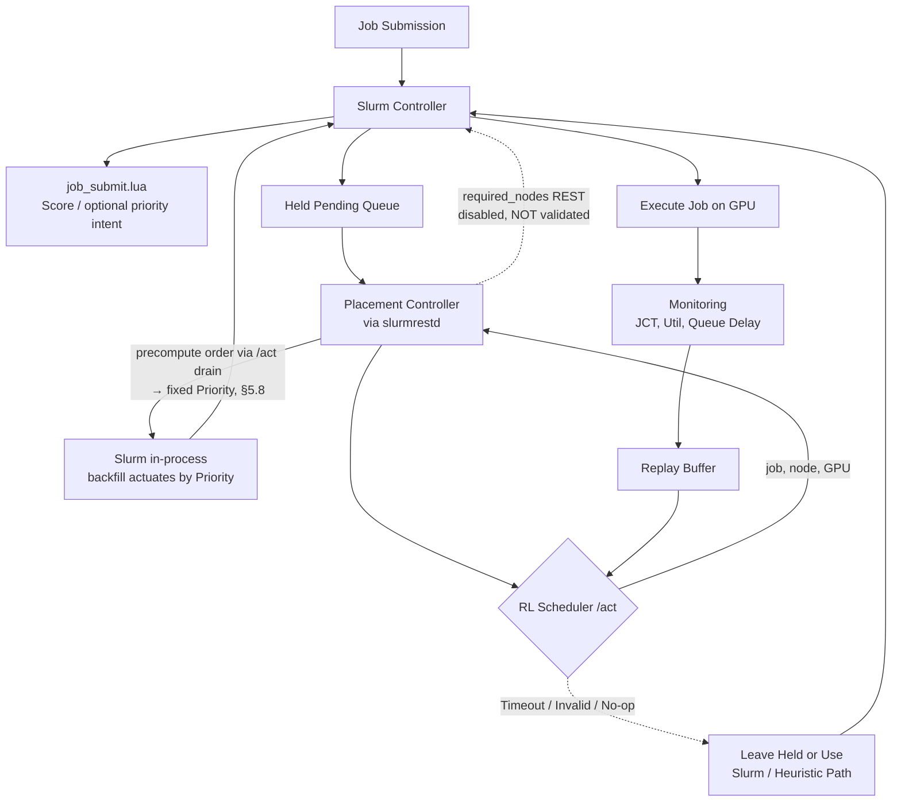
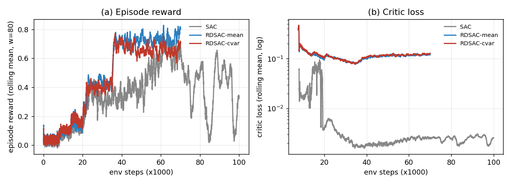

# 基於 Slurm 與 Kubernetes 架構下 AI 伺服器 GPU 工作負載智慧排程技術之研究

### Intelligent GPU Workload Scheduling Techniques for AI Servers under a Slurm-on-Kubernetes Architecture

**作者一¹、作者二²**
¹○○大學 ○○系　²○○大學 ○○系
{author1, author2}@stumail.nutn.edu.tw

---

## 摘要

異質 GPU 與 NVIDIA MPS 共享使排程器必須同時考量硬體差異、工作配額與佇列狀態；傳統 Slurm 固定規則難以動態兼顧工作完成時間（JCT）與尾端延遲 [1][2][3][4]。現有深度強化學習（DRL）排程研究多停留於模擬，較少在真實 Slurm 流程中處理 MPS-aware 工作派遣與 GPU placement。

本研究提出以 Slurm-on-Kubernetes 為排程核心的異質 GPU 智慧排程框架；Kubernetes 僅負責部署 [5]。框架以聯合動作介面建模 MPS-aware 工作派遣與 placement。本研究於 RTX 4070 與 RTX 3080 環境，以 trace-derived 混合 AI 工作負載比較 FCFS、Backfill、啟發式、SAC、RDSAC 與 RLPD [6][7][8][9]。在僅控制 placement（提交時節點綁定、順序由 Slurm 決定）的路徑下，學習式策略的平均 JCT 僅略優於或打平 FCFS／Backfill 且以顯著尾端代價換得，未形成穩健優勢。然而當策略經一條經驗證的**原生排序致動路徑（ordering-only）**（arrival-aware 前展策略取得完整派遣順序，交由 Slurm 自身 in-process 排程器以固定 Priority 致動並自由放置）取得對*順序*的控制權後，在**真實 CUDA、poisson 到達、深負載（oversub=6）**下，學習式策略的平均 JCT *與*尾端 P99 皆顯著勝過生產 Backfill 約 11–13%（Wilcoxon 皆 *p*=0.002，10 seed 中 10/10 的 P99 低於 Backfill）。此結果實機確認了模擬天花板分析對「ordering headroom 隨負載上升」的預測，並顯示效益取決於 RL 是否掌握*排序*槓桿、致動路徑是否原生、以及負載是否足以形成可重排的 backlog（淺佇列下排序無槓桿）。

**關鍵詞**：GPU 資源排程、異質 GPU、NVIDIA MPS、Slurm、Kubernetes、深度強化學習

## Abstract

The rapid growth of large language models and generative AI has made GPUs the primary compute resource for AI workloads [1][2]. However, many laboratory and small-scale clusters consist of heterogeneous GPU generations, and NVIDIA Multi-Process Service (MPS) allows multiple jobs to share a single GPU [3], making it difficult for traditional Slurm scheduling [4] to jointly optimize GPU utilization, job completion time (JCT), and tail latency. Existing heuristic policies such as FCFS and Backfill rely on fixed rules and cannot adapt to workload characteristics, while existing DRL schedulers rarely perform job selection and heterogeneous GPU placement under explicit MPS-quota constraints inside a real Slurm environment.

This paper proposes an intelligent scheduling framework for heterogeneous GPUs with NVIDIA MPS, using **Slurm as the scheduling core**. Kubernetes (k3s) only provides deployment and lifecycle management [5]. The policy interface models joint queue selection and placement. A placement-only real-machine path calls `/act` before submission and binds the selected node through `sbatch -w`, leaving job *ordering* to Slurm; on an RTX 4070/3080 testbed with trace-derived mixed AI workloads [1][2], learned policies under this path only match or marginally beat FCFS/Backfill in mean JCT and at a large tail cost, without a robust advantage. A held-job controller's post-submission `required_nodes` REST actuation was disabled by the tested Slurm REST API (v0.0.37); we therefore validated a **native ordering-only actuation path** instead — rolling the served policy forward (arrival-aware, rolling top-16 window) to obtain its full dispatch order, then handing that order to Slurm's own in-process backfill scheduler as fixed administrator `Priority` values while letting Slurm place freely. Under **real-CUDA aimix, poisson arrival, and deep load (oversub=6)** (10 seeds, 150 jobs), every learned policy significantly beats production Backfill in **both mean JCT and tail P99 by ~11–13%** (paired Wilcoxon *p*=0.002; P99 below Backfill in 10/10 seeds) — at this load Backfill's own aggressive mean-optimizing reorder starves some jobs into the worst tail of all arms, exactly what RL ordering avoids. This is a real-machine confirmation of the simulator ceiling analysis's prediction that ordering headroom grows with load, and shows the benefit hinges on the RL agent controlling *ordering*, a native actuation path, and enough load to form a reorderable backlog (at a shallow queue ordering has no leverage). Multiple-comparison correction, TOST, a ceiling analysis, and a placement ablation characterize the efficacy boundary and remaining uncertainty [6][7][8][9].

**Keywords**: GPU Resource Scheduling, Heterogeneous GPU, NVIDIA MPS, Slurm, Kubernetes, Deep Reinforcement Learning

---

## 1. 緒論

Slurm Workload Manager 是高效能運算叢集最廣泛使用的工作排程系統之一，提供完整的工作提交、佇列管理、資源限額與 GPU 資源配置功能 [4]，其以「節點」為基礎的資源模型非常適合研究工作環境。然而 Slurm 原生設計以固定實體節點為主，對彈性擴縮與容器化整合的支援相對有限。Kubernetes 則是目前最主流的容器編排平台，能自動管理容器的部署、擴縮與健康監控 [5]，但其原生排程器 (kube-scheduler) 以服務導向設計為主，對批次工作、GPU 共享與研究工作特有的排程需求支援不足。因此有多項研究嘗試將 Slurm 與 Kubernetes 整合，以同時取得批次排程語意與雲端彈性管理能力；實作層面也有 Slinky [10] 等 Slurm-on-Kubernetes 方向的工具，顯示此類架構已具有實務需求與發展基礎。

### 1.1 AI 工作負載快速增加

近年大型語言模型、生成式 AI 與深度學習服務快速發展，使 GPU 成為 AI 訓練與推論最重要的運算資源 [1][2]。相較於傳統批次運算，AI 叢集經常同時承載短時間推論、模型微調、長時間訓練與矩陣運算等不同工作，這些工作在執行時間、記憶體需求、延遲敏感度與 GPU 使用型態上皆有明顯差異 [1][2]。

在大學實驗室與中小型研究叢集中，GPU 資源通常有限，且硬體常由不同世代 GPU 漸進式擴充而成。例如 RTX 4070 與 RTX 3080 在算力、記憶體容量與功耗上皆不同。若排程器只把 GPU 視為同質資源，便可能讓小型推論工作佔用高效能 GPU，或讓長時間訓練阻塞後續短工作，造成 GPU utilization、JCT 與 queue delay 之間的取捨更加困難。

NVIDIA MPS 提供另一個重要槓桿：多個 CUDA 工作可共享同一張 GPU，使 GPU 不再只能以整張卡為單位分配 [3]。然而 MPS 也讓排程問題從「選哪張 GPU」變成「選哪張 GPU 與該工作需要多少 **MPS fraction**」。因此，在異質 GPU 與 MPS 共存的環境中，GPU scheduling 已成為影響叢集效能的核心問題。

### 1.2 現有方法限制

Slurm 提供 FCFS、Backfill、multifactor priority 與 GRES/TRES GPU 資源管理 [4]，但其傳統策略多以固定規則為主，難以感知異質 GPU、MPS 分片、工作類型與長期回報之間的相互影響。現有方法主要存在四項限制：

1. **不充分考慮 GPU 差異**：許多排程方法把 GPU 視為同質資源，較少將不同世代 GPU 的算力、記憶體與執行時間差異納入 placement 決策。
2. **不充分考慮 MPS fraction**：部分研究討論 GPU sharing 或 GPU partition，但未將 **MPS fraction** 需求作為排程器的顯式感知變數。
3. **依賴固定規則**：FCFS 與 Backfill 能提供穩定基準，但難以隨工作負載動態調整策略。
4. **缺乏真實 Slurm 流程驗證**：不少學習式排程研究停留在模擬環境，未整合到真實 Slurm job submission path，也未處理服務失效與實機部署。

### 1.3 為什麼使用 DRL

GPU scheduling 不是單次分類問題，而是序列決策問題。一次 placement 會改變 GPU 剩餘 MPS、後續佇列等待時間、工作共置干擾與未來可用資源，因此當下看似最佳的放置，未必能帶來長期最佳的 JCT 或利用率。此問題具有三個適合使用 DRL 的特徵：

1. **Sequential decision**：每次工作放置會影響後續所有排程決策。
2. **Long-term optimization**：排程目標不只包含當下工作的執行時間，也包含 queue delay、makespan、tail latency 與整體 GPU utilization。
3. **Dynamic environment**：工作到達率、工作類型、GPU 使用率與 MPS 剩餘容量會隨時間改變，固定 heuristic 難以完整涵蓋所有情境。

因此，本研究採用 DRL 作為排程策略學習方法，讓代理人從模擬與實機回饋中學習 GPU placement 與 MPS-aware 排程的長期效果。

### 1.4 研究貢獻

本研究的核心貢獻在於將「異質 GPU + MPS + 真實 Slurm 流程」三者結合，具體如下：

1. **MPS 配額約束下的工作派遣與異質 GPU placement**：不同於 UXP-RL [11] 主要決定 CPU-vs-GPU 資源類型、KIS-S [12] 調整 Kubernetes 推論副本數、DRR [13] 處理 GPU 碎片化，本研究的策略介面與模擬環境將「派哪個工作」與「放到哪張異質 GPU」建模為聯合離散動作。每個工作攜帶既定的 MPS fraction 需求（25%/50%/75%/100%）作為 state 特徵與 action mask 的可行性約束，使決策在尊重 MPS 配額的前提下進行。此設計首次在真實 Slurm 佇列上刻畫「job 選擇與異質 GPU placement 聯合決策」相對於僅決定資源類型 [11] 或僅調整副本數 [12] 的可行性與行為差異。

2. **失效安全的 Slurm 策略層整合**：不同於 UXP-RL、KIS-S 等純模擬研究，本研究把學習式決策服務嵌入真實 Slurm job submission path，並提供 fail-safe 回退機制，當 RL 服務逾時、回傳無效 action 或健康檢查失敗時自動回退至啟發式策略，使排程核心 (slurmctld) 永不被阻塞。此設計讓 DRL scheduler 得以在真實排程路徑中部署，而不需修改 Slurm 核心。本研究因此證明學習式排程可在不更動 slurmctld 的前提下安全嵌入生產排程路徑，這是先前純模擬研究 [11][12] 未曾示範的部署可行性。

3. **實機比較與效益邊界分析**：本研究於 RTX 4070/3080 異質環境，以 trace-derived 混合 AI 工作負載比較 FCFS、Backfill、啟發式、SAC、RDSAC 與 RLPD，並採多 seed、Holm-Bonferroni 校正與 TOST 等價檢定。學習式策略在平均 JCT 上優於傳統 Slurm 排程，但兩者皆不足以支持穩健超越 size-aware 啟發式。並且由於實驗環境限於小叢集，經消融實驗分析後因變異過大而無法辨識哪個決策具有穩定優勢。

## 2. 相關研究

### 2.1 GPU 叢集排程、分析與資源共享

近期研究聚焦於單節點內或單一叢集模型上的動態資源調度本身。Wang 等人的 DCUDA [14] 針對單節點多 GPU 情境，設計了一套輕量級核心／記憶體使用率監控機制，搭配近乎零開銷的「執行中」CUDA 應用即時遷移，將 GPU 過載時間平均降低 78.3%、一般工作執行時間降低 42.1%（記憶體密集型工作最高 67%）。Sedighi 等人 [15] 則在 Alibaba 的 cluster-trace-gpu 生產工作負載軌跡之上，提出結合硬體與軟體分割的公平且需求感知動態資源配置演算法，於模擬環境中將 GPU 資源使用量降低達 88%。這兩項工作皆聚焦「資源配置本身如何隨工作負載動態調整」（即時遷移／再分割），評估分別侷限於單一多 GPU 節點與純模擬 trace 重放，並未涉及與批次排程器（如 Slurm）的整合。

在 GPU 共享機制方面，NVIDIA MPS 允許多個 CUDA process 同時共享同一張 GPU 的運算資源 [3]，NVIDIA MIG 則在硬體層面將 GPU 切分成隔離的 instance [16]。學術上亦有更細緻的 partition 與時空共享研究，如多 GPU 伺服器上的時空共享服務 [17] 與現代 GPU 的階層式資源分割 [18]。針對深度學習工作負載，也有專門的叢集排程系統：Gandiva [19] 以 introspective 排程與工作遷移提升利用率，Tiresias [20] 以近似 age-based 的優先序縮短 JCT，MLaaS 生產叢集分析 [2] 則刻畫了大規模異質 GPU 叢集的工作特性。這些方法多假設整卡分配或同質 GPU，較少把 MPS fraction 作為排程流程的顯式決策脈絡。

### 2.2 強化學習排程

Lin 等人 [11] 提出 UXP-RL：一個以 DQN 為核心、涵蓋前處理／訓練／推論三類任務、可部署為集中式或分散式排程器、並跨雲／邊／霧三層架構運作的 CPU-GPU 任務排程演算法。其於**模擬環境**中，集中式排程器將平均週轉時間相較 SJF／FCFS 與 TYPE 啟發式分別降低 57.81%、57.28% 與 27.66%；分散式排程器則因能將長訓練工作卸載至雲端而把推論任務週轉時間再降低 89.07%。同年 Zhang 等人的 KIS-S [12] 以 PPO 訓練一個 GPU-aware 的 Kubernetes 推論自動擴縮策略，完全於自建模擬器 (KISim) 中訓練後零樣本部署，於多種流量情境下平均獎勵提升 75.2%；其問題設定是調整副本數的自動擴縮，而非本研究的工作放置排程。Wu 等人的 DRR [13] 則針對 GPU 共享叢集的碎片化問題，以模仿學習從既有啟發式暖啟動一個深度強化學習去碎片化排程器，並同時於實體 Kubernetes 測試床與大規模模擬叢集上驗證，平均碎片率降低 50%，是少數同時涉及真實 Kubernetes 部署的學習式排程器。

在演算法基礎方面，Discrete SAC 將最大熵框架延伸到離散動作空間，以 categorical 策略取代高斯策略、以期望估計熵項 [6]；分布式評論家（如 IQN [7]、DSAC [8]）以回報分布與風險敏感目標處理尾端延遲；以 BatchNorm 移除 target network 以提升樣本效率的 CrossQ [21] 則代表近期簡化訓練流程的方向；RLPD [9] 進一步以對稱取樣真實資料的方式進行 offline-to-online 微調，降低從零探索的成本。然而，現有 RL scheduler 多假設單一 GPU、同質 GPU 或大型模擬叢集，或將 Kubernetes 當作排程主體（如 Kubeflow [22]、Volcano [23]、Kueue [24]、NVIDIA KAI [25]）；較少探討在真實 Slurm 流程中，如何讓 RL 同時決定異質 GPU placement 與 MPS-aware 排程，並在服務失效時維持排程安全。

### 2.3 異質與邊緣 GPU 排程

Tsenos 與 Kalogeraki [26] 針對缺乏原生虛擬化支援的邊緣 GPU（如消費級卡）提出一套硬體無關的時空共享機制：為每個行程建立 cgroup、動態調整其 duty cycle 來實現優先權式與截止期限式排程，且無需修改工作負載原始碼即可整合進 TensorFlow、PyTorch、FFmpeg 等既有框架。Majeed 等人 [27] 則以系統性文獻回顧整理 NVIDIA Jetson 系列邊緣 SoC 上的 DNN 排程器，區分規則式與最佳化式兩大類，並整理其記憶體競爭、跨加速器轉移成本與靜態／動態排程的權衡；其排程粒度是單一 DNN 模型內的層級（將個別網路層指派給不同硬體加速器）。這些邊緣場景的資源與延遲約束與資料中心叢集不同，惟顯示異質硬體上的細粒度排程是一個活躍的研究方向。此外，異質 Kubernetes 叢集上的 RL 排程 [28]、混合學習與最佳化排程 [29] 與語意感知的 LLM 叢集排程 [30] 亦顯示學習式方法在異質資源分配上的潛力。

### 2.4 定位比較

表 1 彙整本研究與主要研究類型的定位差異。本研究的核心位置在於將「異質 GPU + MPS + 真實 Slurm 流程」三者結合；Kubernetes 僅是部署平台 [5]，不是本文的主要排程貢獻。

表 1. 相關研究定位比較

| 類型 | 是否考慮異質 GPU | 是否考慮 MPS fraction | 是否整合真實 Slurm | 主要限制 |
|---|:--:|:--:|:--:|---|
| FCFS / Backfill [4] | 部分 | 部分 | 是 | 固定規則，難以學習長期效果 |
| GPU sharing / partition [3][16][17][18] | 部分 | 部分 | 否 | 多聚焦 partition 機制，較少處理排程流程 |
| RL scheduler（模擬）[11][12] | 部分 | 少 | 否 | sim-to-real 效益不明 |
| RL scheduler（真實 K8s）[13] | 部分 | 少 | 否 | 針對碎片化，非 Slurm 工作流 |
| Kubernetes GPU scheduler [22][23][24][25] | 部分 | 部分 | 否 | Kubernetes 是排程主體，不處理 Slurm 工作流 |
| 本研究 | 是 | 是 | 是 | 目前實機規模仍小，需擴大驗證 |

## 3. 研究目的與系統架構

### 3.1 研究目的

本研究的目標是在異質 GPU 與 NVIDIA MPS 環境中，學習一個能在 MPS 配額約束下決定工作派遣與 GPU placement 的排程策略，以降低 average JCT 與尾端 JCT。更具體而言，本研究要回答兩個問題：第一，DRL 在模擬環境中相對固定規則的表現如何；第二，此學習式策略部署到真實異質 GPU 叢集後，相對 FCFS、Backfill 與 size-aware 啟發式的效益與限制為何。

本研究將異質 GPU + MPS 排程建模為馬可夫決策過程 (MDP)。每次有工作可排程時，代理人觀察叢集狀態，選擇一個工作與其 GPU placement，並在工作完成後根據 JCT 與 GPU utilization 取得 reward。

**State.** 狀態包含四類資訊：

1. **Job features**：工作類型、預估 runtime、GPU memory 需求、MPS 需求、SLO 緊迫度與等待時間。
2. **GPU features**：GPU 型號、GPU utilization、SM utilization、memory usage、可用 MPS、目前共置工作數。
3. **Queue features**：佇列長度、前 K 個工作的需求、等待時間分布與到達率。
4. **History features**：近期完成工作 JCT、slowdown、SLO violation 與各 GPU 的負載變化。

**Action.** 動作為「從佇列前 K 個工作中選一個」與「將其放置到哪張 GPU」的聯合離散決策，另含一個 no-op（暫不派遣）：

```text
Action = (選 job_i ∈ top-K 佇列) × (放置到 node_j / gpu_k)  ∪  {no-op}
```

在本研究的 2×1 實驗平台（K=16、2 個 placement）中，動作空間為 16×2+1 = 33 個離散動作，observation 維度為 168。每個工作攜帶自身的 MPS fraction 需求（25%/50%/75%/100%），排程器透過 state 特徵感知、並由 action mask 遮蔽 MPS 剩餘容量不足的放置，因此策略是在尊重工作 MPS 需求的前提下做 job 選擇與 placement

**Reward.** Reward 的設計目標是降低使用者感受到的等待與完成時間，並以小權重的資源使用項避免 GPU 閒置，故採以 JCT 為核心的多目標形式：

```text
R = w_jct · (−JCT / reward_scale) + w_util · GPUUtil
```

本研究訓練使用 w_jct=1.0、w_util=0.05、reward_scale=20000。JCT = 完成時間 − 提交時間，已包含 queue delay；GPUUtil = 叢集 MPS 使用率 = used_MPS / total_MPS ∈ [0, 1]，為模擬器每一步的資源使用狀態，用於避免策略學到保守閒置。兩項計入頻率不同：util 項於**每一步**計入、−JCT/reward_scale 項於**工作完成時**計入（reward_scale=20000 相對於訓練分布的 JCT 量級選定，使該項落於 O(0.1) 尺度）。util 項設計上為小權重（0.05）的「維持 GPU 忙碌」輔助訊號，惟因每步計入，其累積影響會隨 episode 長度上升，故兩項的實際權衡取決於 JCT 尺度與 episode 長度。另可選用 potential-based reward shaping [31] 提供密集訊號，並以 opt-in 的 SLO 逾時懲罰處理延遲敏感工作。此 reward 設計讓 DRL 不只最佳化單一工作，而是學習長期排程結果。

### 3.2 系統架構

本研究建立一套以 Slurm 為排程核心的異質 GPU + MPS 智慧排程平台（圖 1）。學習式策略以服務形式接入 Slurm 的工作提交流程：策略讀取工作、GPU、MPS 剩餘容量與佇列狀態，輸出建議的工作與 GPU placement，並由系統於提交時據以綁定節點（工作的 MPS fraction 依其請求分配、非策略輸出）。若策略服務逾時或回傳不可行決策，系統自動回退至啟發式路徑，確保排程核心不被阻塞。工作執行期間，監控服務收集資源使用、queue delay、JCT 與 reward，寫入 replay buffer 供後續訓練或 RLPD (Reinforcement Learning with Prior Data) [9] 微調使用。

需說明的是，本文 §5.2 的主要實機評估聚焦於 **GPU placement** 的效果：系統於提交時取得策略建議的節點並綁定，藉此在真實叢集上比較不同 placement 決策；由策略即時從佇列挑選下一個工作（順序）並以 held-job 控制器透過 `required_nodes` REST 呼叫致動，在受測 slurmrestd（v0.0.37）中被停用而未生效，故該 REST 致動路徑不納入本文效能宣稱。§5.8 進一步驗證並採用一條替代的**原生排序致動路徑**：前展服務中的策略取得完整派遣順序，再以固定 Slurm `Priority` 交由 Slurm 自身 in-process 排程器致動，使 RL 掌握順序與節點、Slurm 掌握時機；此路徑經實測有效並用於 §5.8 之重載評估。



**圖 1. 系統架構與排程流程。** 學習式策略接入 Slurm 提交流程，於提交時提供節點綁定建議；透過 `required_nodes` REST 的即時致動在受測環境未生效（圖中虛線），改採 §5.8 驗證的原生路徑：前展策略取得派遣順序後，以固定 Priority 交由 Slurm 自身 in-process 排程器致動。逾時、不可行決策或 no-op 時回退至 Slurm／啟發式路徑。監控服務週期蒐集資源使用、queue delay 與 job events，寫入 Replay Buffer。

本平台使用 Kubernetes (k3s) 部署 Slurm controller、worker、RL scheduler、monitoring service 與相關容器 [5]。底層 GPU 基礎建設是透過 Kubernetes Dynamic Resource Allocation (DRA) 宣告與取得裝置 [32]，工作層級的 MPS 配額仍由 Slurm `gres/mps` 與對應的 MPS 執行環境落實。**Kubernetes 在本文中不負責工作排程決策**，只提供容器化部署、服務健康檢查、網路與生命週期管理。此設計保留 Slurm 在 HPC batch scheduling 中成熟的佇列語意 [4]。此方向與將 Slurm 整合進 Kubernetes 的 Slinky [10] 互補：Slinky 提供 Slurm-on-Kubernetes 部署基礎，本研究則在 Slurm 排程路徑上加入具失效回退機制的學習式策略層。

## 4. 排程技術

本章介紹本研究的 scheduler：以 Slurm 原生能力作為穩定基線，以啟發式評分函式作為可部署的中階基準，再以 DRL agent 學習序列排程策略。

### 4.1 Slurm 內建排程演算法

本研究以 Slurm 原生排程能力作為穩定基線，而非重寫排程核心。例如 Backfill 允許在不延後高優先權工作的前提下，讓資源需求較小、執行時間較短的工作提前插隊執行，緩解大工作長期佔用資源造成的閒置；此外也納入更保守的 FCFS 作為基準對照（為現成排程器基準，非理論下界），用以檢驗啟發式與學習式策略相對 Slurm 開箱即用能力是否確有改善。

### 4.2 啟發式排程策略

啟發式策略以加權線性組合公式計算工作優先級，分數越高代表該工作越值得優先排程。三個因子及對應權重如表 2 所示。此 score heuristic 代表可部署、可解釋且低成本的生產啟發式方法。

表 2. 啟發式因子與係數定義

| 因子 | 係數 | 定義 |
|---|:--:|---|
| MPS | 0.40 | `mps_req/100 ∈ [0, 1]`。沒給=1.0，超過=0.0。 |
| VRAM | 0.20 | `(1 − (fit_tier − req))/max_tier ∈ [0, 1]`。依 job 需求選最小可用 VRAM tier，沒給=0.5。 |
| Frag | 0.20 | `4x(1 − x), x = mps_req/100`，並以負號納入總分。mps_req=0 或滿載→0.0；mps_req=50%→最高懲罰 1.0。 |

需注意 score 在兩個評估管線的強度不同：模擬使用含 SJF-like runtime kicker 的完整版本（ε=0.30），而實機部署因 runtime predictor 未上線而停用該項（ε=0），僅保留 MPS-fit 與 VRAM-fit。兩者為同一評分函式的兩種設定，故模擬表與實機表的 score 絕對表現不宜直接跨表比較；各表內部的相對比較則不受影響。

### 4.3 深度強化學習策略

本研究比較以下 DRL 方法：

1. **Discrete SAC**：將 Soft Actor-Critic 延伸到離散 action space，以 categorical 策略取代高斯策略、以期望估計熵項，適合 job 選擇與 GPU placement 這類有限離散動作 [6]。
2. **RDSAC-mean**：以分布式 critic 建模回報分布，但 actor 主要依平均回報決策 [7][8]。
3. **RDSAC-cvar**：在 RDSAC 上加入 CVaR 風險敏感目標，使策略更重視尾端 JCT 與 SLO violation [8]。
4. **RLPD**：以真實資料對模擬訓練出的模型進行微調，縮小 sim-to-real gap [9]。本研究忠實採用原論文核心配方——每個 batch 對稱取樣 50% sim 先驗 + 50% 真實資料、critic 加 LayerNorm 的 critic ensemble、高 UTD——但訓練機制為離線（更新迴圈只做梯度更新、不在真環境即時互動），故為「sim + 真實混合 buffer 的離線微調」，非原論文的真線上更新。

RDSAC 採用雙頭 IQN critic 建模 reward return 與 entropy return [7]，並使用 masked categorical actor 避免選到不可執行 action（即所選放置的 GPU 剩餘 MPS 不足以容納該工作請求的動作）。訓練流程包含 prioritized replay、n-step return、potential-based reward shaping [31] 與 heuristic warm start。需澄清命名：本研究的 RDSAC 為自組的「distributional + discrete SAC」，以離散動作空間搭配 IQN 分位數 critic 建構 [7][8]，與 Duan 等人 [33] 針對連續控制、將回報建模為單一高斯分布的 Distributional Soft Actor-Critic 不同，兩者不應混淆。

## 5. 實驗與評估

### 5.1 實驗環境與訓練

本研究使用一個小規模異質 GPU 實機叢集進行部署與評估，相關環境如表 3 所示。此環境刻意保留 GPU 世代差異，讓排程器必須面對異質 GPU placement 的問題；由於硬體規模只有兩張 GPU，本研究將結果定位為實機 proof-of-concept 與方法學驗證，不直接外推至大型生產叢集。

表 3. 實驗環境列表

| 項目 | 設定 |
|---|---|
| 節點 1（控制平面） | Intel Core i7-10700（16 執行緒）、64 GB RAM、NVIDIA RTX 4070 |
| 節點 2（工作節點） | Intel Core i7-9700、8 GB RAM、NVIDIA RTX 3080 |
| 作業系統 | Ubuntu 24.04.4 LTS（kernel 7.0.0 / 6.8.0） |
| NVIDIA driver／CUDA | 580.167.08／CUDA 13.0 |
| 容器平台 | k3s v1.34.6、containerd 2.2.2；僅負責容器部署與服務生命週期 [5] |
| GPU 資源宣告 | Kubernetes Dynamic Resource Allocation (DRA) driver v0.4.1 [32] |
| 排程器 | Slurm 23.11.7 with GRES/TRES and MPS（slurmrestd REST API v0.0.37）[4] |
| GPU sharing | NVIDIA MPS，MPS fraction 為 25%、50%、75%、100% [3] |
| 深度學習框架 | PyTorch |
| 網路 | 同一區域網路，節點間 RTT ≈ 0.16 ms（ping 量測，可忽略） |
| 監控 | SM 利用率、memory usage、job event、queue delay |

訓練資料集使用 Alibaba GPU Trace 與 Microsoft Philly Trace：前者用於參考生產 MLaaS 工作的到達率、工作長度與資源需求分布 [2]，後者用於參考多租戶 GPU training workload 的佇列與 JCT 特性 [1]。同時在本研究叢集上執行 cuBLAS、BERT inference、ResNet training、Qwen fine-tuning 與矩陣運算等真實 AI 工作。

為確保比較公平，各方法在同一評估中取得一致的工作資訊：FCFS／Backfill 使用提交時的 Slurm time-limit；模擬中 score 的 SJF 項與學習式策略的 runtime 特徵皆來自同一組執行時間估計（模擬為 oracle），無單一方法獨享的未來資訊；實機部署因 runtime predictor 未上線，score 停用 SJF 項（ε=0），僅使用 MPS-fit 與 VRAM-fit。

直接在實際環境從頭訓練需要數十萬到數百萬個 transition，而真實叢集中一個決策對應一個跑數分鐘至數小時的任務，收集足夠樣本需時數月。因此本研究採 sim-to-real 兩段式：(1) 在模擬環境大量訓練，產出基本模型；(2) 上線部署，記錄真實叢集 (observation, action, reward) 資料；(3) 以 RLPD 用真實資料把基本模型微調成真實環境策略。DRL 訓練參數如表 4 所示；所有學習臂共用網路與最佳化設定，僅 critic 家族與風險目標不同。

表 4. DRL 訓練超參數

| 項目 | 數值 |
|---|---|
| 優化器／學習率（actor, critic, α） | Adam／3×10⁻⁴ |
| 折扣 γ／目標軟更新 τ | 0.99／0.005 |
| 隱藏層（MLP trunk） | (256, 256) + LayerNorm |
| batch size／UTD ratio | 256／4 |
| n-step return | 10 |
| replay | Prioritized (SumTree) + score warm start |
| IQN 分位數 N_QUANT／cosine 維度 | 32／64（RDSAC 臂） |
| 風險目標／tail mass β | CVaR／0.25（RDSAC-cvar 臂） |
| 溫度 α | 固定 0.05 |
| reward | 多目標（w_jct=1.0, w_util=0.05），reward_scale=20000 |
| 訓練長度 | 每臂約 1×10⁵ curriculum env-steps |

圖 2 為三個學習臂在 aimix-family 課程訓練下的 episode reward 與 critic loss（跨 seed、rolling window w=80 平滑）。三臂皆使用固定溫度 α=0.05；曲線在課程切換後維持有限值，未出現數值發散。由於不同 critic 的 loss 尺度不可直接比較，圖 2 僅用於檢查訓練穩定性，不據此判定策略優劣。



**圖 2. 學習臂訓練收斂**（SAC / RDSAC-mean / RDSAC-cvar，aimix-family 課程，跨 seed 平均、rolling window w=80）。

### 5.2 實機評估結果

**模擬結果。** 在 trace-derived AI-serving 工作負載中（8 個 held-out workload seed），啟發式與學習式策略明顯區分不同排程方法：size-aware 的 multifactor／score 在 SLO 違反率上（≈41%）明顯優於 FCFS（66.5%），此區隔在計入 seed 變異後仍成立，說明模擬器本身具備區分策略的能力（表 5）。

表 5. 模擬環境下 AI-serving 工作負載的排程器比較（8 個 held-out workload seed，mean ± std；score 使用 sim 預設 ε=0.30）

| 排程器 | 平均 JCT (s) | 推論 JCT (s) | SLO 違反 (%) |
|---|--:|--:|--:|
| FCFS | 2199 ± 1201 | 1847 ± 1151 | 66.5 ± 23.2 |
| multifactor | 1108 ± 398 | 461 ± 264 | 41.1 ± 20.1 |
| score | 1129 ± 398 | 520 ± 331 | 40.7 ± 19.0 |

**實機混合 AI 工作負載。** 在 BERT inference、ResNet training、Qwen fine-tuning 與 cuBLAS 矩陣運算四路混合工作負載（數量占比分別為 30%、30%、30%、10%，每 seed 125 個工作、8 seeds）上評估。結果如表 6 所示。在主要 campaign 中，SAC（126.2 s）與 RDSAC-cvar（130.5 s）的平均 JCT 點估計低於 FCFS（137.0 s）與 Backfill（136.2 s），與 size-aware 啟發式（125.2 s）則相當接近；RDSAC-cvar 在尾端（P99）於學習式策略內部表現相對較佳。以真實資料 sim-to-real 微調的 RLPD 取得表中最佳的平均 JCT 點估計（110.7 s）；惟 RLPD 為獨立配對評估（表 6 註 †），其相對自身併跑 score 基準的改善約 2.2%（點估計，未達統計顯著，詳 §5.5）。整體而言，部分學習式策略在平均 JCT 上優於傳統 Slurm 排程（FCFS／Backfill），但相對已 size-aware 的啟發式尚未形成穩健優勢。

表 6. 實機混合 AI 工作負載評估（每 seed 提交 125 個工作，n=8 seeds；表列 JCT／P95／P99 為各 seed 內平均之**未加權平均 ± 標準差**，單位秒；完成數為各 seed 平均，各臂皆接近滿額；ΔJCT% 定義見 §5.4）。† RLPD 為獨立配對評估，其併跑的 size-aware score 基準約 113.7 s；RLPD 的絕對 JCT 不宜與其他列直接配對比較，僅其對自身基準的 ΔJCT（+2.2%，點估計）具配對意義（詳 §5.5）。

| 排程器 | 完成數 | 平均 JCT (s) | P95 (s) | P99 (s) |
|---|--:|--:|--:|--:|
| FCFS | 125 | 137.0 ± 18.3 | 241.2 ± 41.7 | 255.0 ± 43.7 |
| Backfill | 125 | 136.2 ± 23.4 | 255.6 ± 52.5 | 269.8 ± 50.1 |
| 啟發式 | 125 | 125.2 ± 19.3 | 433.5 ± 146.4 | 517.6 ± 122.2 |
| SAC | 124 | 126.2 ± 19.8 | 471.2 ± 86.2 | 566.5 ± 49.9 |
| RDSAC-mean | 124 | 142.3 ± 38.8 | 469.7 ± 152.7 | 600.3 ± 77.1 |
| RDSAC-cvar | 125 | 130.5 ± 23.3 | 395.0 ± 132.9 | 527.7 ± 110.6 |
| **RLPD** † | 125 | **110.7 ± 18.9** | 418.0 ± 103.5 | 509.0 ± 80.2 |

由表 6 可以發現，在平均 JCT 的部分，SAC 與 RDSAC-cvar 的平均 優於 FCFS／Backfill，但相對啟發式的差距很小，而 RDSAC-mean 則較差。FCFS／Backfill 以嚴格序列執行換得較低的 P99 (255~270 s)，明顯低於啟發式與學習式策略的 509–600 s。也發現 RDSAC-cvar 在**學習式策略內部**取得較佳尾端平衡。

**重載複核（150 工作／16 seed，基準改為 Backfill，score 移除）。** 為在 §5.7 天花板分析所指出「headroom 開窗」的較重負載 regime 進一步檢驗，並以更大樣本與更直接的基準複核，另跑一組六臂實機評估：每 seed 工作數由 125 提高至 150、workload seed 由 8 擴至 16，移除 size-aware score 臂，直接以 Slurm 生產排程器 **Backfill** 作為 seed-level 配對基準；RLPD 於此 campaign 為一等公民臂，由 §5.1 所述之忠實 168 維線上日誌（2 786 筆真實 transition、以 sacct 真實 JCT 計 reward）微調而得。結果如表 6b。**無任何學習式策略在平均 JCT 上顯著勝過 Backfill**（皆 *p*>0.05）：RDSAC-mean 最接近打平（−1.3%，16 seed 中 10 個較快，*p*=0.70），SAC／RDSAC-cvar／RLPD 平均略慢於 Backfill（−4.5%～−5.3%，皆未達顯著）；FCFS 則顯著慢於 Backfill（−13.1%，0/16，*p*<0.001），確認基準本身具鑑別力。與表 6 一致，學習式策略的尾端明顯更差：P99 均落在 ≈639–668 s，約為 Slurm-native（≈263–282 s）的 2.4 倍。此較重負載、較大樣本的複核顯示——**在此 placement-only 路徑（RL 只綁節點、順序由 Slurm 決定）下，即使負載進入天花板分析指出效益空間開啟的區間，學習式仍無法穩健勝過已充分調校的生產 Slurm 排程，且以平均 JCT 的打平換取顯著更差的尾端延遲**。（此 campaign 之忠實 RLPD 於重載下不再取得表 6 之最佳平均 JCT，顯示其相對優勢亦取決於負載與基準。）惟須強調此為 placement-only 路徑之結論；§5.8 進一步顯示，當 RL 改經原生排序致動路徑（ordering-only）取得對*順序*的控制權，並在深負載（poisson oversub=6）下評估時，學習式策略的平均 JCT *與*尾端 P99 反而**同時顯著勝過 Backfill 約 11–13%**（皆 *p*=0.002）——故本負向結果應理解為特定致動路徑（及該路徑下的節點綁定序列化）之限制，而非學習式排程於重載下的最終判定。

表 6b. 重載混合 AI 工作負載評估（每 seed 提交 150 個工作，n=16 seeds；JCT／Makespan／P95／P99 為各 seed 內平均之未加權平均 ± 標準差，單位秒；score 已自評估項目移除，Backfill 為配對基準；ΔJCT% 見表 8b）

| 排程器 | 平均 JCT (s) | Makespan (s) | P95 (s) | P99 (s) |
|---|--:|--:|--:|--:|
| FCFS | 151.4 ± 29.1 | 778.9 ± 37.4 | 270.2 ± 45.1 | 282.4 ± 46.6 |
| **Backfill**（基準） | 134.6 ± 28.8 | 757.5 ± 46.8 | 251.2 ± 48.2 | 263.2 ± 48.7 |
| SAC | 138.9 ± 23.8 | 776.4 ± 36.1 | 540.4 ± 120.5 | 655.6 ± 66.1 |
| RDSAC-mean | 134.9 ± 27.0 | 764.4 ± 38.0 | 447.3 ± 165.2 | 640.5 ± 73.5 |
| RDSAC-cvar | 140.2 ± 27.1 | 783.0 ± 30.7 | 529.2 ± 139.4 | 639.3 ± 61.1 |
| RLPD | 139.4 ± 28.6 | 786.8 ± 39.4 | 513.1 ± 177.8 | 667.5 ± 55.3 |

### 5.3 系統行為量測

除排程品質外，本研究亦量測學習式決策路徑的系統行為，以檢驗其失效安全整合是否非侵入。在 2×1 平台上以 8 個工作負載 seed（每 seed 125 個工作）重放排程序列，於控制平面（CPU）逐次計時策略決策，並依線上服務的判定門檻（低信心 value／entropy）將每次決策分類為 RL 主導、低信心回退，或暫不派遣（no-op），結果如表 7。

決策延遲為次毫秒級（p99 0.27 ms、最大 7.3 ms），較 Lua hook 的 fail-safe 逾時門檻（150 ms）低約三個數量級；在 76,099 次決策中無任一次逾時，顯示 RL 路徑對 slurmctld 幾乎零額外負擔，逾時型回退不會因決策過慢而觸發。在實際放置決策中約 12% 因低信心回退至啟發式基準、其餘由 RL 主導；其中大量的 no-op 反映離散事件下多數時間步並無可派工作，屬正常等待行為。

表 7. 系統行為量測（RDSAC-cvar 策略，2×1，8 seeds × 125 工作，控制平面 CPU）

| 指標 | 數值 |
|---|--:|
| 決策延遲 mean／p50／p95／p99／max (ms) | 0.19／0.18／0.26／0.27／7.27 |
| 逾時（> 150 ms fail-safe 門檻）比例 | 0.00%（0 / 76,099） |
| 放置決策中低信心回退比例 | 12.0%（115 / 959） |
| RL 主導放置比例 | 88.0%（844 / 959） |

> 以下 §5.4–5.8 以嚴謹的統計方法（seed-level 配對、Holm-Bonferroni 多重比較校正、TOST 等價檢定）進一步刻畫上述效益的統計邊界與場景依賴性，並輔以天花板分析與 placement 消融解析可贏空間的來源。

### 5.4 統計方法

實機評估採用三項方法降低誤判：

- Common random numbers：同一 seed 下的排程器共用相同工作序列。
- Drift-robust interleaving：同一 campaign 內的方法交錯執行，降低 GPU 暖機或系統漂移與特定方法混淆。
- Seed-level paired statistics：以 seed 為分析單位，避免偽重複。配對顯著性以 seed-level 配對 t 檢定計算；多重比較的 Holm-Bonferroni family 為主 campaign 中各非-score 臂（SAC、RDSAC-mean、RDSAC-cvar、FCFS、Backfill）對 score 的 5 項比較（RLPD 屬獨立 campaign，另計）；TOST 等價界限（±10%）為**事前**指定，取約當基準 score 跨 seed 的相對 JCT 變異量級作為實務可忽略門檻。各臂的等價檢定為個別進行，未再跨等價檢定做多重性校正。

**ΔJCT% 與分析單位**：ΔJCT% 由表 6 之 seed-mean JCT 計 `(JCT_score − JCT_arm) / JCT_score × 100`（正值＝快於 score），故可由表 6 **逐格還原、與 §5.5 一致**；表 6 的「平均 JCT」為各 seed 內平均 JCT 之未加權平均 ± 標準差（n=8），非 pooled jobs。95% CI、Cohen's *d*、配對 t 之 *p* 值與 TOST 則由 seed-level 配對差得出。RLPD 之 score 基準為其自身併跑者（見表 6 註 †）。

受限於 n=8，檢定力偏低，因此本研究不僅依賴單一顯著性檢定，而是以點估計、TOST 等價檢定與天花板分析交叉佐證效益邊界。

> 上述配對與 interleaving 保證只適用於各自 campaign 內，不能用來支持跨 campaign 的 RLPD-vs-FCFS／Backfill 比較。百分比若由彙總平均值計算，僅描述點估計；推論性結論以同一 seed 內的配對差為準。

### 5.5 與啟發式基準的嚴謹比較

表 6 顯示 SAC 與 RDSAC-cvar 在平均 JCT 上優於 FCFS／Backfill，但相對 **size-aware score** 則未構成穩健超越。以 aimix125c campaign 的 seed-level 配對差（ΔJCT%，正值代表快於 score；n=8，配對 t 檢定，Holm-Bonferroni 校正；TOST 等價界限**事前**定為 ±10%）進行嚴謹比較。

本節各臂 ΔJCT% **直接由表 6 之 seed-mean JCT 計算** `(JCT_score − JCT_arm) / JCT_score × 100`，故與表 6 **逐格一致、可直接驗證**（例如 RDSAC-mean (125.2−142.3)/125.2 = −13.7%、FCFS −9.4%、SAC −0.8%）；95% CI、Cohen's *d*、adjusted *p* 與 TOST 則由 seed-level 配對差得出。RLPD 之絕對平均 JCT 取自併跑其自身 score 基準的評估（見表 6 註 †），故其 ΔJCT% 以該基準計算。

六臂的完整統計如表 8。

表 8. 與 size-aware 啟發式（score）之嚴謹比較（aimix125c，n=8 seeds；ΔJCT% 正值＝快於 score，由表 6 之 seed-mean JCT 直接相除）

| 臂 | ΔJCT% | 95% CI | Cohen's *d* | Holm adj. *p* | TOST ±10% |
|---|--:|--:|--:|--:|:--:|
| SAC | −0.8 | [−7.3, +5.7] | −0.10 | 0.72 | 通過 |
| RDSAC-cvar | −4.2 | [−12.0, +3.6] | −0.45 | 0.53 | 否 |
| RDSAC-mean | −13.7 | [−35.4, +8.0] | −0.53 | 0.53 | 否 |
| FCFS | −9.4 | [−16.8, −2.0] | −1.07 | 0.075 | 否 |
| Backfill | −8.8 | [−17.8, +0.2] | −0.81 | 0.21 | 否 |
| **RLPD** † | **+2.2** | [−4.5, +8.9] | +0.28 | 0.46 | 通過 |

† RLPD 之基準為其自身併跑之 score（絕對平均 JCT 110.7 s，為表 6 最佳）；其 ΔJCT% 以該基準計算，不與前五臂同 Holm family。

**重載六臂之配對統計（基準 Backfill）。** 表 8b 列出 §5.2 重載複核 campaign（150 工作／16 seed，score 移除）中，各臂相對 **Backfill** 的 seed-level 配對 ΔJCT%（正值＝快於 Backfill）與 one-sample t 檢定（自由度 15）。此 campaign 以 Backfill 為唯一配對基準、無 score 臂，故 ΔJCT% 直接由表 6b 之 seed-mean JCT 計 `(JCT_backfill − JCT_arm) / JCT_backfill × 100`。除 **FCFS 顯著慢於 Backfill**（−13.1%，0/16 seed 較快，*p*<0.001）外，四個學習式臂**均未達顯著**（*p* 介於 0.16–0.70），且點估計皆為負（略慢於 Backfill）；其中 RDSAC-mean 最接近等價（−1.3%，10/16 較快，*p*=0.70）。即便未施加多重比較校正，除 FCFS-較慢外亦無任一臂達顯著。此結果在更大樣本（n=16）與更重負載（150 工作）下重現 §5.2 主 campaign 的型態——**學習式 placement 相對生產 Slurm（Backfill）無穩健優勢，且尾端顯著更差**（表 6b：學習式 P99 ≈639–668 s vs Slurm-native ≈263–282 s）。

表 8b. 重載六臂相對 Backfill 之配對比較（heavy150aimix，n=16 seeds；ΔJCT% 正值＝快於 Backfill，為各 seed 配對差之平均 ± 標準差，由表 6b 之 seed-mean JCT 直接相除；*p* 為 one-sample t 檢定 vs 0，未施 Holm 校正）

| 臂 | ΔJCT% vs Backfill | seed 較快數 | t 檢定 *p* |
|---|--:|:--:|--:|
| FCFS | −13.1 ± 7.3 | 0/16 | **<0.001** |
| SAC | −4.9 ± 15.7 | 8/16 | 0.233 |
| RDSAC-mean | −1.3 ± 13.4 | 10/16 | 0.701 |
| RDSAC-cvar | −5.3 ± 14.5 | 7/16 | 0.160 |
| RLPD | −4.5 ± 14.5 | 7/16 | 0.230 |

僅 SAC 與 RLPD 通過 ±10% TOST 等價（與 score 實務等價），其餘臂點估計偏慢且信賴區間甚寬。值得注意的是，FCFS 的未校正 95% CI 已不含 0，但經 Holm 校正後 adjusted *p*=0.075 仍未達顯著——此為小樣本（n=8）疊加多重比較校正的正常後果，也再次說明本規模下不宜僅憑點估計下結論。

整體而言，無任一臂（含取得表 6 最佳絕對 JCT 的 RLPD）在配對檢定下穩健超越 size-aware 啟發式：SAC 與 RLPD 與 score 實務等價（±10% TOST 通過），其餘臂點估計偏慢且信賴區間寬。

### 5.6 天花板分析

為區分負向結果是源於特定 RL 方法的局限、還是測試 regime 本身空間有限，本研究在模擬器中進行了獨立於任何學習式方法的天花板分析：固定 GPU/MPS placement，讓排程器唯一能控制的槓桿只剩 dispatch **ordering**，並以 random-restart + swap local search 搜尋每個 instance 在所有 ordering 中可達的最佳平均 JCT，定義 `headroom% = (score_JCT − best_ordering_JCT) / best_ordering_JCT`。結果（表 9）顯示 headroom 隨負載單調上升：在本研究 cuBLAS 與模擬比較的測試負載（n_jobs≈50，對應 load 40–60）下 headroom 僅 0.1–0.7%，即 score 已幾乎位於可達排程上界；即使負載提高到 n_jobs=100，headroom 也僅約 4.1%。這說明低負載下的策略空間確實接近平坦，是負向結果的結構性原因，而不是特定方法的偶然失敗。

表 9. Headroom vs. 負載（2-GPU 叢集，3 families × 10 seeds/row，n=30）

| 負載 (n_jobs) | Headroom（mean ± 95% CI） | Max |
|---|--:|--:|
| 40 | +0.1% ± 0.1% | +1.5% |
| 60 | +0.7% ± 0.5% | +5.8% |
| 80 | +2.0% ± 1.1% | +9.7% |
| 100 | +4.1% ± 2.3% | +25.2% |

### 5.7 Placement 解耦消融

排程的另一個可能槓桿是 GPU/MPS placement 本身，而非 ordering。本研究以解耦消融訓練三個網路形狀相同的臂：**joint**（同時學 job 選擇與 placement）、**placement_only**（job 選擇凍結為 score 首選，只學 placement）、**job_only**（placement 凍結為 first-fit，只學 job 選擇）。結果（表 10）顯示兩個解耦臂與 joint 的差異均未達統計顯著；但估計區間很寬，且本分析未進行 TOST，因此「未顯著」不能解讀為實質等價，也不能據此判定 job 選擇或 placement 無效。此消融只能說明：在目前 2×1、5 training seeds 的樣本下，尚無法辨識哪個決策槓桿帶來穩定優勢。

表 10. Joint-vs-Decoupled placement 消融（2×1，3 臂 × 5 training seeds，pooled JCT）

| 臂 | 平均 JCT (s) | Δ vs joint | 配對 *p* |
|---|--:|--:|--:|
| joint | 9150 ± 2335 | — | — |
| placement_only | 8443 ± 2631 | −5.3% ± 33.8% | 0.585 |
| job_only | 10540 ± 1358 | +19.6% ± 35.7% | 0.295 |

### 5.8 排序致動的實機驗證：ordering headroom 於重載下可被學習式策略捕捉

前述實機評估（§5.2）與天花板分析（§5.6）留下一個關鍵的歸因問題：§5.6 的模擬天花板分析預測「ordering headroom 隨負載上升」，但 §5.2 的實機路徑（提交時以 `sbatch -w` 綁定 RL 所選節點、**工作順序仍由 Slurm 決定**）在重載下不但未捕捉此 headroom，尾端 P99 反而約為 Slurm-native 的 2.4 倍。此負向結果究竟源於「學習式策略無法捕捉 ordering headroom」，還是源於「該實機路徑並未賦予 RL 對*順序*的控制權」？本節以一條經驗證的**原生排序致動路徑**分離此二因。

**致動路徑與方法。** §3.2 所述的 held-job 控制器，其提交後 `required_nodes` REST 致動在受測的 slurmrestd（v0.0.37）被停用而未生效（摘要與 §3.2 所述）。本研究改採一條原生路徑並先行驗證其正確性：以服務中的策略對一個確定性、**arrival-aware** 的雙節點消耗過程做前展（in-memory drain，重複呼叫 `/act`，容量與 first-fit 回退皆與線上路徑一致；工作僅在其到達時刻後方進入佇列，策略每步只看**當前已到達佇列的 rolling top-16 視窗**，與線上 top-16 select 介面完全一致），讀出策略對該 seed 全部 150 個工作的完整**派遣順序**；隨後將每個工作於其到達時刻以 unheld 提交，提交後即以 `scontrol update Priority` 依前展所得 rank 設定 Slurm 優先序（管理員 `direct_set_prio`，於 unheld 工作設定方能生效；於 held 狀態設定會被 multifactor 重算清除）。Slurm **自身**的 in-process backfill 排程器即以此固定優先序在原生速度下排序並放置工作——RL 掌握*順序*、Slurm 掌握*放置與時機*。

此設計刻意隔離出 **RL 排序（ordering-only）**，並排除兩種混淆：（i）*致動延遲*——以 hold／輪詢-release 迴圈在進程外致動時，被釋放的容量會閒置至下一輪快照（每輪約 30–100 s），實測此開銷會使所有策略塌縮到相對 Backfill 一致的 ≈+35%（量到的是輪詢開銷而非策略品質）；（ii）*節點綁定序列化*——若同時以 `sbatch -w` 綁定 RL 所選節點，在分散到達下一個高優先工作被釘在忙碌節點時會阻塞，而 Slurm 無法將已綁定工作 backfill 至另一閒置節點（實測使併發塌到約 1、平均 JCT 反升近 3 倍）。由於 §5.2／表 6b 已顯示 RL *placement* 無穩健助益，改由 Slurm 自由放置既移除此序列化混淆，亦使放置與 Backfill／FCFS 對照臂完全一致——比較遂純粹關於*排序*。

**評估 regime。** 工作負載為**真實 CUDA** aimix（BERT inference／ResNet training／Qwen fine-tune／cuBLAS，同 §5.2）、每 seed 150 工作、10 個 workload seed（42–51）、2×1 異質。**到達採 poisson**，與 §5.2 重載 campaign（`run_heavy150`）一致：inter-arrival 為指數分佈、平均間隔 = mean(runtime)/oversub，故到達比服務快 `oversub` 倍、佇列隨時間**堆積成持續 backlog**（而非一次性 burst）。runtime 經壓縮使 p95≈`target_max`=20 s（保留 heavy-tail 形狀，同表 6b 口徑）。排序只有在存在可重排的 backlog 時才有意義，故本節取兩個具 backlog 的負載點 **oversub=4 與 6**（中／深佇列）並置成兩點負載掃描（表 6c–6e）；淺佇列（如 oversub=2）下佇列常近空、排序幾無槓桿（smoke 實測此時 RL 反略差），此負載相依性正是 §5.6 天花板分析「headroom 隨負載上升」的體現。對照臂 **Backfill**（`sched/backfill`，fast-aging `PriorityMaxAge`=5 min 使其自身老化在秒級工作上真正生效、避免飢餓——更強的基準）與 **FCFS**（`sched/builtin`＋`priority/basic`）以相同工作流分別評估；fast-aging 對 RL 臂則因 `direct_set_prio` 及 rank 間距遠大於老化貢獻而不起作用（RL 順序不被老化改動）。策略為 §4.3／§5.1 之 fairness-reward 微調 checkpoint。

**結果（表 6c）。** 在此真實 CUDA、poisson、深負載 regime 下，**所有學習式策略在平均 JCT 與尾端 P99 上均顯著勝過 Backfill**。平均：ΔmeanJCT −11.3% 至 −13.0%，四臂之 Wilcoxon 符號秩檢定（配對，10 seed）皆 *p*=0.002。**尾端亦同勝**：ΔP99 −10.9% 至 −13.1%，且 10 seed 中有 10 個（RLPD 為 9 個）的 P99 勝過 Backfill。值得注意的是，**深佇列下 Backfill 自身的 P99（768 s）為所有臂之最差**——其積極的平均導向重排把部分工作餓入尾端；FCFS 以嚴格序列換得低尾端（P99 604 s）但平均最高；學習式策略則**同時**取得較低平均（265–270 s vs 305 s）與較低尾端（667–684 s vs 768 s），在兩個軸上皆優於生產 Backfill。FCFS 的平均反略高於 Backfill（+3.3%，*p*=0.19，未顯著），確認 Backfill 為較強基準。

表 6c. 重載排序致動評估（真實 CUDA aimix、poisson 到達 oversub=6、原生 Priority 致動、ordering-only；每 seed 提交 150 工作，n=10 seeds，seed 42–51；JCT／P50／P95／P99 為各 seed 內平均之**未加權平均 ± 標準差**，單位秒；Backfill 為 seed-level 配對基準；ΔmeanJCT% 之 95% CI 與 Wilcoxon *p* 為配對；P99<bf 為 P99 勝過 Backfill 之 seed 數）

| 排程器 | 平均 JCT (s) | P50 (s) | P95 (s) | P99 (s) | ΔmeanJCT% [95% CI] | Wilcoxon *p* | P99<bf |
|---|--:|--:|--:|--:|--:|--:|--:|
| FCFS | 314.3 ± 20.9 | 316.4 ± 24.5 | 582.3 ± 29.3 | 604.3 ± 30.5 | +3.3 [−1.0, +7.7] | 0.19 | 10/10 |
| Backfill（基準） | 304.6 ± 18.4 | 281.1 ± 21.7 | 710.4 ± 59.5 | 767.8 ± 32.1 | — | — | — |
| SAC | 265.4 ± 22.1 | 231.5 ± 33.5 | 583.9 ± 60.6 | 667.1 ± 76.5 | −13.0 [−15.0, −10.9] | 0.002 | 10/10 |
| RDSAC-mean | 270.0 ± 15.5 | 250.6 ± 30.0 | 563.0 ± 26.8 | 679.0 ± 64.0 | −11.3 [−12.6, −10.0] | 0.002 | 10/10 |
| RDSAC-cvar | 265.6 ± 15.6 | 220.8 ± 24.5 | 593.8 ± 57.8 | 677.9 ± 74.3 | −12.7 [−15.0, −10.5] | 0.002 | 10/10 |
| RLPD | 269.6 ± 14.6 | 222.7 ± 18.5 | 660.1 ± 51.0 | 684.2 ± 58.1 | −11.4 [−14.0, −8.8] | 0.002 | 9/10 |

**中負載複核（oversub=4）與兩點負載掃描。** 為檢驗上述優勢是否為 oversub=6 單一負載點之特例，並開始描出「ordering headroom 隨負載浮現」的曲線，於同一路徑、同 10 個 workload seed（42–51）下再取一較淺負載點 **oversub=4**（到達比服務快 4 倍，backlog 較淺）。結果如表 6d：**所有學習式策略在 oversub=4 仍顯著勝過 Backfill**，平均 ΔmeanJCT −9.4% 至 −10.5%（四臂 Wilcoxon 皆 *p*=0.002），尾端亦全數同勝（ΔP99 −14.4% 至 −19.3%，P99<bf 皆 10/10）；FCFS 則顯著慢於 Backfill（+10.0%，*p*=0.004），確認 Backfill 仍為較強基準。將兩點並置（表 6e）可見清楚的**負載相依趨勢**：學習式對 Backfill 的平均 JCT 優勢隨佇列加深而擴大（約 −10% @ oversub=4 → 約 −12% @ oversub=6），而 FCFS 相對 Backfill 的劣勢則隨負載收斂（+10.0% → +3.3%，因深佇列下 Backfill 為衝平均之重排把工作餓入尾端、拉近了與純序列 FCFS 的平均差距）。此為 §5.6 天花板分析「headroom 隨負載上升」預測的**兩點實機確認**；更淺負載（oversub=2）之量測（預期優勢趨近 0 甚至翻負，標出效益翻正之負載門檻）進行中，完整三點曲線列於後續材料。

表 6d. 中負載排序致動評估（真實 CUDA aimix、poisson 到達 **oversub=4**、原生 Priority 致動、ordering-only；每 seed 提交 150 工作，n=10 seeds，seed 42–51；欄位定義同表 6c）

| 排程器 | 平均 JCT (s) | P50 (s) | P95 (s) | P99 (s) | ΔmeanJCT% [95% CI] | Wilcoxon *p* | P99<bf |
|---|--:|--:|--:|--:|--:|--:|--:|
| FCFS | 286.5 ± 20.6 | 289.2 ± 28.3 | 527.1 ± 28.0 | 546.1 ± 30.8 | +10.0 [+7.1, +13.0] | 0.004 | 10/10 |
| Backfill（基準） | 260.7 ± 19.3 | 236.7 ± 19.2 | 616.0 ± 124.9 | 750.8 ± 31.1 | — | — | — |
| SAC | 233.8 ± 15.8 | 208.6 ± 15.2 | 510.2 ± 76.2 | 605.3 ± 93.0 | −10.2 [−13.1, −7.3] | 0.002 | 10/10 |
| RDSAC-mean | 235.7 ± 17.9 | 213.8 ± 28.5 | 486.0 ± 36.9 | 628.8 ± 64.5 | −9.4 [−12.7, −6.2] | 0.002 | 10/10 |
| RDSAC-cvar | 233.0 ± 15.7 | 200.6 ± 25.5 | 523.6 ± 54.4 | 642.2 ± 72.3 | −10.5 [−12.5, −8.6] | 0.002 | 10/10 |
| RLPD | 233.2 ± 18.3 | 194.3 ± 28.6 | 596.7 ± 72.9 | 613.9 ± 77.1 | −10.4 [−13.8, −7.0] | 0.002 | 10/10 |

表 6e. 兩點 poisson 負載掃描：各臂相對 Backfill 之 seed-level 配對 ΔmeanJCT%（負值＝快於 Backfill；每格為 10 seed 配對差之平均 ± 標準差；括號為 Backfill 該負載點之絕對平均 JCT，s）

| 臂 | oversub=4（Backfill 260.7 s） | oversub=6（Backfill 304.6 s） |
|---|--:|--:|
| FCFS | +10.0 ± 4.5 | +3.3 ± 6.6 |
| SAC | −10.2 ± 4.4 | −13.0 ± 3.1 |
| RDSAC-mean | −9.4 ± 5.0 | −11.3 ± 1.9 |
| RDSAC-cvar | −10.5 ± 3.0 | −12.7 ± 3.4 |
| RLPD | −10.4 ± 5.2 | −11.4 ± 4.0 |

**詮釋與界限。** 三點結論：（1）重載下 Backfill 之上的 ordering headroom 不僅存在，且**可被現有學習式策略在真實 CUDA、realistic poisson 到達下捕捉**——前提是 RL 須經由一條原生致動路徑取得對*順序*的控制權。這修正了 §5.2／§5.7 的歸因：placement-only 的負向結果與 2.4 倍尾端，相當程度上是「未賦予 RL 順序控制權」與「進程外綁定／節點綁定致動」之限制，而非「RL 無法貢獻」之證明。（2）此結果亦**修正**了本文早期以 wait-dominated 代理所得的暫時性判斷「尾端結構性受限、fairness reward 動不了 P99」：在深佇列、真實 CUDA 下，學習式策略的 P99 反而**穩定低於** Backfill（10/10）——因為此 regime 的尾端主要來自 Backfill 為衝平均而產生的重排飢餓，正是 RL 排序可避免者。（3）界限須明列：本結果為**兩個深／中負載點**（oversub=4 與 6）之量測，二者皆為學習式顯著勝過 Backfill 且優勢隨負載加深而擴大（表 6e）；效益仍具負載相依性（淺佇列下排序無槓桿），最淺負載點（oversub=2）之量測進行中以標出效益翻正之門檻、補足完整三點曲線。此外前展所得為策略的 reactive→static 轉換（arrival-aware，與 §5.6 之 FixedPriorityScheduler 同法），是策略順序的一致近似而非逐步反應重放；本節隔離*排序*效益，RL *placement* 之效果另見 §5.2／§5.7。

> 相關材料見 `runs/step3prio_*/ov{4,6}/`（真實 CUDA poisson oversub=4 與 6）與 `eval/scripts/{scontrol_ab.py,run_step3_prio.sh,aggregate_step3.py,aggregate_step3_sweep.py}`；兩點負載掃描由 `aggregate_step3_sweep.py` 彙整。

### 5.9 效益邊界小結

綜合 §5.5–5.8，效益邊界可依「RL 掌握何種槓桿、以何路徑致動」而清楚劃分。在 placement 為主的實機路徑（§5.2，RL 只選節點、順序由 Slurm 決定）下，部分學習式策略（SAC、RDSAC-cvar）的平均 JCT 僅略優於或打平 FCFS／Backfill，且未形成相對 size-aware 啟發式的穩健優勢；更關鍵的是這些平均值是以顯著的尾端代價換得——該路徑下學習式 P99（約 500–600 s，重載達 640–668 s）約為 FCFS／Backfill（255–270 s）的兩倍。

然而 §5.8 顯示，當 RL 經一條**原生排序致動路徑（ordering-only）**取得對*順序*的控制權後，在**真實 CUDA、realistic poisson 到達、深負載（oversub=6）**下，所有學習式策略不僅平均 JCT **顯著勝過生產 Backfill 約 11–13%**（Wilcoxon 皆 *p*=0.002），**尾端 P99 亦同勝約 11–13%**（10 seed 中 10/10 的 P99 低於 Backfill）。此結果一方面**實機確認**了 §5.6 天花板分析對「ordering headroom 隨負載上升」的預測（且**可被現有 DRL 策略捕捉**，修正了先前「出現 headroom 但 DRL 未能捕捉」的暫時性判斷），另一方面也指出 §5.2 的負向結果與 2.4 倍尾端相當程度是**致動路徑**（進程外綁定、節點綁定序列化、順序不由 RL 掌握）之限制，而非策略本身無法貢獻。

因此，現有證據支持的、更精確的結論是：**學習式排程的效益取決於 RL 是否掌握*排序*槓桿、致動路徑是否原生、以及負載是否足以形成可重排的 backlog**——三者具備時，重載下平均 JCT *與*尾端 P99 皆可穩健勝過已充分調校的生產 Slurm 排程。此亦**修正**了本文早期以 wait-dominated 代理所得的暫時性判斷「尾端結構性受限、fairness reward 動不了 P99」：在深佇列、真實 CUDA 下，尾端主要來自 Backfill 為衝平均而生的重排飢餓，正是 RL 排序可避免者，故學習式 P99 反而穩定較低。惟效益具**負載相依性**（淺佇列下排序無槓桿，RL 甚至略差），本文僅測單一深負載點（oversub=6），完整的 poisson 負載掃描列為後續工作；placement 消融（§5.7）則因變異過大而無法提供確定歸因。策略效益整體仍取決於工作負載、負載強度、硬體規模與底層資源分配後端。

> 相關材料見 `runs/headroom_*/` 與 `runs/ablation_std_*/`

## 6. 結論與未來展望

### 6.1 結論

本研究實作了可在異質 GPU 與 NVIDIA MPS 配額約束下輸出工作選擇與 GPU placement 的 DRL 策略，並透過 Slurm job submission path 整合到真實排程流程。相較傳統只選 GPU 或只做固定規則的方法，本研究在排程框架中整合了 GPU 型號差異、MPS 配額、工作特徵、佇列狀態與回饋訊號，並以失效安全設計確保排程核心穩定。

實驗結果顯示，學習式策略的效益取決於其掌握的排程槓桿、致動路徑與負載強度。在僅控制 placement（節點綁定、順序由 Slurm 決定）的實機路徑下，部分學習式策略（SAC、RDSAC-cvar）在平均 JCT 上僅略優於或打平 FCFS／Backfill，且以顯著尾端代價換得（P99 約為 Slurm-native 的兩倍），未形成相對 size-aware 啟發式的穩健優勢。然而，當策略經一條經驗證的**原生排序致動路徑（ordering-only）**（arrival-aware 前展策略取得完整派遣順序，再以固定 Slurm Priority 交由 Slurm 自身 in-process 排程器致動並自由放置）取得對*順序*的控制權後，在**真實 CUDA、poisson 到達、深負載（oversub=6）**下，所有學習式策略的平均 JCT *與*尾端 P99 皆**顯著勝過生產 Backfill 約 11–13%**（Wilcoxon 皆 *p*=0.002，P99 於 10/10 seed 低於 Backfill）。此結果實機確認了模擬天花板分析對「ordering headroom 隨負載上升」的預測，並顯示先前的負向結果相當程度上係致動路徑（進程外綁定、節點綁定序列化）之限制而非策略本身無法貢獻。

此結果亦修正了本文早期以 wait-dominated 代理所得的暫時性判斷「尾端結構性受限、fairness reward 動不了 P99」：在深佇列、真實 CUDA 下，尾端主要來自 Backfill 為衝平均而生的重排飢餓，正是 RL 排序可避免者，故學習式 P99 反而穩定較低。惟效益具負載相依性（淺佇列下排序無槓桿，RL 甚至略差），本文僅測單一深負載點（oversub=6），完整的 poisson 負載掃描（oversub 2／4／6）與較大型叢集之效能仍待後續驗證；placement 消融亦因變異過大而無法形成確定歸因。

### 6.2 未來展望

未來工作可沿以下方向展開：

1. **更大、更高競爭的叢集**：擴展至更多節點與 GPU，檢驗學習式策略的效益是否隨叢集規模與競爭程度進一步增強。
2. **MIG + MPS fraction 混合 partition**：同時納入硬體級隔離與軟體級共享，建立更完整的 GPU sharing action space [3][16]。
3. **Offline RL / 真線上 RLPD**：收集更大量真實 Slurm transition，以 offline RL 或真線上 RLPD 改善 sim-to-real 轉移 [9]。
4. **Energy-aware scheduling**：將功耗、能效與碳排納入 reward，使排程器兼顧效能與能源效率的最佳化。
5. **LLM serving workload**：加入更真實的 LLM serving trace，評估 token latency、throughput、SLO violation 與 batch scheduling 的交互影響 [30]。

## 參考文獻

[1] M. Jeon, S. Venkataraman, A. Phanishayee, et al., "Analysis of large-scale multi-tenant GPU clusters for DNN training workloads," in *USENIX ATC*, 2019.

[2] Q. Weng, W. Xiao, Y. Yu, et al., "MLaaS in the wild: workload analysis and scheduling in large-scale heterogeneous GPU clusters," in *USENIX NSDI*, 2022.

[3] NVIDIA Corporation, "Multi-Process service (MPS)," NVIDIA Documentation, 2024.

[4] SchedMD, "Slurm workload manager," https://slurm.schedmd.com, 2024.

[5] Kubernetes Authors, "Kubernetes," https://kubernetes.io, 2024.

[6] P. Christodoulou, "Soft actor-critic for discrete action settings," *arXiv:1910.07207*, 2019 (unpublished).

[7] W. Dabney, G. Ostrovski, D. Silver, and R. Munos, "Implicit quantile networks for distributional reinforcement learning," in *ICML*, 2018.

[8] X. Ma, J. Chen, L. Xia, J. Yang, Q. Zhao, and Z. Zhou, "DSAC: distributional soft actor-critic for risk-sensitive reinforcement learning," *Journal of Artificial Intelligence Research*, vol. 83, 2025.

[9] P. J. Ball, L. Smith, I. Kostrikov, and S. Levine, "Efficient online reinforcement learning with offline data (RLPD)," in *ICML*, 2023.

[10] SchedMD, "Slinky: Slurm in Kubernetes," https://github.com/SlinkyProject, 2024.

[11] Y.-D. Lin, Y.-T. Ling, Y.-C. Lai, and D. Sudyana, "Reinforcement learning for AI as a service: CPU-GPU task scheduling for preprocessing, training, and inference tasks," *IEEE Transactions on Network and Service Management*, vol. 22, no. 4, 2025.

[12] G. Zhang, W. Guo, Z. Tan, Q. Guan, and H. Jiang, "KIS-S: a GPU-aware Kubernetes inference simulator with RL-based auto-scaling," *arXiv:2507.07932*, 2025 (unpublished).

[13] Q. Wu, P. Chen, and Y. Wang, "Defragmentation scheduling with deep reinforcement learning in shared GPU clusters," in *ACM SoCC*, 2025.

[14] X. Wang, Y. Li, F. Guo, Y. Xu, and J. C. S. Lui, "Dynamic GPU scheduling with multi-resource awareness and live migration support," *IEEE Transactions on Cloud Computing*, vol. 11, no. 3, 2023.

[15] H. Sedighi, F. Wuhib, and R. H. Glitho, "Dynamic task scheduling and adaptive GPU resource allocation in the cloud," *IEEE Transactions on Network and Service Management*, vol. 23, 2026.

[16] E. Lipe, N. Karia, C. Espenshade, C. Stein, A. Tantawi, and O. Tardieu, "Energy efficient scheduling of AI/ML workloads on Multi-Instance GPUs with dynamic repartitioning," in *IEEE CCGrid*, 2025.

[17] S. Choi, S. Lee, Y. Kim, J. Park, Y. Kwon, and J. Huh, "Serving heterogeneous machine learning models on multi-GPU servers with spatio-temporal sharing," in *USENIX ATC*, 2022.

[18] U. Saroliya, E. Arima, D. Liu, and M. Schulz, "Hierarchical resource partitioning on modern GPUs: a reinforcement learning approach," in *IEEE CLUSTER*, 2023.

[19] W. Xiao, R. Bhardwaj, R. Ramjee, et al., "Gandiva: introspective cluster scheduling for deep learning," in *USENIX OSDI*, 2018.

[20] J. Gu, M. Chowdhury, K. G. Shin, et al., "Tiresias: a GPU cluster manager for distributed deep learning," in *USENIX NSDI*, 2019.

[21] A. Bhatt, D. Palenicek, B. Belousov, M. Argus, A. Amiranashvili, T. Brox, and J. Peters, "CrossQ: batch normalization in deep reinforcement learning for greater sample efficiency and simplicity," in *ICLR*, 2024.

[22] Kubeflow Authors, "Kubeflow: the machine learning toolkit for Kubernetes," https://www.kubeflow.org, 2024.

[23] Volcano Authors, "Volcano: a cloud native batch system for compute-intensive workloads," CNCF, https://volcano.sh, 2024.

[24] Kubernetes SIG-Scheduling, "Kueue: Kubernetes-native job queueing," https://kueue.sigs.k8s.io, 2024.

[25] NVIDIA, "KAI scheduler: a Kubernetes-native GPU scheduler for AI workloads," https://github.com/NVIDIA/KAI-Scheduler, 2025.

[26] M. Tsenos and V. Kalogeraki, "Exploring GPU-based workload scheduling techniques for edge computing," in *IEEE IC2E*, 2025.

[27] A. A. Majeed, M. Meribout, and S. M. Sali, "Scheduling techniques of AI models on modern heterogeneous edge GPU: a critical review," *IEEE Transactions on Industrial Informatics*, vol. 22, no. 4, 2026.

[28] S. Dong, B. Zheng, L. Pan, and S. Liu, "A reinforcement learning-based approach for scheduling machine learning training tasks in heterogeneous Kubernetes clusters," *Future Generation Computer Systems*, vol. 182, art. 108459, 2026.

[29] S. Dongare, R. I. S. Khan, H. Albahar, N. Zhao, D. Melendez Maita, and A. R. Butt, "Hybrid learning and optimization-based dynamic scheduling for DL workloads on heterogeneous GPU clusters," in *ACM SoCC*, 2025.

[30] Y. Wang, Y. Hu, A. Klimovic, X. Zhang, Y. Wen, G. Sun, and J. Lin, "Semantic-aware scheduling for GPU clusters with large language models," *arXiv:2510.03334*, 2025 (unpublished).

[31] A. Y. Ng, D. Harada, and S. Russell, "Policy invariance under reward transformations: theory and application to reward shaping," in *ICML*, 1999.

[32] Kubernetes Authors, "Dynamic resource allocation (DRA)," Kubernetes Documentation, 2025.

[33] J. Duan, Y. Guan, S. E. Li, Y. Ren, and B. Cheng, "Distributional soft actor-critic: off-policy reinforcement learning for addressing value estimation errors," *IEEE Transactions on Neural Networks and Learning Systems*, 2021.
