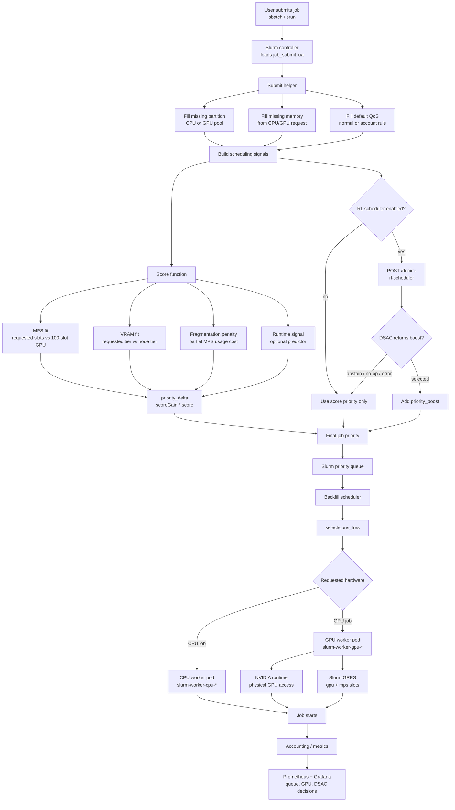
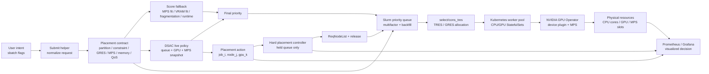
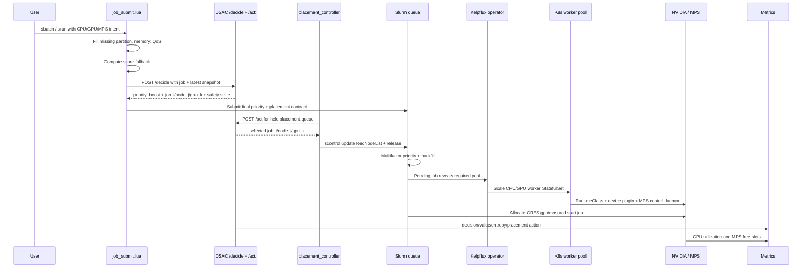

# Scheduler Production Spec

本文件描述目前 Kelpflux 上線中的排程與 placement 規格。範圍包含 Slurm 內建排程、`job_submit.lua` submit-time scoring、runtime predictor、weight tuner、DSAC live scheduler、Kubernetes / NVIDIA GPU stack、fallback policy 與可觀測性。歷史開發階段、實驗路線圖與已淘汰設計不再列入本規格。

Kelpflux 的主要貢獻不是取代 Slurm，而是在 Slurm 前後加入一層可訓練、可觀測、可回退的 ML placement control plane：

- 將使用者的 CPU / GPU / VRAM / MPS 需求正規化成 Slurm 能執行的 placement contract。
- 以 submit-time score 作為穩定 fallback，避免 RL service 不可用時影響提交。
- 以 DSAC 在 live traffic 上介入 pending job 的排序，並在 hard placement path 中把模型輸出的 `node_j` / `gpu_k` 轉成 Slurm 原生 placement constraint。
- 以 Slurm GRES、`select/cons_tres`、Kubernetes worker pool、NVIDIA runtime 與 MPS control daemon 共同完成硬體資源配置。
- 以 Prometheus / Grafana / OpenTelemetry 暴露決策、queue、GPU、MPS、placement intent 與 hard placement action，讓非開發者也能看懂系統如何把 job 放到資源上。

## 1. 上線架構

```text
sbatch / srun
    |
    v
Slurm job_submit.lua
    |-- submit helper: 補齊 partition / memory / qos
    |-- score function: MPS / VRAM / fragmentation / runtime signal
    |-- runtime predictor: 可選，用於短工優先與 walltime 建議
    |-- weight tuner: 可選，載入目前最佳 score 係數
    |-- DSAC scheduler: live 模式時可回傳 priority boost + placement action
    v
Slurm priority + backfill + select/cons_tres
    |
    |-- optional hard placement controller: /act -> ReqNodeList -> release
    v
Kubernetes worker pool + NVIDIA runtime + Slurm GRES
    v
physical CPU / GPU / MPS slots
```

核心原則：

- Slurm 仍是最終資源分配與 job lifecycle owner。
- `job_submit.lua` 在提交時調整 priority / metadata / placement contract，不阻塞 Slurm 的基本行為。
- DSAC live scheduler 以 priority boost 介入排序；hard placement controller 會把 `node_j` / `gpu_k` action 轉成 Slurm `ReqNodeList` + release。
- Submit-time path 不在 `job_submit.lua` 內覆蓋 node allocation；正式 hard placement path 透過 Slurm 原生 hold-release 與 `select/cons_tres` 執行。
- 任何 DSAC 失敗都 fallback 到 score / Slurm 原生排程。
- GPU live migration 不在上線規格內；若要處理 running job，只能走 application-level checkpoint + requeue。

## 2. Job Submit 決策流程

以下 Mermaid 圖示意一個 job submit 後，系統如何補齊 job metadata、計算排序訊號、呼叫 DSAC，最後交給 Slurm 分配硬體資源。



決策重點：

- helper 只補缺值，不覆蓋使用者已指定的 partition、memory 或 QoS。
- score function 產生穩定的 submit-time priority delta，是 DSAC 不可用時的主要 fallback。
- DSAC live scheduler 在 submit-time path 會加 priority boost，並回傳 `node_j` / `gpu_k` 作為 placement intent；hard placement controller 會在 held job path 中把同一類 action 落成 `ReqNodeList`。
- GPU job 的硬體資源由 Kubernetes worker pod、NVIDIA runtime、Slurm GRES 與 MPS slot 共同約束，這是目前客製 placement 的執行層。

## 3. 完整排程與客製 Placement Stack

Kelpflux 把「排程」拆成兩個互相銜接的問題：先決定哪個 pending job 應該更早被 Slurm 考慮，再用一組可被 Slurm / Kubernetes / NVIDIA stack 執行的 placement contract 把 job 放到硬體上。



### 3.1 Placement Contract

Submit-time path 中，placement contract 由 submit helper、使用者 sbatch flags 與 Slurm config 共同決定；hard placement path 會在 held job release 前額外寫入 `ReqNodeList`：

| Contract 欄位 | 來源 | 執行者 | 作用 |
|---------------|------|--------|------|
| `partition` | 使用者指定或 submit helper 補齊 | Slurm + Kelpflux operator | 決定 CPU / GPU worker pool，例如 `cpu`、`gpu-rtx4070` |
| `constraint` / features | 使用者指定 | Slurm node feature matching | 約束 VRAM tier、GPU 型號或節點特徵 |
| `ReqNodeList` | hard placement controller | Slurm scheduler / select plugin | 將 DSAC 選到的 worker node 轉成 hard placement constraint |
| `gres/gpu` | `--gres` / `tres_per_node` | Slurm GRES + NVIDIA device plugin | 配置 GPU 類型與數量 |
| `gres/mps` | `--gres` / `tres_per_node` | Slurm GRES + NVIDIA MPS control daemon | 配置單 GPU 上的 MPS slot |
| `memory` | 使用者指定或 helper 估算 | Slurm cgroup / Kubernetes pod resources | 避免 job 在 placement 後因 memory 不足失敗 |
| `qos` / priority | 使用者、helper、score、DSAC | Slurm priority queue | 決定 pending jobs 的排序與 backfill 機會 |
| worker pool size | Slurm pending/running state | Kelpflux operator | pending jobs 觸發 scale-up；running jobs 阻止 scale-down |

換句話說，Kelpflux 的客製 placement 不是單一 API call，而是一條可被多層系統共同執行的約束鏈：job submit 時建立 contract，Slurm 根據 contract 選資源，hard placement controller 可對 held jobs 寫入 `ReqNodeList`，operator 確保 worker pool 存在且不縮掉 running jobs，NVIDIA stack 提供 GPU / MPS isolation。

### 3.2 DSAC 在 Placement 中的角色

DSAC action space 已經是 placement-aware：模型輸出的 flat action 會被解碼成 `(job_i, node_j, gpu_k)`，action mask 只允許選擇 MPS free slots 足夠的 placement。

| DSAC 輸出 | Submit-time live path | Hard placement controller |
|-----------|-----------------------|---------------------------|
| `job_i` | 若選中的 job 是正在 submit 的 job，回傳 positive `priority_boost` | 對 held pending queue 中被選到的 job 執行 placement |
| `node_j` | 記錄為 placement intent，用於 metrics、Grafana 與訓練分析 | 映射到可用 Slurm GPU worker node，寫入 `ReqNodeList=<node>` |
| `gpu_k` | 記錄為 placement intent，用於觀察模型偏好的 GPU slot | 目前 live worker 是 1 GPU / node，因此 `gpu_k=0`；多 GPU node 需要對應 GPU/MPS slot topology |
| `priority_boost` | 加到 `job_desc.priority`，讓 Slurm 更早考慮該 job | 不使用；controller 透過 hold-release 控制何時進入 Slurm placement |
| `abstain` / no-op | guardrail 觸發時不 boost，回到 score + Slurm | 不更新 job，保持 held/pending，等待下一輪或人工處理 |

Submit-time path 仍是低風險預設；hard placement controller 是正式可用的 Slurm-safe placement path，適合需要 DSAC 實際指定 worker / GPU / MPS contract 的實驗與受控上線。它不在 `job_submit.lua` 裡阻塞，而是只處理 held pending jobs，先讓使用者提交 `sbatch --hold ... --gres=mps:N`，再由 controller 寫入 Slurm 原生約束並 release。

#### 演算法：risk-sensitive distributional SAC（RDSAC）

底層 agent（`services/rl_scheduler/dsac.py`）是 Ma et al. 2020/2025〈DSAC: Distributional Soft Actor-Critic for Risk-Sensitive Reinforcement Learning〉(arXiv:2004.14547) 的**離散動作忠實轉寫**。連續控制的 reparameterised Gaussian actor 因為 placement 是離散動作而換成**顯式 categorical actor** `π(a|s;φ)`；分布式 critic 與 risk 機制依論文 §4.1（RDSAC）：

- **雙分布 critic**：把 soft return 拆成 reward 分布 `Z_R` 與 entropy 分布 `Z_H`，各以 IQN(Dabney et al. 2018)的 quantile 表示、共用 trunk 只差最後一層；quantile Huber 回歸 + twin critic double learning。慣例採 α-external：`Z_H` 回歸純 entropy return，組合值為 `Q = E[Z_R] + α·E[Z_H]`。
- **Risk 進策略目標**：actor 目標 `J_π = Σ_a π(a|s)·[α·logπ(a|s) − ρ[Z_R(s,a)] − α·E[Z_H(s,a)]]`，distortion `ρ` 只作用在 reward 分布 `Z_R`，entropy 保持期望。
- **Risk 旋鈕** `risk_mode ∈ {mean, cvar, wang, cpw, msd}`（`risk_beta` 為風險參數，見 `services/rl_scheduler/distortion.py`）：`mean` 為 risk-neutral，退化成穩定性導向的 distributional SAC；`cvar` 偏好下尾較不嚴重的 placement，對應排程的 straggler / cold worker / long-tail runtime 風險。temperature α 依 SAC 自動調（離散 target entropy = `ratio·log(n_valid)`）。

`risk_mode=mean` 是預設;要尾部感知(p95/p99 JCT、tail slowdown,見 `sim/metrics.py`)時改用 `cvar`。

### 3.3 Submit 到硬體分配的時序



### 3.4 Hard Placement Controller

`services/rl_scheduler/placement_controller.py` 是目前的 Slurm-safe hard placement 執行路徑。它輪詢 Slurm held queue 與 GPU worker state，呼叫 DSAC `/act`，把 action 解碼出的 `node_j` 映射到可用 worker，接著執行：

```bash
scontrol update JobId=<job_id> ReqNodeList=<selected_node>
scontrol release <job_id>
```

執行規則：

- 預設只處理 `JobHeldUser` / `JobHeldAdmin` pending jobs，避免碰到一般使用者已排隊的 job。
- 使用者的 GPU/MPS 需求必須在提交時已存在，例如 `sbatch --hold -p gpu-rtx4070 --gres=mps:10 ...`；controller 不在 release 後修改 GRES。
- 會排除 `DRAIN`、`DOWN`、`NOT_RESPONDING`、`FAIL` 的 worker node。
- 會讀 `/healthz` 的 `n_actions`，若 node list 大於 checkpoint topology 支援的 placement 數，會自動修剪並在 log 中提示需要重新訓練 / 部署更大 topology checkpoint。
- DSAC no-op 時不更新 job，維持 held/pending。

Live 手動驗證已確認 controller 能把 DSAC action 寫入 Slurm：job `131` 被更新為 `ReqNodeList=slurm-worker-gpu-rtx4070-1`，Slurm 隨後配置 `NodeList=slurm-worker-gpu-rtx4070-1`、`BatchHost=slurm-worker-gpu-rtx4070-1`、`TRES=gres/mps=10`。後續已修正 elastic operator worker lifecycle guard：只要 pool 內 `running_jobs > 0`，policy 會回 `running_jobs_block_scale_down`，scale action 層也會阻止 drain / replica patch，因此 hard placement job 不會再因 `pending_jobs=0` 被 operator scale-down eviction。

`services/rl_scheduler/live_daemon.py` 保留為研究 / legacy 原型；它以 `srun --jobid ... --nodelist ...` 嘗試直接執行，適合離線比較與 RLPD transition 蒐集。正式 hard placement path 是 `services/rl_scheduler/placement_controller.py`，因為它使用 Slurm 原生 hold-release 與 `ReqNodeList`，可被 Slurm priority、backfill、GRES/MPS accounting 和 operator lifecycle guard 正常約束。

## 4. Slurm 基礎排程設定

上線使用 Slurm 原生能力作為穩定底座：

| 設定 | 上線值 / 行為 | 用途 |
|------|---------------|------|
| `SchedulerType` | `sched/backfill` | 允許不延後高優先 job 的前提下安排短 job 插隊 |
| `SelectType` | `select/cons_tres` | 以 TRES 表示 CPU / GPU / MPS 資源 |
| `SelectTypeParameters` | `CR_Core` | CPU core 級資源選擇；submit-time 與 hard placement 都仍交由 Slurm 管理配置 |
| `PriorityType` | `priority/multifactor` | 保留 Slurm age / job size / partition / qos 等基本排序 |
| `AccountingStorageTRES` | `gres/gpu,gres/mps` | 讓 GPU 與 MPS usage 進 accounting |
| `PreemptType` | 預設關閉 | 上線不主動踢 running job |

上線邊界：

| 能力 | 狀態 |
|------|------|
| 新 job 進來時依 priority 重新排序 | 支援 |
| backfill 短 job | 支援 |
| GPU / MPS 作為 Slurm GRES | 支援 |
| GPU runtime live migration | 不支援 |
| 跨節點 GPU memory 搬移 | 不支援 |
| 強制 requeue running job | 非預設上線行為 |

## 5. Submit Helper

`job_submit.lua` 會先執行 submit helper，讓後續 score 與 DSAC 看到較完整的 job 描述。helper 不覆蓋使用者明確指定的欄位。

| Helper | 行為 | 預設 |
|--------|------|------|
| memory | 使用 GPU 數與 CPU 數估算 `--mem` | enabled |
| partition | 依 `tres_per_node` 內容選擇 `cpu` / `gpu-rtx4070` / `gpu-rtx4080` | enabled |
| qos | 依 account rule 或 default 補 `qos` | enabled，default=`normal` |

partition rule 預設：

| Match | Partition |
|-------|-----------|
| `gpu:rtx4080` | `gpu-rtx4080` |
| `gpu:rtx4070` | `gpu-rtx4070` |
| `gpu:` | `gpu-rtx4070` |
| no GPU match | `cpu` |

## 6. Score Function

score function 是 submit-time heuristic，用來產生 priority delta。分數越高，job 越值得被提前考慮。

```text
score(J, P) = α * f_mps_fit(J, P)
            + β * f_vram_fit(J, P)
            + γ * f_topology(J, P)
            - δ * f_fragmentation(J, P)
            + ε * f_pred_runtime(J)

score = clamp(score, 0, 1)
priority_delta = round(scoreGain * score)
```

上線套用方式：

```text
if scoreApply=true and priority_delta > 0 and job_desc.priority is empty:
    job_desc.priority = priority_delta
```

`scoreGain` 預設為 `1000`，用來把 `[0,1]` score 轉成 Slurm priority delta。

### 6.1 係數

chart 預設係數：

| Factor | Symbol | Default | 說明 |
|--------|--------|---------|------|
| MPS fit | α | `0.40` | 偏好 MPS request 與 GPU slot 配適 |
| VRAM fit | β | `0.20` | 避免小 VRAM job 佔用大 VRAM tier |
| Topology | γ | `0.00` | 保留欄位，目前不影響上線結果 |
| Fragmentation cost | δ | `0.20` | 懲罰容易留下 MPS 碎片的 request |
| Predicted runtime | ε | `0.00` | predictor 啟用且係數非 0 時，短 job 會拿較高分 |

若 `weight-tuner` 啟用，Lua plugin load 時會從 `GET /weights` 載入 `(α, δ, ε)`，`β` 固定，`γ` 維持 chart 設定。

### 6.2 `f_mps_fit`

衡量 job MPS request 與單 GPU MPS 容量的配適程度。

| 項目 | 規格 |
|------|------|
| Input | `job_desc.tres_per_node`，例如 `gpu:rtx4070:1,mps:25` |
| MPS 容量 | `slurm.jobSubmit.mpsPerNode`，預設 `100` |
| Formula | `mps_req / mpsPerNode`，clamp 到 `[0,1]` |
| no MPS request | 回傳 `1.0` |
| request 超過容量 | 回傳 `0.0` |

### 6.3 `f_vram_fit`

依 `--constraint` 中的 `vram-*g` 需求選擇最小可用 VRAM tier，避免過度配置。

| 項目 | 規格 |
|------|------|
| Input | `job_desc.features`，例如 `vram-12g+` |
| VRAM tiers | `slurm.jobSubmit.vramTiers`，預設 `[12, 24]` |
| Formula | `1 - (fit_tier - req) / max_tier`，clamp 到 `[0,1]` |
| 無 VRAM constraint | 回傳 `0.5` |
| 無 tier 可容納 | 回傳 `0.0` |

### 6.4 `f_topology`

目前為保留欄位，Lua 回傳中性值 `0.5`。因 chart 預設 `γ=0`，此因子不影響上線 priority。

### 6.5 `f_fragmentation`

目前使用 submit-time proxy，不讀 live cluster state。它懲罰最容易留下碎片的 MPS request。

| 項目 | 規格 |
|------|------|
| Input | `mps_req` |
| Formula | `4 * x * (1 - x)`，其中 `x = mps_req / mpsPerNode` |
| `mps_req <= 0` | 回傳 `0.0` |
| `mps_req >= mpsPerNode` | 回傳 `0.0` |
| `mps_req = 50%` | 回傳接近 `1.0`，碎片化代價最高 |

### 6.6 `f_pred_runtime`

runtime predictor 啟用時，短 job 取得較高 score。predictor 不可用時回傳中性值。

| 項目 | 規格 |
|------|------|
| Endpoint | `POST /predict`，預設 `http://runtime-predictor:8080/predict` |
| Timeout | `slurm.jobSubmit.predictor.timeoutMs`，預設 `200ms` |
| Formula | `1 - pred_seconds / fallback_seconds`，clamp 到 `[0,1]` |
| fallback seconds | `fallbackHours * 3600`，預設 `4h` |
| predictor disabled | 回傳 `0.5` |
| timeout / 5xx / invalid body | 回傳 `0.5` |

Predictor request body：

```json
{
  "user": "alice",
  "partition": "gpu-rtx4070",
  "gpu_count": 1,
  "mps_req": 25,
  "gpu_type": "rtx4070",
  "user_time_limit_seconds": 3600
}
```

Predictor response：

```json
{
  "pred_seconds": 1146.28,
  "pred_minutes": 19.10,
  "model_version": "lgbm-v1",
  "bootstrap": false,
  "latency_ms": 1.12
}
```

`applyTimeLimit=true` 時，Lua 可把 `job_desc.time_limit` 改成預測值；上線建議只有在 predictor 經過校準後才開啟，避免模型低估造成 job timeout。

## 7. Weight Tuner

`weight-tuner` 是可選 FastAPI service，用 UCB1 在離散 arm 空間中調整 score function 的 `(α, δ, ε)`。

| Endpoint | 說明 |
|----------|------|
| `GET /weights` | 回傳目前 best arm 與統計資料 |
| `POST /feedback` | 以 reward 更新指定 arm |
| `GET /stats` | 回傳所有 arms 的 pulls 與 mean reward |
| `GET /healthz` | health check |

行為：

- Lua plugin 只在 load 時抓一次 `/weights`。
- 抓取失敗時沿用 chart 預設係數。
- `β` 不由 tuner 調整。
- live reward 以 completed jobs 的 mean JCT 轉換為負 reward。

## 8. DSAC Live Scheduler

`rl-scheduler` 是 FastAPI service，載入目前 image 內的 DSAC checkpoint，提供 Slurm Lua hook 查詢。

| Endpoint | 說明 |
|----------|------|
| `GET /healthz` | model readiness、obs/action shape、snapshot age、shadow mode |
| `POST /snapshot` | 由 `rl-snapshot-agent` 定期更新 cached cluster snapshot |
| `POST /decide` | 對提交中的 job 回傳 priority boost / abstain / selected placement |
| `GET /metrics` | Prometheus metrics |

目前 live 介入方式分成兩層：submit-time **priority boost** 是預設低風險路徑；hold-release **hard placement controller** 是正式可用的受控 placement 路徑。

```text
job_submit.lua -> POST /decide
    if rl_selected=true and priority_boost>0:
        job_desc.priority += priority_boost
```

在 submit-time `/decide` 路徑中，DSAC 不直接執行 `srun --nodelist`，也不在 `job_submit.lua` 內覆蓋 Slurm placement；`node_j` 與 `gpu_k` 會回傳並記錄為 placement intent，實際 placement 仍交給 Slurm `select/cons_tres`。

若需要 DSAC 的 placement action 真正生效，使用 `services/rl_scheduler/placement_controller.py`：它對 held pending jobs 呼叫 `/act`，把 `node_j` 映射到可用 GPU worker，寫入 `ReqNodeList=<selected_node>`，再 `scontrol release`。這條路徑已納入正式規格，但目前不由 `deploy-2.sh` 預設常駐啟動；啟用前需要確認 checkpoint topology 與 live node/GPU topology 一致。

### 8.1 Snapshot Schema

```json
{
  "now": 0,
  "pending_jobs": [],
  "nodes": [
    {
      "gpus": [
        {"free_mps": 100, "running_jobs": 0, "gpu_type": "rtx4070"}
      ]
    }
  ],
  "n_nodes": 1,
  "gpus_per_node": 1,
  "mps_per_gpu": 100
}
```

`rl-snapshot-agent` 會定期從 Slurm REST API 讀取 jobs/nodes 並 POST `/snapshot`，讓 cached snapshot 保持 fresh。`/decide` 仍會在 snapshot 缺失或超過 `snapshotTtlSeconds` 時 abstain，避免使用過期 cluster state 做 live boost。

### 8.2 Decision Schema

Lua hook 送出的 request：

```json
{
  "job_id": "123",
  "mps_req": 25,
  "gpu_count": 1,
  "gpu_type": "rtx4070",
  "runtime_s": 3600,
  "now": 0
}
```

Service response：

```json
{
  "priority_boost": 1000,
  "rl_selected": true,
  "abstain": false,
  "abstain_reason": null,
  "rl_selected_job_id": "123",
  "node_j": 0,
  "gpu_k": 0,
  "value": -180.06,
  "entropy": 0.0,
  "shadow": false
}
```

`value` 為策略下的期望 risk-adjusted action value `Σ_a π(a|s)·(ρ[Z_R(s,a)] + α·E[Z_H(s,a)])`（由 `DSACAgent.action_values` 計算，受 `risk_mode` 影響）；`entropy` 為 categorical policy `π(a|s)` 的熵。兩者餵給下方 §8.3 的 `valueAbstain` / `entropyAbstain` guardrail。

### 8.3 Live Safety Gates

| Gate | 行為 |
|------|------|
| `shadowMode=true` | service 回傳 shadow decision，不實際 boost |
| stale snapshot | abstain，`priority_boost=0` |
| low value | 若 `value < valueAbstain`，abstain |
| high entropy | 若 `entropy > entropyAbstain`，abstain |
| no-op action | 不 boost |
| invalid / masked action | 不 boost |
| network / parse / Lua error | Lua hook no-op，submission 繼續 |

目前 live deployment 使用 DSAC checkpoint，`shadowMode=false` 時會實際套用 positive `priority_boost`。hard placement controller 另以 `/act` 執行 held job placement，不受 Lua `shadowMode` 控制；controller 自身以 `--shadow / --no-shadow` 控制是否真的更新 Slurm job。

## 9. Boundary Policy

| Failure | 行為 |
|---------|------|
| `job_submit.lua` Lua error | `pcall` 保護；回傳 `slurm.SUCCESS`，priority 不動 |
| predictor timeout / malformed response | `f_pred_runtime=0.5` |
| weight tuner unavailable | 使用 chart 預設 weights |
| RL scheduler unavailable | `rl_apply` no-op；submission 不失敗 |
| score < 0 | clamp 到 0 |
| score > 1 | clamp 到 1 |
| `scoreGain=0` | score 只記錄，不改 priority |
| `scoreApply=false` | score 只記錄，不改 priority |
| DSAC abstain | submit-time 不加 boost；hard placement path 不 release / 不更新 placement |
| DSAC no-op | submit-time 不 boost；hard placement job 維持 held/pending |
| hard placement 選到 unavailable node | controller 過濾 DRAIN/DOWN/NOT_RESPONDING/FAIL，不更新該節點 |
| operator scale-down during running job | policy/action guard 阻止 scale-down，保留 running/COMPLETING worker |

## 10. Monitoring Metrics

`rl-scheduler` 暴露 Prometheus metrics，Grafana dashboard `Scheduler Live Resource View` 會使用這些指標。

| Metric | 說明 |
|--------|------|
| `rl_scheduler_ready` | DSAC model 是否載入 |
| `rl_scheduler_shadow_mode` | 1=shadow，0=live |
| `rl_scheduler_decisions_total{result}` | selected / no_boost / abstain 次數 |
| `rl_scheduler_priority_boost_total` | positive boost 累積次數 |
| `rl_scheduler_last_priority_boost` | 最近一次 boost |
| `rl_scheduler_policy_value` | 最近一次 value estimate |
| `rl_scheduler_policy_entropy` | 最近一次 entropy |
| `rl_scheduler_snapshot_age_seconds` | snapshot age |
| `rl_scheduler_snapshot_pending_jobs` | snapshot pending jobs |
| `rl_scheduler_snapshot_free_mps` | snapshot free MPS slots |
| `rl_scheduler_last_action` | 最近一次 flat action index |
| `rl_scheduler_last_job_index` | 最近一次 selected job slot |
| `rl_scheduler_last_node_index` | 最近一次 selected node index |
| `rl_scheduler_last_gpu_index` | 最近一次 selected GPU index |

## 11. Deployment Knobs

常用 Helm values：

```yaml
slurm:
  jobSubmit:
    enabled: true
    scoreApply: true
    scoreGain: 1000
    mpsPerNode: 100
    predictor:
      enabled: false
      applyTimeLimit: false

rlScheduler:
  enabled: true
  shadowMode: false
  snapshotTtlSeconds: 86400
  valueAbstain: -100000
  entropyAbstain: 1.5
  priorityBoost: 1000
  lua:
    enabled: true

weightTuner:
  enabled: false
```

Live smoke check：

```bash
kubectl -n slurm exec slurm-controller-0 -- \
  curl -fsS http://rl-scheduler:8002/healthz

kubectl -n slurm exec slurm-controller-0 -- \
  curl -fsS http://rl-scheduler:8002/metrics | grep rl_scheduler

LOGIN_POD=$(kubectl -n slurm get pod -l app=slurm-login -o jsonpath='{.items[0].metadata.name}')
kubectl -n slurm exec "$LOGIN_POD" -- \
  sbatch --wrap='sleep 3' --job-name='dsac-live-smoke' -p cpu

kubectl -n slurm logs slurm-controller-0 --tail=500 | grep -E '\[rl\]|\[score'
```

Hard placement smoke check：

```bash
JOB_ID=$(kubectl -n slurm exec deploy/slurm-login -- \
  sbatch --hold --parsable -J dsac-place-smoke \
  -p gpu-rtx4070 --gres=mps:10 --time=00:03:00 \
  --wrap 'hostname; sleep 10')

PYTHONPATH=. python -m services.rl_scheduler.placement_controller \
  --once --no-shadow --job-id "$JOB_ID" \
  --node-name slurm-worker-gpu-rtx4070-0 \
  --node-name slurm-worker-gpu-rtx4070-1 \
  --scheduler-url http://rl-scheduler:8002 \
  --scheduler-exec-prefix 'kubectl -n slurm exec pod/slurm-controller-0 --' \
  --slurm-exec-prefix 'kubectl -n slurm exec deploy/slurm-login --'

kubectl -n slurm exec deploy/slurm-login -- \
  scontrol show job "$JOB_ID" | grep -E 'ReqNodeList|NodeList|BatchHost|TRES'
```

## 12. Files

| Path | Purpose |
|------|---------|
| `chart/templates/configmap-job-submit.yaml` | Generates `job_submit.lua` |
| `chart/lua/rl_hook.lua` | Lua client for DSAC `/decide` |
| `services/rl_scheduler/serve.py` | DSAC FastAPI service |
| `services/rl_scheduler/snapshot_agent.py` | Periodic Slurm REST snapshot updater for `/snapshot` |
| `services/rl_scheduler/placement_controller.py` | Slurm-safe DSAC hard placement controller using hold-release and `ReqNodeList` |
| `services/rl_scheduler/live_daemon.py` | Direct placement research / legacy prototype; not recommended for Slurm-safe production placement |
| `services/rl_scheduler/dsac.py` | RDSAC (Ma et al.) — dual Z_R/Z_H IQN critic + categorical actor |
| `services/rl_scheduler/distortion.py` | Risk distortions (CVaR/Wang/CPW/MSD) |
| `services/runtime_predictor/` | Runtime prediction service |
| `services/weight_tuner/` | UCB1 weight tuner |
| `chart/dashboards/scheduler-live.json` | Live scheduler Grafana dashboard |
| `docs/monitoring.md` | Monitoring metrics and dashboard details |
